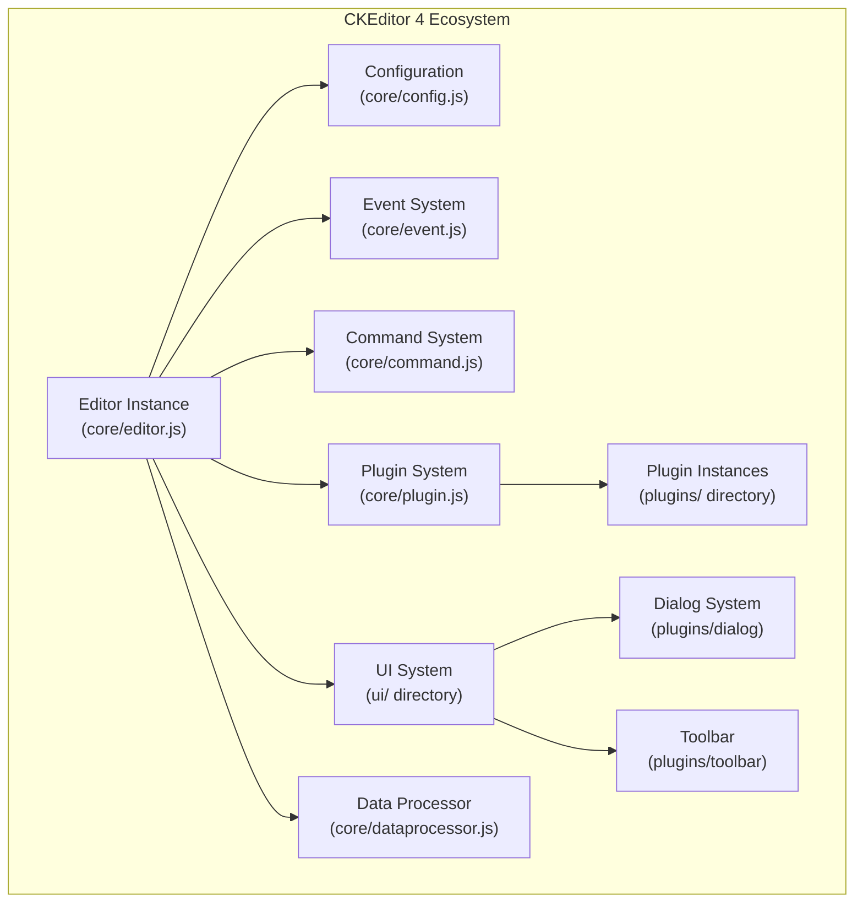
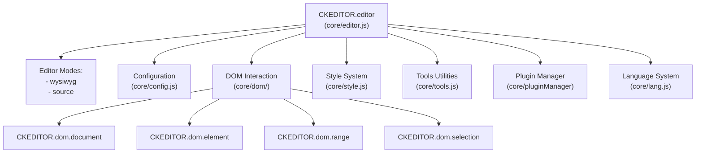
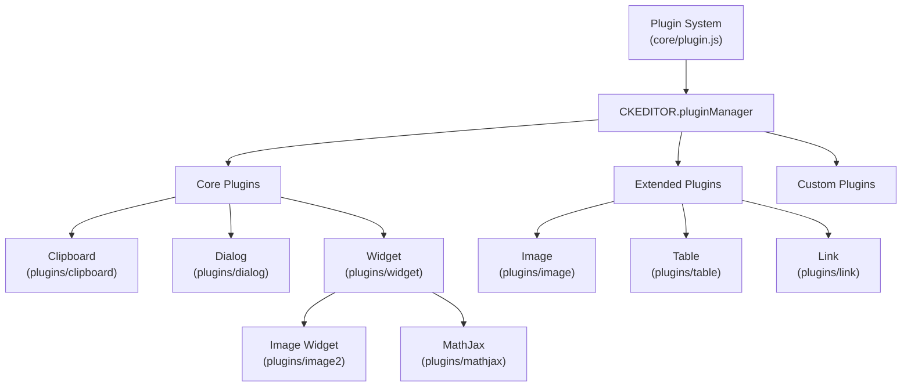
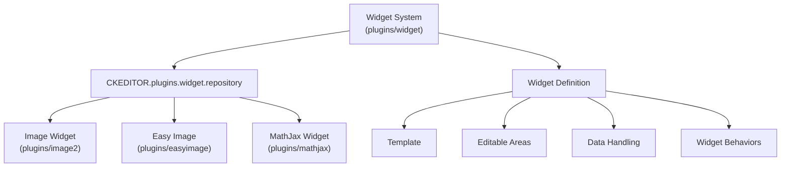
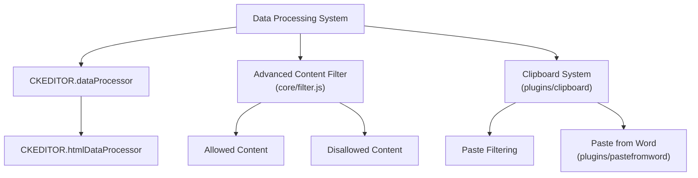
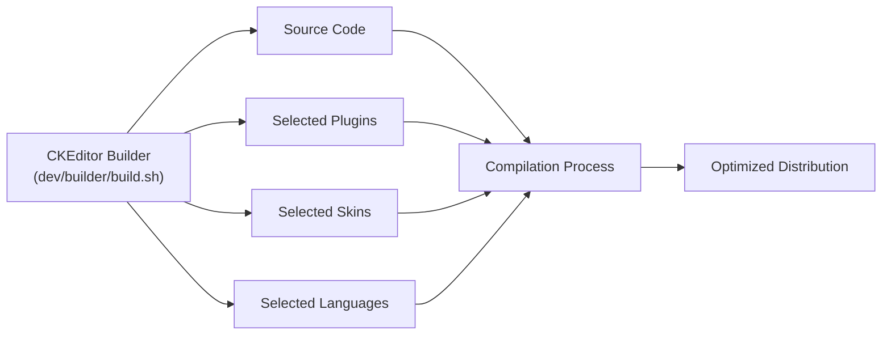

# Overview

<details>
<summary>Relevant source files</summary>

The following files were used as context for generating this wiki page:

- [.circleci/config.yml](https://github.com/ckeditor/ckeditor4/blob/c7e59ec1/.circleci/config.yml)
- [.github/CONTRIBUTING.md](https://github.com/ckeditor/ckeditor4/blob/c7e59ec1/.github/CONTRIBUTING.md)
- [.github/PULL_REQUEST_TEMPLATE.md](https://github.com/ckeditor/ckeditor4/blob/c7e59ec1/.github/PULL_REQUEST_TEMPLATE.md)
- [.github/SUPPORT.md](https://github.com/ckeditor/ckeditor4/blob/c7e59ec1/.github/SUPPORT.md)
- [.gitignore](https://github.com/ckeditor/ckeditor4/blob/c7e59ec1/.gitignore)
- [.npm/README.md](https://github.com/ckeditor/ckeditor4/blob/c7e59ec1/.npm/README.md)
- [CHANGES.md](https://github.com/ckeditor/ckeditor4/blob/c7e59ec1/CHANGES.md)
- [LICENSE.md](https://github.com/ckeditor/ckeditor4/blob/c7e59ec1/LICENSE.md)
- [README.md](https://github.com/ckeditor/ckeditor4/blob/c7e59ec1/README.md)
- [bender-runner.config.json](https://github.com/ckeditor/ckeditor4/blob/c7e59ec1/bender-runner.config.json)
- [bender.ci.js](https://github.com/ckeditor/ckeditor4/blob/c7e59ec1/bender.ci.js)
- [bender.js](https://github.com/ckeditor/ckeditor4/blob/c7e59ec1/bender.js)
- [core/promise.js](https://github.com/ckeditor/ckeditor4/blob/c7e59ec1/core/promise.js)
- [dev/builder/build.sh](https://github.com/ckeditor/ckeditor4/blob/c7e59ec1/dev/builder/build.sh)
- [package.json](https://github.com/ckeditor/ckeditor4/blob/c7e59ec1/package.json)
- [samples/old/sample_posteddata.php](https://github.com/ckeditor/ckeditor4/blob/c7e59ec1/samples/old/sample_posteddata.php)
- [tests/_benderjs/ssl/cert.pem](https://github.com/ckeditor/ckeditor4/blob/c7e59ec1/tests/_benderjs/ssl/cert.pem)
- [tests/_benderjs/ssl/key.pem](https://github.com/ckeditor/ckeditor4/blob/c7e59ec1/tests/_benderjs/ssl/key.pem)
- [tests/core/tools/promise.js](https://github.com/ckeditor/ckeditor4/blob/c7e59ec1/tests/core/tools/promise.js)

</details>


CKEditor 4 is a highly configurable WYSIWYG HTML editor written in JavaScript. This document provides a comprehensive introduction to the architecture, core components, and fundamental concepts of CKEditor 4. It serves as an entry point for developers looking to understand, use, or extend the editor.

## Introduction to CKEditor 4

CKEditor 4 is a feature-rich text editor that transforms HTML textarea fields into powerful editing environments. It offers a robust platform for creating and editing content with support for text formatting, media embedding, tables, and numerous other features through its extensive plugin architecture.

As of June 2023, CKEditor 4 has reached its End of Life for the open source edition. However, it continues to be available as a Long Term Support (LTS) version under the Extended Support Model until December 2028, ensuring security updates and critical bug fixes for those with commercial licenses.



Sources: [CHANGES.md:1-10](https://github.com/ckeditor/ckeditor4/blob/c7e59ec1/CHANGES.md#L1-L10), [package.json:1-10](https://github.com/ckeditor/ckeditor4/blob/c7e59ec1/package.json#L1-L10), [README.md:11-22](https://github.com/ckeditor/ckeditor4/blob/c7e59ec1/README.md#L11-L22)

## Core Architecture

The CKEditor 4 architecture is built around a modular core that provides essential services, with functionality extended through plugins. The editor is designed to be highly adaptable, allowing developers to customize it to their specific needs while maintaining a consistent API.

### Editor Instance

At the heart of CKEditor 4 is the editor instance, which serves as the central coordination point. Each instance represents a single editor on a page and provides the API for interacting with the editor.



Sources: [README.md:180-181](https://github.com/ckeditor/ckeditor4/blob/c7e59ec1/README.md#L180-L181), [bender.js:35-40](https://github.com/ckeditor/ckeditor4/blob/c7e59ec1/bender.js#L35-L40)

### Plugin Architecture

CKEditor 4 uses a plugin-based architecture that allows for modular extension of functionality. Plugins can add new features, modify existing behavior, and interact with other plugins through a well-defined API.



Sources: [bender.js:106-113](https://github.com/ckeditor/ckeditor4/blob/c7e59ec1/bender.js#L106-L113), [README.md:181-182](https://github.com/ckeditor/ckeditor4/blob/c7e59ec1/README.md#L181-L182)

## Key Subsystems

CKEditor 4 comprises several key subsystems that together provide its rich editing capabilities.

### UI System

The UI system provides the user interface components, including the toolbar, dialogs, panels, and other visual elements. It's designed to be themeable and adaptable to different environments.

### Event System

CKEditor 4 uses an event-based architecture for communication between components. Events can be triggered, listened to, and processed by various parts of the system, allowing for loose coupling between components.

### Command System

The command system provides a way to encapsulate editor operations. Commands can be executed, undone, and redone, and they provide a consistent interface for user actions.

### Widget System

Widgets are special content elements that provide a unified way to handle complex content, like images with captions, media embeds, or code snippets. The widget system makes it easier to interact with these elements as single units.



Sources: [README.md:135](https://github.com/ckeditor/ckeditor4/blob/c7e59ec1/README.md#L135)

### Data Processing and Filtering

CKEditor 4 provides robust data processing capabilities to ensure that content is properly handled when entering or leaving the editor.



Sources: [CHANGES.md:80-82](https://github.com/ckeditor/ckeditor4/blob/c7e59ec1/CHANGES.md#L80-L82), [CHANGES.md:86-87](https://github.com/ckeditor/ckeditor4/blob/c7e59ec1/CHANGES.md#L86-L87)

## Getting Started with CKEditor 4

CKEditor 4 can be integrated into web applications using various methods, including via npm, CDN, or manual download.

### Basic Implementation

The simplest way to add CKEditor 4 to a webpage is:

```html
<textarea id="editor"></textarea>
<script src="path/to/ckeditor.js"></script>
<script>
    CKEDITOR.replace('editor');
</script>
```

### Configuration Options

CKEditor 4 can be extensively configured through its configuration system:

```javascript
CKEDITOR.replace('editor', {
    language: 'en',
    uiColor: '#9AB8F3',
    toolbar: [
        ['Bold', 'Italic', 'Link', 'Image']
    ]
});
```

The editor provides numerous configuration options for customizing its behavior, appearance, and features.

### Available Presets

CKEditor 4 comes in different presets to suit various use cases:

| Preset | Description | Features |
|--------|-------------|----------|
| Standard | Balanced preset with essential features | Basic formatting, tables, images |
| Full | All available features | All official plugins included |
| Basic | Minimal preset with core functionality | Basic text formatting only |
| Custom | Tailor-made configuration | Chosen by developer |

Sources: [README.md:126-125](https://github.com/ckeditor/ckeditor4/blob/c7e59ec1/README.md#L126-L125)

## Extending CKEditor 4

CKEditor 4 can be extended through plugins, customized skins, and additional languages.

### Plugin Development

Custom plugins can be created to add new functionality. A basic plugin structure includes:

```javascript
CKEDITOR.plugins.add('myplugin', {
    init: function(editor) {
        // Plugin initialization code
    }
});
```

### Building Custom Distributions

The CKEditor 4 builder allows creating custom distributions with selected plugins and features:



Sources: [dev/builder/build.sh:5-10](https://github.com/ckeditor/ckeditor4/blob/c7e59ec1/dev/builder/build.sh#L5-L10), [README.md:186-193](https://github.com/ckeditor/ckeditor4/blob/c7e59ec1/README.md#L186-L193)

## Browser Support

CKEditor 4 supports a wide range of browsers, including legacy ones, making it suitable for applications that need to work across various environments.

| Browser | Supported Versions |
|---------|-------------------|
| Internet Explorer | IE8, IE9, IE10, IE11 |
| Edge | All versions |
| Chrome | Latest versions |
| Firefox | Latest versions |
| Safari | Latest versions |
| Opera | Latest versions |
| iOS Safari | Latest versions |
| Chrome for Android | Latest versions |

Sources: [README.md:140-145](https://github.com/ckeditor/ckeditor4/blob/c7e59ec1/README.md#L140-L145)

## Licensing

CKEditor 4 is available under different licensing models:

1. CKEditor 4.22.1 and below: Available under open source licenses (GPL, LGPL, or MPL)
2. CKEditor 4.23.0-lts and above: Available only under the commercial Extended Support Model

Sources: [LICENSE.md:1-7](https://github.com/ckeditor/ckeditor4/blob/c7e59ec1/LICENSE.md#L1-L7), [README.md:203-218](https://github.com/ckeditor/ckeditor4/blob/c7e59ec1/README.md#L203-L218)

## Related Documentation

For more detailed information about specific subsystems, please refer to the following wiki pages:

- For core architecture details, see [Core Architecture](#2)
- For widget system documentation, see [Widget System](#3)
- For clipboard and content processing, see [Clipboard and Content Processing](#4)