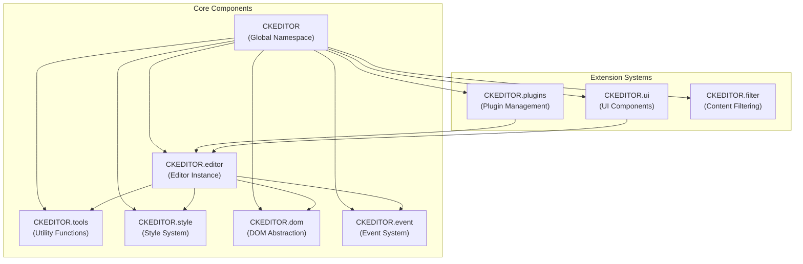
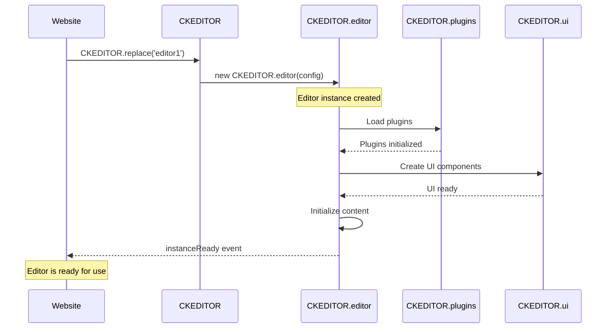
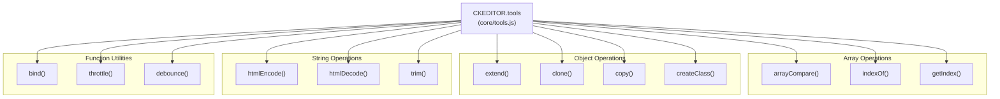
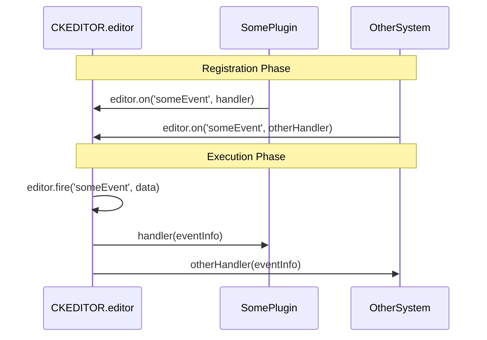
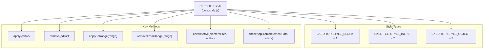
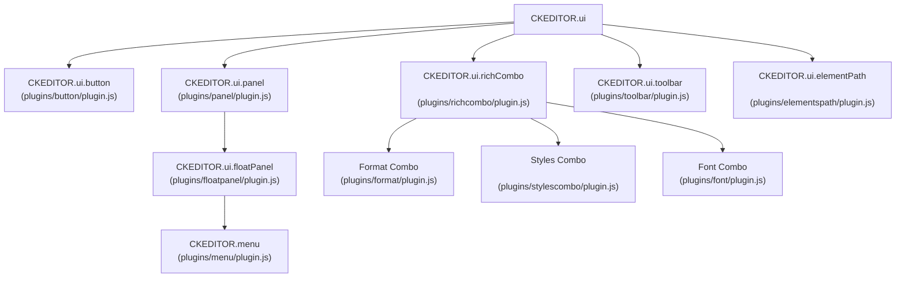
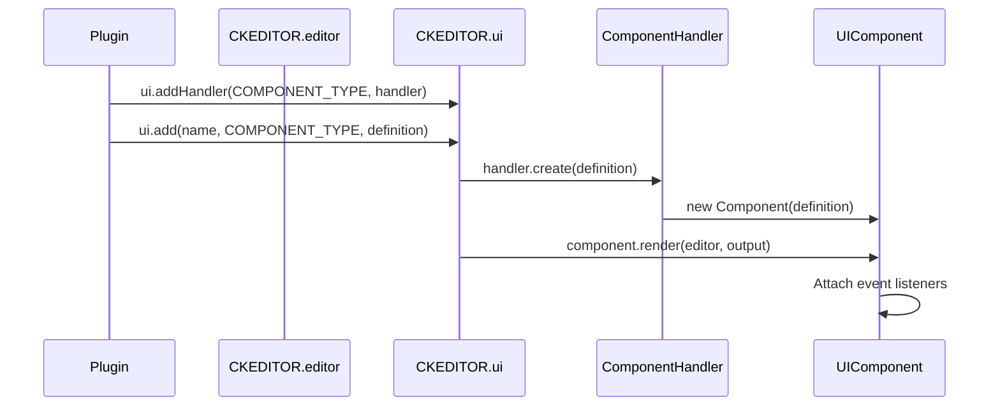
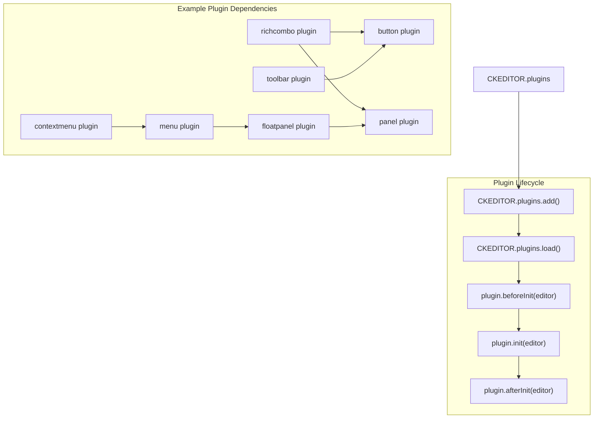

# Core Architecture

Relevant source files

The following files were used as context for generating this wiki page:

- [.circleci/config.yml](https://github.com/ckeditor/ckeditor4/blob/c7e59ec1/.circleci/config.yml)
- [.github/CONTRIBUTING.md](https://github.com/ckeditor/ckeditor4/blob/c7e59ec1/.github/CONTRIBUTING.md)
- [.github/PULL_REQUEST_TEMPLATE.md](https://github.com/ckeditor/ckeditor4/blob/c7e59ec1/.github/PULL_REQUEST_TEMPLATE.md)
- [.github/SUPPORT.md](https://github.com/ckeditor/ckeditor4/blob/c7e59ec1/.github/SUPPORT.md)
- [.gitignore](https://github.com/ckeditor/ckeditor4/blob/c7e59ec1/.gitignore)
- [.npm/README.md](https://github.com/ckeditor/ckeditor4/blob/c7e59ec1/.npm/README.md)
- [CHANGES.md](https://github.com/ckeditor/ckeditor4/blob/c7e59ec1/CHANGES.md)
- [LICENSE.md](https://github.com/ckeditor/ckeditor4/blob/c7e59ec1/LICENSE.md)
- [README.md](https://github.com/ckeditor/ckeditor4/blob/c7e59ec1/README.md)
- [bender-runner.config.json](https://github.com/ckeditor/ckeditor4/blob/c7e59ec1/bender-runner.config.json)
- [bender.ci.js](https://github.com/ckeditor/ckeditor4/blob/c7e59ec1/bender.ci.js)
- [bender.js](https://github.com/ckeditor/ckeditor4/blob/c7e59ec1/bender.js)
- [core/promise.js](https://github.com/ckeditor/ckeditor4/blob/c7e59ec1/core/promise.js)
- [core/style.js](https://github.com/ckeditor/ckeditor4/blob/c7e59ec1/core/style.js)
- [core/tools.js](https://github.com/ckeditor/ckeditor4/blob/c7e59ec1/core/tools.js)
- [core/ui.js](https://github.com/ckeditor/ckeditor4/blob/c7e59ec1/core/ui.js)
- [dev/builder/build.sh](https://github.com/ckeditor/ckeditor4/blob/c7e59ec1/dev/builder/build.sh)
- [package.json](https://github.com/ckeditor/ckeditor4/blob/c7e59ec1/package.json)
- [plugins/button/plugin.js](https://github.com/ckeditor/ckeditor4/blob/c7e59ec1/plugins/button/plugin.js)
- [plugins/contextmenu/plugin.js](https://github.com/ckeditor/ckeditor4/blob/c7e59ec1/plugins/contextmenu/plugin.js)
- [plugins/elementspath/plugin.js](https://github.com/ckeditor/ckeditor4/blob/c7e59ec1/plugins/elementspath/plugin.js)
- [plugins/floatingspace/plugin.js](https://github.com/ckeditor/ckeditor4/blob/c7e59ec1/plugins/floatingspace/plugin.js)
- [plugins/floatpanel/plugin.js](https://github.com/ckeditor/ckeditor4/blob/c7e59ec1/plugins/floatpanel/plugin.js)
- [plugins/font/plugin.js](https://github.com/ckeditor/ckeditor4/blob/c7e59ec1/plugins/font/plugin.js)
- [plugins/format/plugin.js](https://github.com/ckeditor/ckeditor4/blob/c7e59ec1/plugins/format/plugin.js)
- [plugins/listblock/plugin.js](https://github.com/ckeditor/ckeditor4/blob/c7e59ec1/plugins/listblock/plugin.js)
- [plugins/menu/plugin.js](https://github.com/ckeditor/ckeditor4/blob/c7e59ec1/plugins/menu/plugin.js)
- [plugins/menubutton/plugin.js](https://github.com/ckeditor/ckeditor4/blob/c7e59ec1/plugins/menubutton/plugin.js)
- [plugins/panel/plugin.js](https://github.com/ckeditor/ckeditor4/blob/c7e59ec1/plugins/panel/plugin.js)
- [plugins/panelbutton/plugin.js](https://github.com/ckeditor/ckeditor4/blob/c7e59ec1/plugins/panelbutton/plugin.js)
- [plugins/richcombo/plugin.js](https://github.com/ckeditor/ckeditor4/blob/c7e59ec1/plugins/richcombo/plugin.js)
- [plugins/stylescombo/plugin.js](https://github.com/ckeditor/ckeditor4/blob/c7e59ec1/plugins/stylescombo/plugin.js)
- [plugins/stylesheetparser/plugin.js](https://github.com/ckeditor/ckeditor4/blob/c7e59ec1/plugins/stylesheetparser/plugin.js)
- [plugins/toolbar/plugin.js](https://github.com/ckeditor/ckeditor4/blob/c7e59ec1/plugins/toolbar/plugin.js)
- [samples/old/sample_posteddata.php](https://github.com/ckeditor/ckeditor4/blob/c7e59ec1/samples/old/sample_posteddata.php)
- [tests/_benderjs/ssl/cert.pem](https://github.com/ckeditor/ckeditor4/blob/c7e59ec1/tests/_benderjs/ssl/cert.pem)
- [tests/_benderjs/ssl/key.pem](https://github.com/ckeditor/ckeditor4/blob/c7e59ec1/tests/_benderjs/ssl/key.pem)
- [tests/core/editable/keystrokes/delbackspacequirks/manual/nbspbackspacing.html](https://github.com/ckeditor/ckeditor4/blob/c7e59ec1/tests/core/editable/keystrokes/delbackspacequirks/manual/nbspbackspacing.html)
- [tests/core/editable/keystrokes/delbackspacequirks/manual/nbspbackspacing.md](https://github.com/ckeditor/ckeditor4/blob/c7e59ec1/tests/core/editable/keystrokes/delbackspacequirks/manual/nbspbackspacing.md)
- [tests/core/editable/keystrokes/delbackspacequirks/manual/nbspdeleting.html](https://github.com/ckeditor/ckeditor4/blob/c7e59ec1/tests/core/editable/keystrokes/delbackspacequirks/manual/nbspdeleting.html)
- [tests/core/editable/keystrokes/delbackspacequirks/manual/nbspdeleting.md](https://github.com/ckeditor/ckeditor4/blob/c7e59ec1/tests/core/editable/keystrokes/delbackspacequirks/manual/nbspdeleting.md)
- [tests/core/tools.js](https://github.com/ckeditor/ckeditor4/blob/c7e59ec1/tests/core/tools.js)
- [tests/core/tools/array.js](https://github.com/ckeditor/ckeditor4/blob/c7e59ec1/tests/core/tools/array.js)
- [tests/core/tools/manual/escapecss.html](https://github.com/ckeditor/ckeditor4/blob/c7e59ec1/tests/core/tools/manual/escapecss.html)
- [tests/core/tools/manual/escapecss.md](https://github.com/ckeditor/ckeditor4/blob/c7e59ec1/tests/core/tools/manual/escapecss.md)
- [tests/core/tools/promise.js](https://github.com/ckeditor/ckeditor4/blob/c7e59ec1/tests/core/tools/promise.js)
- [tests/core/tools/style.js](https://github.com/ckeditor/ckeditor4/blob/c7e59ec1/tests/core/tools/style.js)
- [tests/plugins/table/manual/border.html](https://github.com/ckeditor/ckeditor4/blob/c7e59ec1/tests/plugins/table/manual/border.html)
- [tests/plugins/table/manual/border.md](https://github.com/ckeditor/ckeditor4/blob/c7e59ec1/tests/plugins/table/manual/border.md)
- [tests/plugins/uploadwidget/manual/escapecssuploadimage.html](https://github.com/ckeditor/ckeditor4/blob/c7e59ec1/tests/plugins/uploadwidget/manual/escapecssuploadimage.html)
- [tests/plugins/uploadwidget/manual/escapecssuploadimage.md](https://github.com/ckeditor/ckeditor4/blob/c7e59ec1/tests/plugins/uploadwidget/manual/escapecssuploadimage.md)

This document explains the fundamental architecture of CKEditor 4, describing its core components, how they interact, and the system's design principles. For information about specific systems like the Widget System, see [Widget System](#3), or for detailed information about the Style System, see [Style System](#2.2).

## Overview

CKEditor 4 is built around a modular, plugin-based architecture with a clearly defined core that provides essential functionality. The core components include the editor itself, DOM handling utilities, style management system, and utility functions. The architecture follows the principle of separation of concerns, with each component having a specific responsibility within the system.

Sources: [core/tools.js](https://github.com/ckeditor/ckeditor4/blob/master/core/tools.js), [core/style.js](https://github.com/ckeditor/ckeditor4/blob/master/core/style.js)

## Editor Instance

The `CKEDITOR.editor` class is the central component of the CKEditor architecture. Each editor instance represents a single editing area on a page. The editor handles content management, command execution, and coordinates communication between various components through its event system.

### Editor Creation and Initialization

CKEditor 4 provides several methods to create an editor instance:

1. **CKEDITOR.replace()** - Replaces a textarea with an editor
2. **CKEDITOR.inline()** - Creates an inline editor from a contenteditable element
3. **CKEDITOR.appendTo()** - Creates an editor in a new div element appended to the specified element

Sources: [README.md:67-97](https://github.com/ckeditor/ckeditor4/blob/master/README.md:67-97#L67-L97)

### Editor Modes

CKEditor supports different editing modes:

1. **WYSIWYG mode** - Default editing mode with rich-text capabilities
2. **Source mode** - Raw HTML editing mode

The editor fires events when switching between modes, allowing plugins to respond accordingly.

## Tools Utility Library

The `CKEDITOR.tools` namespace provides a comprehensive set of utility functions that are used throughout the codebase. These utilities handle common tasks such as array manipulation, object operations, string processing, and DOM operations.

Key categories of utilities include:

| Category | Examples | Purpose |
|----------|----------|---------|
| Array Operations | `arrayCompare()`, `indexOf()` | Compare arrays, find items |
| Object Operations | `extend()`, `clone()`, `copy()` | Manipulate objects |
| String Operations | `htmlEncode()`, `trim()` | Process strings |
| CSS Operations | `cssVendorPrefix()`, `normalizeCssText()` | Manipulate CSS |
| Function Utilities | `bind()`, `throttle()`, `debounce()` | Function manipulation |
| Type Checking | `isArray()`, `isEmpty()` | Type verification |
| DOM Helpers | `convertToPx()`, `cssLength()` | DOM manipulation |

Sources: [core/tools.js:125-683](https://github.com/ckeditor/ckeditor4/blob/master/core/tools.js:125-683#L125-L683), [tests/core/tools.js:26-687](https://github.com/ckeditor/ckeditor4/blob/master/tests/core/tools.js:26-687#L26-L687)

## Event System

The event system is the backbone of communication within CKEditor. It's built on the `CKEDITOR.event` class, which is mixed into various components to provide event handling capabilities. The event system follows a publisher-subscriber pattern, allowing components to communicate without direct dependencies.

Key event methods:

- `on()` - Register an event listener
- `once()` - Register a one-time event listener
- `fire()` - Trigger an event
- `removeListener()` - Remove a specific event listener
- `removeAllListeners()` - Remove all listeners for a specific event

Events in CKEditor can carry data and can be cancelable. Listeners can also control the event propagation by returning `false`.

Sources: [core/tools.js:115-117](https://github.com/ckeditor/ckeditor4/blob/master/core/tools.js:115-117#L115-L117)

## Style System

The Style System in CKEditor 4 provides a way to apply, remove, and check for styles in the editor content. It's built around the `CKEDITOR.style` class, which encapsulates style definitions and provides methods to manipulate them.

CKEditor defines three main style types:

1. **CKEDITOR.STYLE_BLOCK** - For block-level elements like headings, paragraphs
2. **CKEDITOR.STYLE_INLINE** - For inline elements like bold, italic, underline
3. **CKEDITOR.STYLE_OBJECT** - For objects like images, tables

The Style System is extensively used by formatting-related plugins, such as the Font, Format, and Styles plugins. For example, the Font plugin creates style definitions that change the font family or size of text, while the Format plugin applies predefined block-level styles.

Sources: [core/style.js:41-486](https://github.com/ckeditor/ckeditor4/blob/master/core/style.js:41-486#L41-L486), [plugins/font/plugin.js:7-83](https://github.com/ckeditor/ckeditor4/blob/master/plugins/font/plugin.js:7-83#L7-L83)

## UI Architecture

CKEditor's UI is built on a hierarchy of components, all managed through the `CKEDITOR.ui` namespace. The UI system is designed to be flexible and extensible, allowing plugins to add new UI elements.

Key UI components include:

1. **Button** - Basic clickable button that usually executes a command
2. **RichCombo** - Dropdown list for selecting options
3. **Panel** - Base container for UI elements
4. **FloatPanel** - Floating container for dialogs and menus
5. **Toolbar** - Container for buttons and other UI controls
6. **ElementPath** - Shows the DOM path to the current selection

Sources: [plugins/button/plugin.js:72-118](https://github.com/ckeditor/ckeditor4/blob/master/plugins/button/plugin.js:72-118#L72-L118), [plugins/richcombo/plugin.js:66-72](https://github.com/ckeditor/ckeditor4/blob/master/plugins/richcombo/plugin.js:66-72#L66-L72), [plugins/panel/plugin.js:19-46](https://github.com/ckeditor/ckeditor4/blob/master/plugins/panel/plugin.js:19-46#L19-L46), [plugins/floatpanel/plugin.js:40-67](https://github.com/ckeditor/ckeditor4/blob/master/plugins/floatpanel/plugin.js:40-67#L40-L67)

### UI Component Creation Process

UI components in CKEditor follow a consistent pattern for creation and rendering:

1. Components register a UI handler using `editor.ui.addHandler()`
2. The handler converts a component definition into an actual component instance
3. The component instance renders itself when needed, usually returning HTML
4. Event listeners are attached to handle user interactions

Sources: [plugins/button/plugin.js:104-115](https://github.com/ckeditor/ckeditor4/blob/master/plugins/button/plugin.js:104-115#L104-L115), [plugins/richcombo/plugin.js:10-56](https://github.com/ckeditor/ckeditor4/blob/master/plugins/richcombo/plugin.js:10-56#L10-L56)

## Plugin System

CKEditor's functionality is largely provided through plugins. The plugin system allows for extending the editor's capabilities without modifying the core code. Plugins can add UI elements, commands, dialogs, and modify the editor's behavior.

Plugins are loaded during editor initialization and can depend on other plugins. The dependency system ensures that plugins are loaded in the correct order.

Common plugin patterns include:

1. **UI Plugins** - Add buttons, dropdowns, dialogs (e.g., Font, Format)
2. **Feature Plugins** - Add editing features (e.g., Table, Link)
3. **Integration Plugins** - Integrate with external services (e.g., file uploaders)
4. **Utility Plugins** - Provide utility functions to other plugins

Sources: [plugins/toolbar/plugin.js:48-53](https://github.com/ckeditor/ckeditor4/blob/master/plugins/toolbar/plugin.js:48-53#L48-L53), [plugins/button/plugin.js:59-63](https://github.com/ckeditor/ckeditor4/blob/master/plugins/button/plugin.js:59-63#L59-L63), [plugins/richcombo/plugin.js:6-12](https://github.com/ckeditor/ckeditor4/blob/master/plugins/richcombo/plugin.js:6-12#L6-L12)

## Performance Considerations

CKEditor 4 includes several optimizations to ensure good performance:

1. **Lazy Loading** - Components are initialized only when needed
2. **Event Buffering** - The `CKEDITOR.tools.throttle()` and `CKEDITOR.tools.debounce()` methods prevent excessive function calls
3. **DOM Caching** - DOM elements are cached to reduce DOM queries
4. **Selective Plugin Loading** - Only required plugins are loaded based on the editor configuration

Sources: [core/tools.js:668-683](https://github.com/ckeditor/ckeditor4/blob/master/core/tools.js:668-683#L668-L683), [core/tools.js:694-696](https://github.com/ckeditor/ckeditor4/blob/master/core/tools.js:694-696#L694-L696)

## Building and Customizing

CKEditor 4 can be built and customized in several ways:

1. **NPM Package** - Install via npm and include in your application
2. **CDN** - Load from the CKEditor CDN
3. **Custom Build** - Create a custom build with only the needed plugins

The build process is handled by the CKBuilder tool, which can be run via the build script.

Sources: [dev/builder/build.sh:1-119](https://github.com/ckeditor/ckeditor4/blob/master/dev/builder/build.sh:1-119#L1-L119), [README.md:67-126](https://github.com/ckeditor/ckeditor4/blob/master/README.md:67-126#L67-L126)

## Conclusion

CKEditor 4's core architecture provides a solid foundation for a flexible, extensible rich-text editor. The modular design with clear component boundaries enables straightforward customization and extension. The event-driven communication pattern allows components to interact without tight coupling, making the system robust and maintainable.

Understanding the core architecture is essential for developers who want to:
- Extend CKEditor with custom plugins
- Customize existing functionality
- Debug issues in the editor
- Build optimized versions of the editor