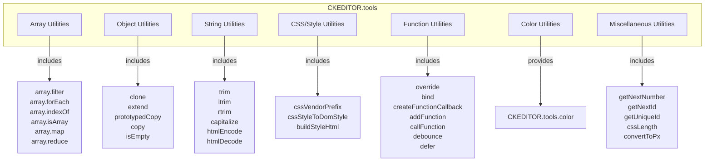
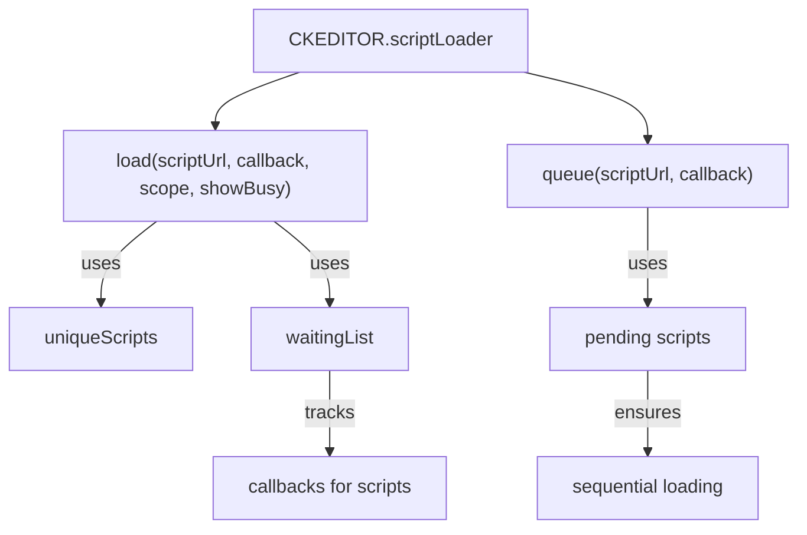
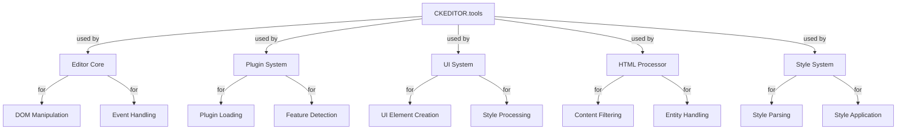

# Tools and Utilities

<details>
<summary>Relevant source files</summary>

The following files were used as context for generating this wiki page:

- [core/ckeditor_license-check.js](https://github.com/ckeditor/ckeditor4/blob/c7e59ec1/core/ckeditor_license-check.js)
- [core/loader.js](https://github.com/ckeditor/ckeditor4/blob/c7e59ec1/core/loader.js)
- [core/scriptloader.js](https://github.com/ckeditor/ckeditor4/blob/c7e59ec1/core/scriptloader.js)
- [core/tools.js](https://github.com/ckeditor/ckeditor4/blob/c7e59ec1/core/tools.js)
- [core/tools/color.js](https://github.com/ckeditor/ckeditor4/blob/c7e59ec1/core/tools/color.js)
- [tests/core/editable/keystrokes/delbackspacequirks/manual/nbspbackspacing.html](https://github.com/ckeditor/ckeditor4/blob/c7e59ec1/tests/core/editable/keystrokes/delbackspacequirks/manual/nbspbackspacing.html)
- [tests/core/editable/keystrokes/delbackspacequirks/manual/nbspbackspacing.md](https://github.com/ckeditor/ckeditor4/blob/c7e59ec1/tests/core/editable/keystrokes/delbackspacequirks/manual/nbspbackspacing.md)
- [tests/core/editable/keystrokes/delbackspacequirks/manual/nbspdeleting.html](https://github.com/ckeditor/ckeditor4/blob/c7e59ec1/tests/core/editable/keystrokes/delbackspacequirks/manual/nbspdeleting.html)
- [tests/core/editable/keystrokes/delbackspacequirks/manual/nbspdeleting.md](https://github.com/ckeditor/ckeditor4/blob/c7e59ec1/tests/core/editable/keystrokes/delbackspacequirks/manual/nbspdeleting.md)
- [tests/core/tools.js](https://github.com/ckeditor/ckeditor4/blob/c7e59ec1/tests/core/tools.js)
- [tests/core/tools/array.js](https://github.com/ckeditor/ckeditor4/blob/c7e59ec1/tests/core/tools/array.js)
- [tests/core/tools/manual/escapecss.html](https://github.com/ckeditor/ckeditor4/blob/c7e59ec1/tests/core/tools/manual/escapecss.html)
- [tests/core/tools/manual/escapecss.md](https://github.com/ckeditor/ckeditor4/blob/c7e59ec1/tests/core/tools/manual/escapecss.md)
- [tests/core/tools/style.js](https://github.com/ckeditor/ckeditor4/blob/c7e59ec1/tests/core/tools/style.js)
- [tests/plugins/table/manual/border.html](https://github.com/ckeditor/ckeditor4/blob/c7e59ec1/tests/plugins/table/manual/border.html)
- [tests/plugins/table/manual/border.md](https://github.com/ckeditor/ckeditor4/blob/c7e59ec1/tests/plugins/table/manual/border.md)
- [tests/plugins/uploadwidget/manual/escapecssuploadimage.html](https://github.com/ckeditor/ckeditor4/blob/c7e59ec1/tests/plugins/uploadwidget/manual/escapecssuploadimage.html)
- [tests/plugins/uploadwidget/manual/escapecssuploadimage.md](https://github.com/ckeditor/ckeditor4/blob/c7e59ec1/tests/plugins/uploadwidget/manual/escapecssuploadimage.md)
- [vendor/promise.js](https://github.com/ckeditor/ckeditor4/blob/c7e59ec1/vendor/promise.js)

</details>


The CKEditor 4 Tools and Utilities system provides a comprehensive set of helper functions that support the core editor functionality. This page documents the `CKEDITOR.tools` namespace, which contains various utility methods for array manipulation, object operations, string handling, style processing, function manipulation, and other common tasks.

For information about the Style System, which manages the creation and application of styles to content, see [Style System](#2.2).

## Overview

The Tools system serves as the utility library for CKEditor 4, providing reusable functions that are used throughout the codebase. It simplifies common operations and encourages code reuse.



Sources: [core/tools.js:125-1118](https://github.com/ckeditor/ckeditor4/blob/c7e59ec1/core/tools.js#L125-L1118), [core/tools/color.js:33-680](https://github.com/ckeditor/ckeditor4/blob/c7e59ec1/core/tools/color.js#L33-L680)

## Array Utilities

The Array utilities in CKEditor 4 provide methods to manipulate and work with arrays more efficiently.

### Key Array Methods

* `array.filter(array, fn, [thisArg])` - Creates a new array with elements that pass the filter function
* `array.forEach(array, fn, [thisArg])` - Executes a function on each array element
* `array.indexOf(array, value)` - Returns the first index of a value in an array
* `array.isArray(object)` - Checks if an object is an array
* `array.map(array, fn, [thisArg])` - Creates a new array with results of the function calls
* `array.reduce(array, fn, initial, [thisArg])` - Reduces array to a single value
* `array.every(array, fn, [thisArg])` - Checks if all elements pass the test
* `array.some(array, fn, [thisArg])` - Checks if at least one element passes the test
* `array.find(array, fn, [thisArg])` - Returns the first element that passes the test
* `array.unique(array)` - Returns a new array with duplicate values removed
* `arrayCompare(arrayA, arrayB)` - Compares two arrays for equality

Example usage of array utilities:

```javascript
// Filter an array
var filteredArray = CKEDITOR.tools.array.filter([0, 1, 2, 3], function(value) {
    return value >= 2;
}); // [2, 3]

// Find the index of an element
CKEDITOR.tools.getIndex([1, 2, 4, 3, 5], function(el) {
    return el >= 3;
}); // Returns 2 (index of element '4')
```

Sources: [core/tools.js:143-156](https://github.com/ckeditor/ckeditor4/blob/c7e59ec1/core/tools.js#L143-L156), [core/tools.js:170-176](https://github.com/ckeditor/ckeditor4/blob/c7e59ec1/core/tools.js#L170-L176), [core/tools.js:346-348](https://github.com/ckeditor/ckeditor4/blob/c7e59ec1/core/tools.js#L346-L348), [core/tools.js:766-781](https://github.com/ckeditor/ckeditor4/blob/c7e59ec1/core/tools.js#L766-L781), [tests/core/tools/array.js:1-246](https://github.com/ckeditor/ckeditor4/blob/c7e59ec1/tests/core/tools/array.js#L1-L246)

## Object Utilities

CKEditor 4 provides a set of utilities to manipulate objects efficiently.

### Key Object Methods

* `clone(object)` - Creates a deep copy of an object
* `extend(target, [source1, source2, ...], [overwrite], [properties])` - Extends one object with properties from others
* `prototypedCopy(source)` - Creates an object which is an instance of a class with a predefined prototype
* `copy(source)` - Makes a shallow copy of an object (faster than clone)
* `isEmpty(object)` - Checks if an object has no properties

Example usage:

```javascript
// Clone an object
var obj = { name: 'John', cars: { Mercedes: { color: 'blue' } } };
var clone = CKEDITOR.tools.clone(obj);
clone.cars.Mercedes.color = 'silver'; // Original object is not affected

// Extend an object
CKEDITOR.tools.extend(target, { prop1: 'value1' }, { prop2: 'value2' });
```

Sources: [core/tools.js:202-232](https://github.com/ckeditor/ckeditor4/blob/c7e59ec1/core/tools.js#L202-L232), [core/tools.js:274-300](https://github.com/ckeditor/ckeditor4/blob/c7e59ec1/core/tools.js#L274-L300), [core/tools.js:312-316](https://github.com/ckeditor/ckeditor4/blob/c7e59ec1/core/tools.js#L312-L316), [core/tools.js:327-335](https://github.com/ckeditor/ckeditor4/blob/c7e59ec1/core/tools.js#L327-L335), [core/tools.js:356-362](https://github.com/ckeditor/ckeditor4/blob/c7e59ec1/core/tools.js#L356-L362), [tests/core/tools.js:26-53](https://github.com/ckeditor/ckeditor4/blob/c7e59ec1/tests/core/tools.js#L26-L53), [tests/core/tools.js:170-225](https://github.com/ckeditor/ckeditor4/blob/c7e59ec1/tests/core/tools.js#L170-L225)

## String Utilities

CKEditor 4 provides several utilities for string manipulation.

### Key String Methods

* `trim(str)` - Removes spaces from the start and end of a string
* `ltrim(str)` - Removes spaces from the start of a string
* `rtrim(str)` - Removes spaces from the end of a string
* `capitalize(str, [keepCase])` - Turns the first letter of a string to upper-case
* `htmlEncode(text)` - Replaces special HTML characters with their entity equivalents
* `htmlDecode(text)` - Decodes HTML entities back to characters
* `htmlEncodeAttr(text)` - Encodes attributes for HTML elements
* `htmlDecodeAttr(text)` - Decodes attributes for HTML elements
* `transformPlainTextToHtml(text, enterMode)` - Transforms text to valid HTML

Example usage:

```javascript
// Capitalize a string
CKEDITOR.tools.capitalize('example'); // 'Example'
CKEDITOR.tools.capitalize('example', true); // 'Example'

// HTML encoding
CKEDITOR.tools.htmlEncode('<a & b>'); // '&lt;a &amp; b&gt;'
```

Sources: [core/tools.js:241-243](https://github.com/ckeditor/ckeditor4/blob/c7e59ec1/core/tools.js#L241-L243), [core/tools.js:708-714](https://github.com/ckeditor/ckeditor4/blob/c7e59ec1/core/tools.js#L708-L714), [core/tools.js:726-732](https://github.com/ckeditor/ckeditor4/blob/c7e59ec1/core/tools.js#L726-L732), [core/tools.js:744-750](https://github.com/ckeditor/ckeditor4/blob/c7e59ec1/core/tools.js#L744-L750), [core/tools.js:447-455](https://github.com/ckeditor/ckeditor4/blob/c7e59ec1/core/tools.js#L447-L455), [core/tools.js:467-474](https://github.com/ckeditor/ckeditor4/blob/c7e59ec1/core/tools.js#L467-L474), [core/tools.js:511-551](https://github.com/ckeditor/ckeditor4/blob/c7e59ec1/core/tools.js#L511-L551), [tests/core/tools.js:82-137](https://github.com/ckeditor/ckeditor4/blob/c7e59ec1/tests/core/tools.js#L82-L137)

## CSS and Style Utilities

CKEditor 4 provides several utilities for working with CSS and styles.

### Key CSS and Style Methods

* `cssVendorPrefix(property, value, [asString])` - Adds vendor-specific prefixes to CSS properties
* `cssStyleToDomStyle(cssName)` - Transforms CSS property names to their DOM style equivalents
* `buildStyleHtml(css)` - Builds a HTML snippet from style rules
* `cssLength(length)` - Ensures CSS lengths have a unit (px)
* `convertToPx(cssLength)` - Converts a CSS length value to pixels
* `normalizeCssText(styleText, [nativeNormalize])` - Normalizes CSS data to avoid differences in style attributes
* `convertRgbToHex(styleText)` - Converts RGB colors to hexadecimal notation

Example usage:

```javascript
// Add vendor prefixes
CKEDITOR.tools.cssVendorPrefix('border-radius', '0', true);
// On Firefox: '-moz-border-radius:0;border-radius:0'

// Format CSS length
CKEDITOR.tools.cssLength(42); // '42px'
CKEDITOR.tools.cssLength('42em'); // '42em'
```

Sources: [core/tools.js:376-385](https://github.com/ckeditor/ckeditor4/blob/c7e59ec1/core/tools.js#L376-L385), [core/tools.js:397-411](https://github.com/ckeditor/ckeditor4/blob/c7e59ec1/core/tools.js#L397-L411), [core/tools.js:420-436](https://github.com/ckeditor/ckeditor4/blob/c7e59ec1/core/tools.js#L420-L436), [core/tools.js:975-987](https://github.com/ckeditor/ckeditor4/blob/c7e59ec1/core/tools.js#L975-L987), [core/tools.js:1000-1035](https://github.com/ckeditor/ckeditor4/blob/c7e59ec1/core/tools.js#L1000-L1035), [core/tools.js:1107-1118](https://github.com/ckeditor/ckeditor4/blob/c7e59ec1/core/tools.js#L1107-L1118), [core/tools.js:1135-1143](https://github.com/ckeditor/ckeditor4/blob/c7e59ec1/core/tools.js#L1135-L1143), [tests/core/tools.js:306-328](https://github.com/ckeditor/ckeditor4/blob/c7e59ec1/tests/core/tools.js#L306-L328), [tests/core/tools.js:412-438](https://github.com/ckeditor/ckeditor4/blob/c7e59ec1/tests/core/tools.js#L412-L438)

## Function and Callback Utilities

The CKEditor 4 tools system provides several methods for function manipulation and callback management.

### Key Function Methods

* `override(originalFunction, functionBuilder)` - Creates a function override
* `bind(func, obj, [args])` - Creates a function bound to a specific context
* `createClass(definition)` - Creates a class with inheritance, static fields and private methods
* `defer(fn)` - Creates a function that will run after the call stack is empty
* `debounce(func, milliseconds)` - Creates a new debounced version of a function
* `throttle(minInterval, output, contextObj)` - Creates a throttle buffer
* `addFunction(fn, [scope])` - Adds a function for later execution via callFunction
* `callFunction(ref, params)` - Calls a function added via addFunction
* `setTimeout(func, milliseconds, [scope], [args], [ownerWindow])` - Executes a function after delay

Example usage:

```javascript
// Create a debounced function that runs at most once every 200ms
var debouncedFn = CKEDITOR.tools.debounce(function() {
    console.log('Update UI');
}, 200);

// Object-oriented class creation
var MyClass = CKEDITOR.tools.createClass({
    $: function(name) { // Constructor
        this._name = name;
    },
    proto: { // Prototype/instance methods
        getName: function() {
            return this._name;
        }
    }
});
```

Sources: [core/tools.js:619-623](https://github.com/ckeditor/ckeditor4/blob/c7e59ec1/core/tools.js#L619-L623), [core/tools.js:840-845](https://github.com/ckeditor/ckeditor4/blob/c7e59ec1/core/tools.js#L840-L845), [core/tools.js:859-909](https://github.com/ckeditor/ckeditor4/blob/c7e59ec1/core/tools.js#L859-L909), [core/tools.js:1090-1098](https://github.com/ckeditor/ckeditor4/blob/c7e59ec1/core/tools.js#L1090-L1098), [core/tools.js:668-683](https://github.com/ckeditor/ckeditor4/blob/c7e59ec1/core/tools.js#L668-L683), [core/tools.js:694-696](https://github.com/ckeditor/ckeditor4/blob/c7e59ec1/core/tools.js#L694-L696), [core/tools.js:927-931](https://github.com/ckeditor/ckeditor4/blob/c7e59ec1/core/tools.js#L927-L931), [core/tools.js:955-958](https://github.com/ckeditor/ckeditor4/blob/c7e59ec1/core/tools.js#L955-L958), [core/tools.js:643-656](https://github.com/ckeditor/ckeditor4/blob/c7e59ec1/core/tools.js#L643-L656), [tests/core/tools.js:236-244](https://github.com/ckeditor/ckeditor4/blob/c7e59ec1/tests/core/tools.js#L236-L244), [tests/core/tools.js:604-729](https://github.com/ckeditor/ckeditor4/blob/c7e59ec1/tests/core/tools.js#L604-L729), [tests/core/tools.js:244-304](https://github.com/ckeditor/ckeditor4/blob/c7e59ec1/tests/core/tools.js#L244-L304)

## Color Utilities

The `CKEDITOR.tools.color` class provides a comprehensive set of utilities for handling color formats, conversions, and validations.

```mermaid
classDiagram
    class CKEDITOR_tools_color {
        +String initialColorCode
        +Any defaultValue
        +getHex() String
        +getHexWithAlpha() String
        +getRgb() String
        +getRgba() String
        +getHsl() String
        +getHsla() String
        +getInitialValue() String
    }
    
    class CKEDITOR_tools_color_statics {
        +TYPE_RGB: 1
        +TYPE_HSL: 2
        +MAX_RGB_CHANNEL_VALUE: 255
        +MAX_ALPHA_CHANNEL_VALUE: 1
        +MAX_HUE_CHANNEL_VALUE: 360
        +MAX_SATURATION_LIGHTNESS_CHANNEL_VALUE: 1
        +hex3CharsRegExp: /#([0-9a-f]{3}$)/gim
        +hex4CharsRegExp: /#([0-9a-f]{4}$)/gim
        +hex6CharsRegExp: /#([0-9a-f]{6}$)/gim
        +hex8CharsRegExp: /#([0-9a-f]{8}$)/gim
        +rgbRegExp: /rgba?\(([^)]+)\)/i
        +hslRegExp: /hsla?\(([^)]+)\)/i
    }
    
    CKEDITOR_tools_color --|> CKEDITOR_tools_color_statics
```

The color class supports:
- Hexadecimal formats (3, 4, 6, and 8 character notation)
- RGB and RGBA formats
- HSL and HSLA formats
- Named color formats

Example usage:

```javascript
// Parse color and convert between formats
var color = new CKEDITOR.tools.color('rgb(225, 225, 225)');
console.log(color.getHex()); // '#FFFFFF'

var redColor = new CKEDITOR.tools.color('red');
console.log(redColor.getHexWithAlpha()); // '#FF0000FF'
```

Sources: [core/tools/color.js:33-680](https://github.com/ckeditor/ckeditor4/blob/c7e59ec1/core/tools/color.js#L33-L680)

## Miscellaneous Utilities

These are other utility functions that don't fit into the categories above.

### ID and Number Generation

* `getNextNumber()` - Gets a unique number for the current session
* `getNextId()` - Gets a unique ID for CKEditor interface elements ('cke_X')
* `getUniqueId()` - Gets a globally unique ID (UUID style)
* `getCsrfToken()` - Gets a token for CSRF protection

### Other Utilities

* `tryThese(fn1, fn2, ...)` - Returns the first successful execution result
* `checkIfAnyObjectPropertyMatches(obj, regexp)` - Checks if any property matches a pattern
* `checkIfAnyArrayItemMatches(array, regexp)` - Checks if any array item matches a pattern
* `genKey(...subKey)` - Generates a combined key from params
* `normalizeHex(hexColorCode)` - Normalizes hexadecimal color codes

Example usage:

```javascript
// Generate IDs
var id = CKEDITOR.tools.getNextId(); // e.g., 'cke_1'
var uuid = CKEDITOR.tools.getUniqueId(); // e.g., 'e5g6h7j8...'

// Try multiple functions until one succeeds
var result = CKEDITOR.tools.tryThese(
    function() { return riskyOperation1(); },
    function() { return fallbackOperation(); }
);
```

Sources: [core/tools.js:563-568](https://github.com/ckeditor/ckeditor4/blob/c7e59ec1/core/tools.js#L563-L568), [core/tools.js:579-581](https://github.com/ckeditor/ckeditor4/blob/c7e59ec1/core/tools.js#L579-L581), [core/tools.js:590-596](https://github.com/ckeditor/ckeditor4/blob/c7e59ec1/core/tools.js#L590-L596), [core/tools.js:1054-1065](https://github.com/ckeditor/ckeditor4/blob/c7e59ec1/core/tools.js#L1054-L1065), [core/tools.js:1076-1078](https://github.com/ckeditor/ckeditor4/blob/c7e59ec1/core/tools.js#L1076-L1078), [tests/core/tools.js:774-809](https://github.com/ckeditor/ckeditor4/blob/c7e59ec1/tests/core/tools.js#L774-L809)

## Script Loading Utilities

The tools system also includes utilities for loading scripts, via the `CKEDITOR.scriptLoader` object.



Key methods:

* `load(scriptUrl, callback, scope, showBusy)` - Loads one or more external scripts
* `queue(scriptUrl, callback)` - Loads a script in a queue, one at a time

Example usage:

```javascript
// Load a single script
CKEDITOR.scriptLoader.load('/myscript.js', function(success) {
    console.log('Script loaded: ' + success);
});

// Load multiple scripts
CKEDITOR.scriptLoader.load(['/script1.js', '/script2.js'], function(completed, failed) {
    console.log('Loaded: ' + completed.length + ', Failed: ' + failed.length);
});
```

Sources: [core/scriptloader.js:17-212](https://github.com/ckeditor/ckeditor4/blob/c7e59ec1/core/scriptloader.js#L17-L212)

## Integration with Other Systems

The tools system is fundamental to CKEditor 4 and integrates with various other systems in the codebase.



Sources: [core/tools.js:1-1118](https://github.com/ckeditor/ckeditor4/blob/c7e59ec1/core/tools.js#L1-L1118), [core/loader.js:21-98](https://github.com/ckeditor/ckeditor4/blob/c7e59ec1/core/loader.js#L21-L98), [core/ckeditor_license-check.js:16-235](https://github.com/ckeditor/ckeditor4/blob/c7e59ec1/core/ckeditor_license-check.js#L16-L235), [core/scriptloader.js:17-212](https://github.com/ckeditor/ckeditor4/blob/c7e59ec1/core/scriptloader.js#L17-L212)

## Performance Considerations

Several tools utilities are designed with performance in mind:

1. **Throttling and Debouncing** - The `throttle` and `debounce` functions help control execution frequency of expensive operations.

2. **Fast Object Copying** - The `copy` method provides fast shallow copying when deep cloning is not required.

3. **Cached Functionality** - Many utilities use closures to cache computational results:
   - `getNextNumber` maintains a counter
   - `cssStyleToDomStyle` caches CSS property name conversions

4. **Lazy Evaluation** - Some functions use immediate functions to initialize only once:
   - `trim`, `ltrim`, and `rtrim` compile regular expressions only once

Sources: [core/tools.js:668-683](https://github.com/ckeditor/ckeditor4/blob/c7e59ec1/core/tools.js#L668-L683), [core/tools.js:694-696](https://github.com/ckeditor/ckeditor4/blob/c7e59ec1/core/tools.js#L694-L696), [core/tools.js:327-335](https://github.com/ckeditor/ckeditor4/blob/c7e59ec1/core/tools.js#L327-L335), [core/tools.js:563-568](https://github.com/ckeditor/ckeditor4/blob/c7e59ec1/core/tools.js#L563-L568), [core/tools.js:708-714](https://github.com/ckeditor/ckeditor4/blob/c7e59ec1/core/tools.js#L708-L714), [core/tools.js:726-732](https://github.com/ckeditor/ckeditor4/blob/c7e59ec1/core/tools.js#L726-L732), [core/tools.js:744-750](https://github.com/ckeditor/ckeditor4/blob/c7e59ec1/core/tools.js#L744-L750)

## Browser Compatibility

The Tools system includes utilities that help manage browser differences:

1. **CSS Vendor Prefixing** - `cssVendorPrefix` adds browser-specific prefixes to CSS properties.

2. **CSS Property Normalization** - `cssStyleToDomStyle` handles differences in CSS property naming (e.g., 'float' vs 'cssFloat'/'styleFloat').

3. **Event Handling** - Several utilities help normalize event handling across browsers.

4. **CSS Escape** - The system provides a polyfill for CSS.escape in IE.

These utilities allow other parts of CKEditor to work consistently across different browsers without having to handle browser-specific code in multiple places.

Sources: [core/tools.js:376-385](https://github.com/ckeditor/ckeditor4/blob/c7e59ec1/core/tools.js#L376-L385), [core/tools.js:397-411](https://github.com/ckeditor/ckeditor4/blob/c7e59ec1/core/tools.js#L397-L411), [core/tools.js:44-113](https://github.com/ckeditor/ckeditor4/blob/c7e59ec1/core/tools.js#L44-L113)

## Summary

The CKEDITOR.tools namespace provides a rich set of utility functions that form the foundation of the CKEditor 4 codebase. These utilities handle common tasks like array manipulation, object operations, string handling, and DOM interactions, allowing the higher-level components to focus on their specific responsibilities.

By understanding and leveraging these utility functions, developers working with CKEditor 4 can write more efficient and maintainable code.