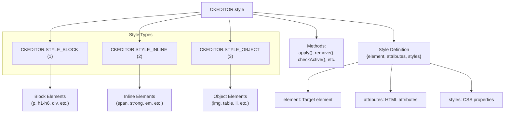
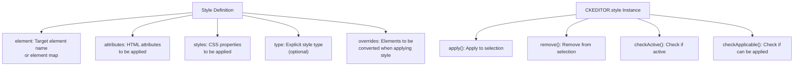
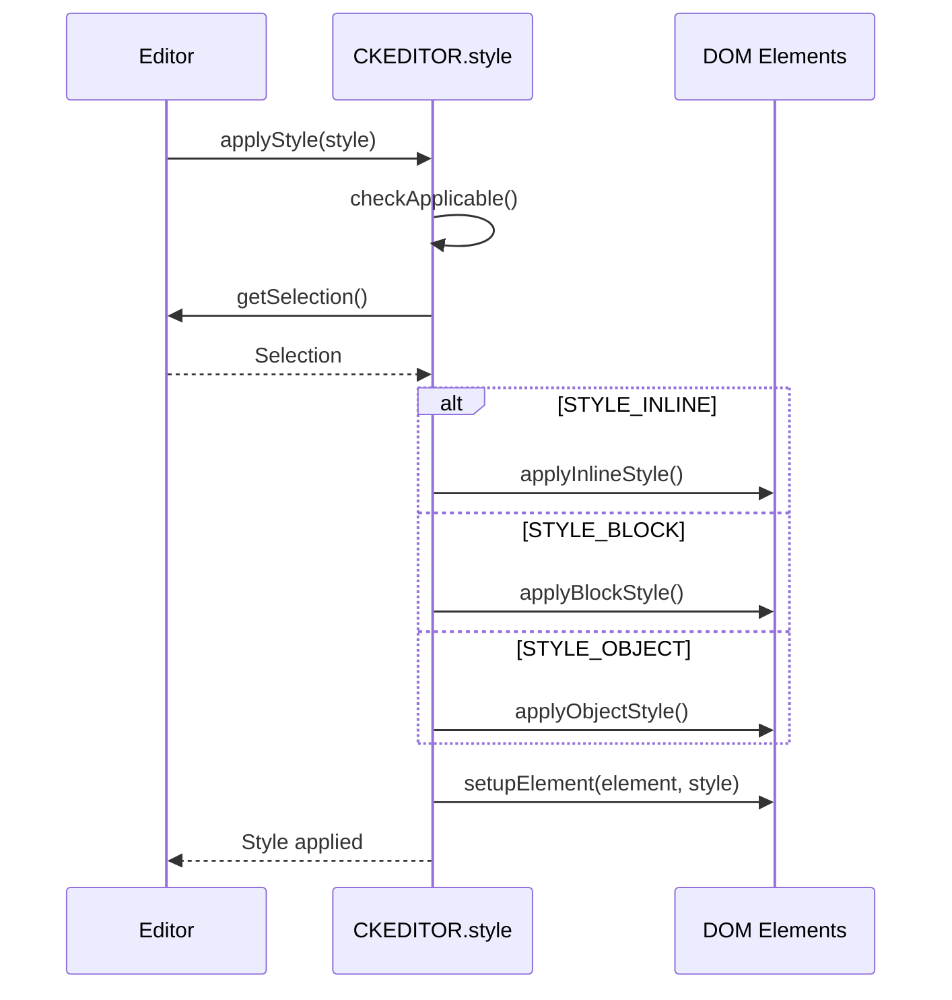
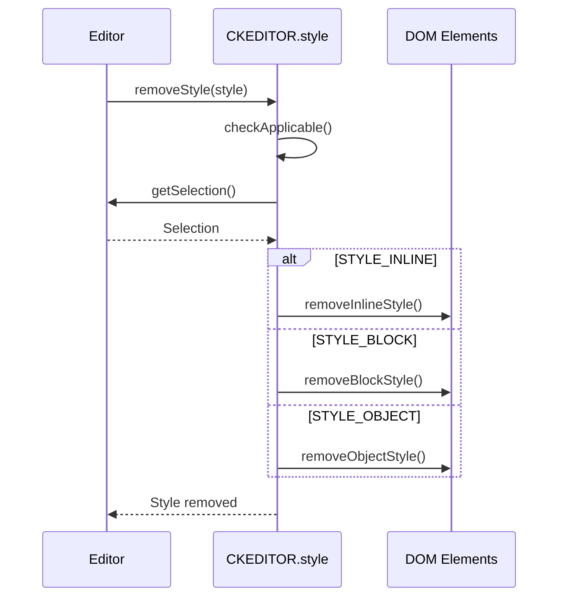
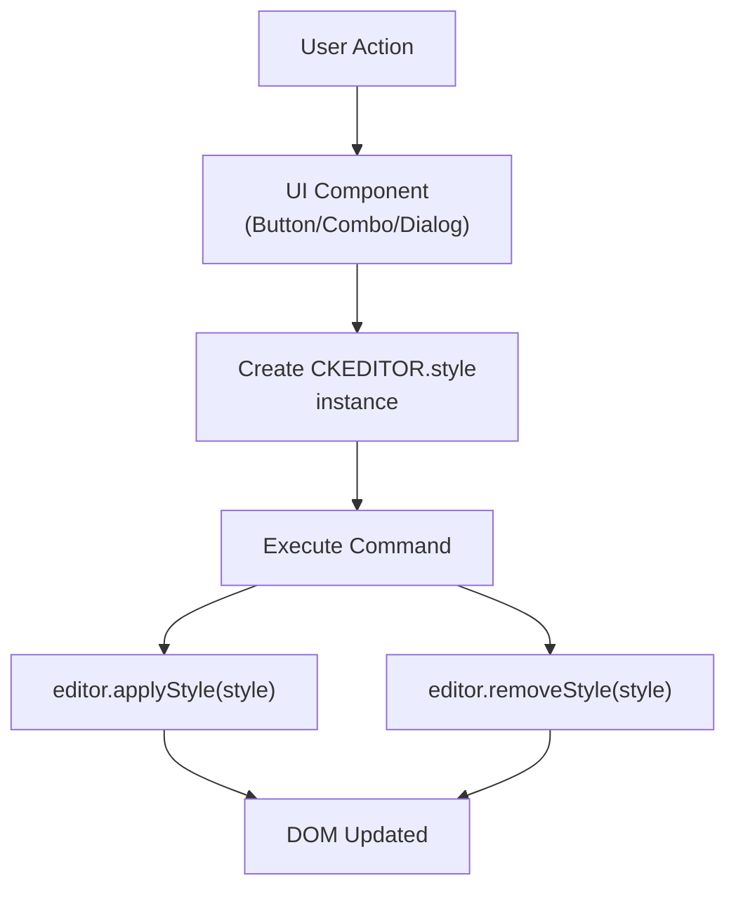
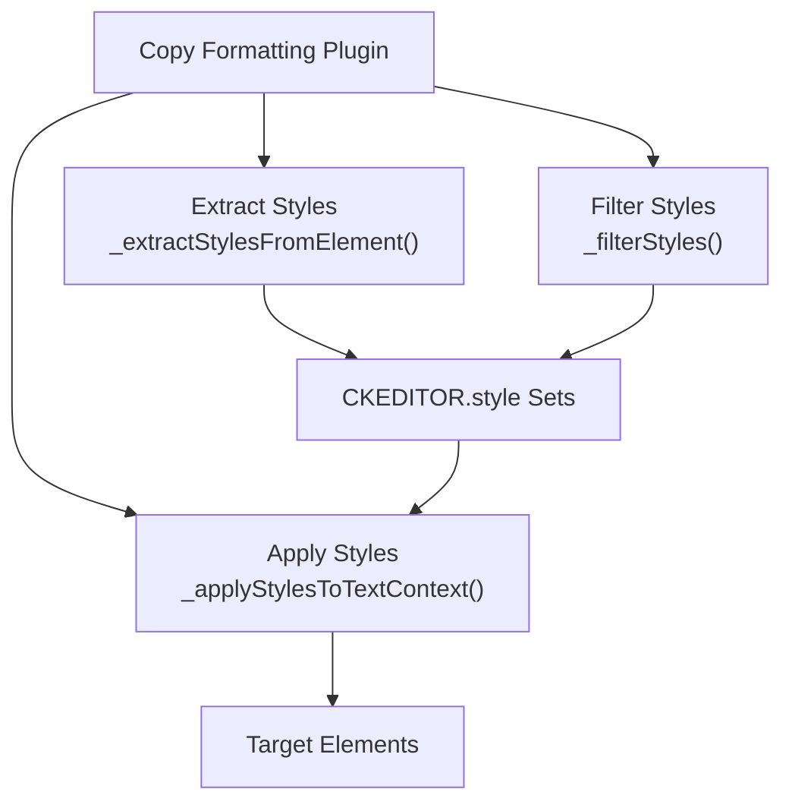

# Style System

<details>
<summary>Relevant source files</summary>

The following files were used as context for generating this wiki page:

- [core/style.js](https://github.com/ckeditor/ckeditor4/blob/c7e59ec1/core/style.js)
- [core/ui.js](https://github.com/ckeditor/ckeditor4/blob/c7e59ec1/core/ui.js)
- [plugins/button/plugin.js](https://github.com/ckeditor/ckeditor4/blob/c7e59ec1/plugins/button/plugin.js)
- [plugins/colorbutton/plugin.js](https://github.com/ckeditor/ckeditor4/blob/c7e59ec1/plugins/colorbutton/plugin.js)
- [plugins/colordialog/dialogs/colordialog.css](https://github.com/ckeditor/ckeditor4/blob/c7e59ec1/plugins/colordialog/dialogs/colordialog.css)
- [plugins/colordialog/dialogs/colordialog.js](https://github.com/ckeditor/ckeditor4/blob/c7e59ec1/plugins/colordialog/dialogs/colordialog.js)
- [plugins/colordialog/plugin.js](https://github.com/ckeditor/ckeditor4/blob/c7e59ec1/plugins/colordialog/plugin.js)
- [plugins/contextmenu/plugin.js](https://github.com/ckeditor/ckeditor4/blob/c7e59ec1/plugins/contextmenu/plugin.js)
- [plugins/copyformatting/icons/copyformatting.png](https://github.com/ckeditor/ckeditor4/blob/c7e59ec1/plugins/copyformatting/icons/copyformatting.png)
- [plugins/copyformatting/icons/hidpi/copyformatting.png](https://github.com/ckeditor/ckeditor4/blob/c7e59ec1/plugins/copyformatting/icons/hidpi/copyformatting.png)
- [plugins/copyformatting/lang/en.js](https://github.com/ckeditor/ckeditor4/blob/c7e59ec1/plugins/copyformatting/lang/en.js)
- [plugins/copyformatting/plugin.js](https://github.com/ckeditor/ckeditor4/blob/c7e59ec1/plugins/copyformatting/plugin.js)
- [plugins/copyformatting/styles/copyformatting.css](https://github.com/ckeditor/ckeditor4/blob/c7e59ec1/plugins/copyformatting/styles/copyformatting.css)
- [plugins/docprops/plugin.js](https://github.com/ckeditor/ckeditor4/blob/c7e59ec1/plugins/docprops/plugin.js)
- [plugins/elementspath/plugin.js](https://github.com/ckeditor/ckeditor4/blob/c7e59ec1/plugins/elementspath/plugin.js)
- [plugins/entities/plugin.js](https://github.com/ckeditor/ckeditor4/blob/c7e59ec1/plugins/entities/plugin.js)
- [plugins/floatingspace/plugin.js](https://github.com/ckeditor/ckeditor4/blob/c7e59ec1/plugins/floatingspace/plugin.js)
- [plugins/floatpanel/plugin.js](https://github.com/ckeditor/ckeditor4/blob/c7e59ec1/plugins/floatpanel/plugin.js)
- [plugins/font/plugin.js](https://github.com/ckeditor/ckeditor4/blob/c7e59ec1/plugins/font/plugin.js)
- [plugins/format/plugin.js](https://github.com/ckeditor/ckeditor4/blob/c7e59ec1/plugins/format/plugin.js)
- [plugins/htmlwriter/plugin.js](https://github.com/ckeditor/ckeditor4/blob/c7e59ec1/plugins/htmlwriter/plugin.js)
- [plugins/listblock/plugin.js](https://github.com/ckeditor/ckeditor4/blob/c7e59ec1/plugins/listblock/plugin.js)
- [plugins/menu/plugin.js](https://github.com/ckeditor/ckeditor4/blob/c7e59ec1/plugins/menu/plugin.js)
- [plugins/menubutton/plugin.js](https://github.com/ckeditor/ckeditor4/blob/c7e59ec1/plugins/menubutton/plugin.js)
- [plugins/panel/plugin.js](https://github.com/ckeditor/ckeditor4/blob/c7e59ec1/plugins/panel/plugin.js)
- [plugins/panelbutton/plugin.js](https://github.com/ckeditor/ckeditor4/blob/c7e59ec1/plugins/panelbutton/plugin.js)
- [plugins/richcombo/plugin.js](https://github.com/ckeditor/ckeditor4/blob/c7e59ec1/plugins/richcombo/plugin.js)
- [plugins/stylescombo/plugin.js](https://github.com/ckeditor/ckeditor4/blob/c7e59ec1/plugins/stylescombo/plugin.js)
- [plugins/stylesheetparser/plugin.js](https://github.com/ckeditor/ckeditor4/blob/c7e59ec1/plugins/stylesheetparser/plugin.js)
- [plugins/toolbar/plugin.js](https://github.com/ckeditor/ckeditor4/blob/c7e59ec1/plugins/toolbar/plugin.js)
- [tests/core/tools/isvalidcolorformat.js](https://github.com/ckeditor/ckeditor4/blob/c7e59ec1/tests/core/tools/isvalidcolorformat.js)
- [tests/plugins/colorbutton/colorcommand.js](https://github.com/ckeditor/ckeditor4/blob/c7e59ec1/tests/plugins/colorbutton/colorcommand.js)
- [tests/plugins/colorbutton/manual/_assets/customstyle.css](https://github.com/ckeditor/ckeditor4/blob/c7e59ec1/tests/plugins/colorbutton/manual/_assets/customstyle.css)
- [tests/plugins/colorbutton/manual/customstyle.html](https://github.com/ckeditor/ckeditor4/blob/c7e59ec1/tests/plugins/colorbutton/manual/customstyle.html)
- [tests/plugins/colorbutton/manual/customstyle.md](https://github.com/ckeditor/ckeditor4/blob/c7e59ec1/tests/plugins/colorbutton/manual/customstyle.md)
- [tests/plugins/copyformatting/_helpers/tools.js](https://github.com/ckeditor/ckeditor4/blob/c7e59ec1/tests/plugins/copyformatting/_helpers/tools.js)
- [tests/plugins/copyformatting/copyformatting.html](https://github.com/ckeditor/ckeditor4/blob/c7e59ec1/tests/plugins/copyformatting/copyformatting.html)
- [tests/plugins/copyformatting/copyformatting.js](https://github.com/ckeditor/ckeditor4/blob/c7e59ec1/tests/plugins/copyformatting/copyformatting.js)
- [tests/plugins/copyformatting/manual/copyformatting.html](https://github.com/ckeditor/ckeditor4/blob/c7e59ec1/tests/plugins/copyformatting/manual/copyformatting.html)
- [tests/plugins/copyformatting/manual/copyformatting.md](https://github.com/ckeditor/ckeditor4/blob/c7e59ec1/tests/plugins/copyformatting/manual/copyformatting.md)
- [tests/plugins/copyformatting/manual/keystroke.html](https://github.com/ckeditor/ckeditor4/blob/c7e59ec1/tests/plugins/copyformatting/manual/keystroke.html)
- [tests/plugins/copyformatting/manual/keystroke.md](https://github.com/ckeditor/ckeditor4/blob/c7e59ec1/tests/plugins/copyformatting/manual/keystroke.md)
- [tests/plugins/copyformatting/manual/links.html](https://github.com/ckeditor/ckeditor4/blob/c7e59ec1/tests/plugins/copyformatting/manual/links.html)
- [tests/plugins/copyformatting/manual/links.md](https://github.com/ckeditor/ckeditor4/blob/c7e59ec1/tests/plugins/copyformatting/manual/links.md)
- [tests/plugins/copyformatting/manual/sticky.html](https://github.com/ckeditor/ckeditor4/blob/c7e59ec1/tests/plugins/copyformatting/manual/sticky.html)
- [tests/plugins/copyformatting/manual/sticky.md](https://github.com/ckeditor/ckeditor4/blob/c7e59ec1/tests/plugins/copyformatting/manual/sticky.md)
- [tests/plugins/dialog/manual/multipleradiogroup.html](https://github.com/ckeditor/ckeditor4/blob/c7e59ec1/tests/plugins/dialog/manual/multipleradiogroup.html)
- [tests/plugins/dialog/manual/multipleradiogroup.md](https://github.com/ckeditor/ckeditor4/blob/c7e59ec1/tests/plugins/dialog/manual/multipleradiogroup.md)
- [tests/plugins/dialog/manual/multipleradiogroupwithtab.html](https://github.com/ckeditor/ckeditor4/blob/c7e59ec1/tests/plugins/dialog/manual/multipleradiogroupwithtab.html)
- [tests/plugins/dialog/manual/multipleradiogroupwithtab.md](https://github.com/ckeditor/ckeditor4/blob/c7e59ec1/tests/plugins/dialog/manual/multipleradiogroupwithtab.md)
- [tests/plugins/dialog/manual/radiogroupfocus.html](https://github.com/ckeditor/ckeditor4/blob/c7e59ec1/tests/plugins/dialog/manual/radiogroupfocus.html)
- [tests/plugins/dialog/manual/radiogroupfocus.md](https://github.com/ckeditor/ckeditor4/blob/c7e59ec1/tests/plugins/dialog/manual/radiogroupfocus.md)
- [tests/plugins/htmlwriter/htmlwriter.js](https://github.com/ckeditor/ckeditor4/blob/c7e59ec1/tests/plugins/htmlwriter/htmlwriter.js)
- [tests/plugins/widget/inlineeditables.js](https://github.com/ckeditor/ckeditor4/blob/c7e59ec1/tests/plugins/widget/inlineeditables.js)
- [tests/plugins/widget/manual/inlineeditable.html](https://github.com/ckeditor/ckeditor4/blob/c7e59ec1/tests/plugins/widget/manual/inlineeditable.html)
- [tests/plugins/widget/manual/inlineeditable.md](https://github.com/ckeditor/ckeditor4/blob/c7e59ec1/tests/plugins/widget/manual/inlineeditable.md)
- [tests/plugins/widget/manual/startupdata.html](https://github.com/ckeditor/ckeditor4/blob/c7e59ec1/tests/plugins/widget/manual/startupdata.html)
- [tests/plugins/widget/manual/startupdata.md](https://github.com/ckeditor/ckeditor4/blob/c7e59ec1/tests/plugins/widget/manual/startupdata.md)
- [tests/plugins/widget/widgetapi.js](https://github.com/ckeditor/ckeditor4/blob/c7e59ec1/tests/plugins/widget/widgetapi.js)

</details>


The Style System in CKEditor 4 provides a robust framework for creating, applying, managing, and removing styles from content in the editor. It serves as the foundation for many formatting features including font selection, color management, text formatting, and advanced copy-formatting functionality. This page explains the architecture and implementation of the style system.

For information about how specific UI components utilize the style system, see [Color and UI Elements](#5.2). For details about copy formatting, which heavily leverages the style system, see [Copy Formatting](#4.2).

## Style Types and Core Architecture

CKEditor 4 defines three fundamental style types that govern how styles are applied to different kinds of elements in the editor:



Sources: [core/style.js:17-39](https://github.com/ckeditor/ckeditor4/blob/c7e59ec1/core/style.js#L17-L39), [core/style.js:142-182](https://github.com/ckeditor/ckeditor4/blob/c7e59ec1/core/style.js#L142-L182)

The style type is determined automatically based on the target element, but can also be explicitly specified. The differentiation between types is crucial as it affects how styles are applied and removed from the content.

## Style Definition Structure

A style definition is an object that specifies what and how styles should be applied to content. 



Sources: [core/style.js:138-182](https://github.com/ckeditor/ckeditor4/blob/c7e59ec1/core/style.js#L138-L182), [core/style.js:184-544](https://github.com/ckeditor/ckeditor4/blob/c7e59ec1/core/style.js#L184-L544)

### Example Style Definitions

Here are examples of style definitions for different style types:

#### Inline Style (e.g., Bold Text)
```javascript
{
    element: 'strong',
    attributes: {},
    styles: {},
    type: CKEDITOR.STYLE_INLINE
}
```

#### Block Style (e.g., Heading)
```javascript
{
    element: 'h2',
    attributes: {},
    styles: {},
    type: CKEDITOR.STYLE_BLOCK
}
```

#### Object Style (e.g., Image with Border)
```javascript
{
    element: 'img',
    attributes: { 'class': 'bordered' },
    styles: { 'border': '2px solid #999' },
    type: CKEDITOR.STYLE_OBJECT
}
```

Sources: [plugins/font/plugin.js:451-457](https://github.com/ckeditor/ckeditor4/blob/c7e59ec1/plugins/font/plugin.js#L451-L457), [plugins/font/plugin.js:506-512](https://github.com/ckeditor/ckeditor4/blob/c7e59ec1/plugins/font/plugin.js#L506-L512), [plugins/format/plugin.js](https://github.com/ckeditor/ckeditor4/blob/c7e59ec1/plugins/format/plugin.js)

## Creating and Using Styles

The `CKEDITOR.style` constructor creates style instances that can be applied to or removed from content:

```javascript
// Create a style instance
var style = new CKEDITOR.style({
    element: 'span',
    attributes: { 'class': 'highlight' },
    styles: { 'background-color': 'yellow' }
});

// Apply style to current selection
editor.applyStyle(style);

// Remove style from current selection
editor.removeStyle(style);
```

Sources: [core/style.js:142-182](https://github.com/ckeditor/ckeditor4/blob/c7e59ec1/core/style.js#L142-L182), [core/style.js:199-247](https://github.com/ckeditor/ckeditor4/blob/c7e59ec1/core/style.js#L199-L247)

### Style Application Process

When a style is applied, the following process occurs:



Sources: [core/style.js:199-213](https://github.com/ckeditor/ckeditor4/blob/c7e59ec1/core/style.js#L199-L213), [core/style.js:262-271](https://github.com/ckeditor/ckeditor4/blob/c7e59ec1/core/style.js#L262-L271)

### Style Removal Process

Similarly, when a style is removed:



Sources: [core/style.js:229-247](https://github.com/ckeditor/ckeditor4/blob/c7e59ec1/core/style.js#L229-L247), [core/style.js:286-295](https://github.com/ckeditor/ckeditor4/blob/c7e59ec1/core/style.js#L286-L295)

## Integration with UI Components

The style system is integrated with various UI components to provide formatting options to users:

### Key UI Components Using Style System

| Component | Purpose | Style Type(s) Used | File Path |
|-----------|---------|-------------------|-----------|
| Font Plugin | Font family/size selection | INLINE | plugins/font/plugin.js |
| Color Button | Text/background color | INLINE | plugins/colorbutton/plugin.js |
| Format Plugin | Paragraph formats | BLOCK | plugins/format/plugin.js |
| Styles Combo | Predefined style sets | ALL | plugins/stylescombo/plugin.js |
| Copy Formatting | Copy styles between elements | ALL | plugins/copyformatting/plugin.js |

Sources: [plugins/font/plugin.js](https://github.com/ckeditor/ckeditor4/blob/c7e59ec1/plugins/font/plugin.js), [plugins/colorbutton/plugin.js](https://github.com/ckeditor/ckeditor4/blob/c7e59ec1/plugins/colorbutton/plugin.js), [plugins/format/plugin.js](https://github.com/ckeditor/ckeditor4/blob/c7e59ec1/plugins/format/plugin.js), [plugins/stylescombo/plugin.js](https://github.com/ckeditor/ckeditor4/blob/c7e59ec1/plugins/stylescombo/plugin.js), [plugins/copyformatting/plugin.js](https://github.com/ckeditor/ckeditor4/blob/c7e59ec1/plugins/copyformatting/plugin.js)

### Style Application via UI Components



Sources: [plugins/font/plugin.js:364-393](https://github.com/ckeditor/ckeditor4/blob/c7e59ec1/plugins/font/plugin.js#L364-L393), [plugins/colorbutton/plugin.js:17-476](https://github.com/ckeditor/ckeditor4/blob/c7e59ec1/plugins/colorbutton/plugin.js#L17-L476)

## Advanced Usage

### Variable Replacement in Style Definitions

The style system supports variable replacement in style definitions:

```javascript
// Style definition with variable
var styleDefinition = {
    element: 'span',
    styles: { 'font-size': '#(size)' }
};

// Create style with variable value
var style = new CKEDITOR.style(styleDefinition, { size: '14px' });
```

Sources: [core/style.js:155-160](https://github.com/ckeditor/ckeditor4/blob/c7e59ec1/core/style.js#L155-L160), [plugins/font/plugin.js:33-36](https://github.com/ckeditor/ckeditor4/blob/c7e59ec1/plugins/font/plugin.js#L33-L36)

### Custom Style Handlers

The style system can be extended with custom handlers for specialized styling needs:

```javascript
var customStyleHandler = CKEDITOR.style.addCustomHandler({
    type: 'myCustomType',
    // Custom implementation methods
    apply: function(editor) { /* custom apply logic */ },
    remove: function(editor) { /* custom remove logic */ }
});
```

Sources: [core/style.js:597-673](https://github.com/ckeditor/ckeditor4/blob/c7e59ec1/core/style.js#L597-L673)

### Style Override Mechanism

The style system can specify how existing elements should be transformed when a style is applied:

```javascript
{
    element: 'span',
    styles: { 'font-family': '#(family)' },
    overrides: [{
        element: 'font',
        attributes: { 'face': null }
    }]
}
```

This example shows how a `<font face="...">` element is converted to a `<span style="font-family:...">` element when the style is applied.

Sources: [plugins/font/plugin.js:451-457](https://github.com/ckeditor/ckeditor4/blob/c7e59ec1/plugins/font/plugin.js#L451-L457), [plugins/font/plugin.js:506-512](https://github.com/ckeditor/ckeditor4/blob/c7e59ec1/plugins/font/plugin.js#L506-L512)

## Style Checking and Element Matching

The style system provides methods to check if a style:
- Is active in the current selection (`checkActive()`)
- Can be applied to the current selection (`checkApplicable()`)
- Matches a specific element (`checkElementMatch()`)
- Can be removed from a specific element (`checkElementRemovable()`)

```javascript
if (style.checkActive(editor.elementPath(), editor)) {
    // Style is already active in the selection
}

if (style.checkApplicable(editor.elementPath(), editor)) {
    // Style can be applied to the selection
}
```

Sources: [core/style.js:323-350](https://github.com/ckeditor/ckeditor4/blob/c7e59ec1/core/style.js#L323-L350), [core/style.js:365-381](https://github.com/ckeditor/ckeditor4/blob/c7e59ec1/core/style.js#L365-L381), [core/style.js:394-434](https://github.com/ckeditor/ckeditor4/blob/c7e59ec1/core/style.js#L394-L434), [core/style.js:448-486](https://github.com/ckeditor/ckeditor4/blob/c7e59ec1/core/style.js#L448-L486)

## Style System Configuration

CKEditor 4 provides various configuration options to customize the style system behavior:

| Configuration | Description | Default Value |
|---------------|-------------|---------------|
| `config.font_style` | Font name style definition | `{ element: 'span', styles: { 'font-family': '#(family)' }, overrides: [{ element: 'font', attributes: { 'face': null } }] }` |
| `config.fontSize_style` | Font size style definition | `{ element: 'span', styles: { 'font-size': '#(size)' }, overrides: [{ element: 'font', attributes: { 'size': null } }] }` |
| `config.colorButton_foreStyle` | Text color style definition | `{ element: 'span', styles: { 'color': '#(color)' }, overrides: [{ element: 'font', attributes: { 'color': null } }] }` |
| `config.colorButton_backStyle` | Background color style definition | `{ element: 'span', styles: { 'background-color': '#(color)' } }` |

Sources: [plugins/font/plugin.js:451-457](https://github.com/ckeditor/ckeditor4/blob/c7e59ec1/plugins/font/plugin.js#L451-L457), [plugins/font/plugin.js:506-512](https://github.com/ckeditor/ckeditor4/blob/c7e59ec1/plugins/font/plugin.js#L506-L512), [plugins/colorbutton/plugin.js:911-917](https://github.com/ckeditor/ckeditor4/blob/c7e59ec1/plugins/colorbutton/plugin.js#L911-L917), [plugins/colorbutton/plugin.js:946-949](https://github.com/ckeditor/ckeditor4/blob/c7e59ec1/plugins/colorbutton/plugin.js#L946-L949)

## Style System and Content Filtering

The style system integrates with CKEditor's Advanced Content Filter (ACF) to ensure only allowed styles are applied:

```javascript
// Check if style is allowed by the filter
if (editor.filter.check(style)) {
    // Style is allowed
    editor.applyStyle(style);
}
```

The filter can be configured to allow or disallow specific styles, ensuring content integrity and security.

Sources: [core/style.js:365-381](https://github.com/ckeditor/ckeditor4/blob/c7e59ec1/core/style.js#L365-L381), [plugins/copyformatting/plugin.js:161-163](https://github.com/ckeditor/ckeditor4/blob/c7e59ec1/plugins/copyformatting/plugin.js#L161-L163)

## Style System Integration with Copy Formatting

The Copy Formatting plugin makes extensive use of the style system to extract, process, and apply styles between different elements:



The Copy Formatting plugin demonstrates the flexibility of the style system, showing how styles can be programmatically extracted, processed, and applied across different contexts.