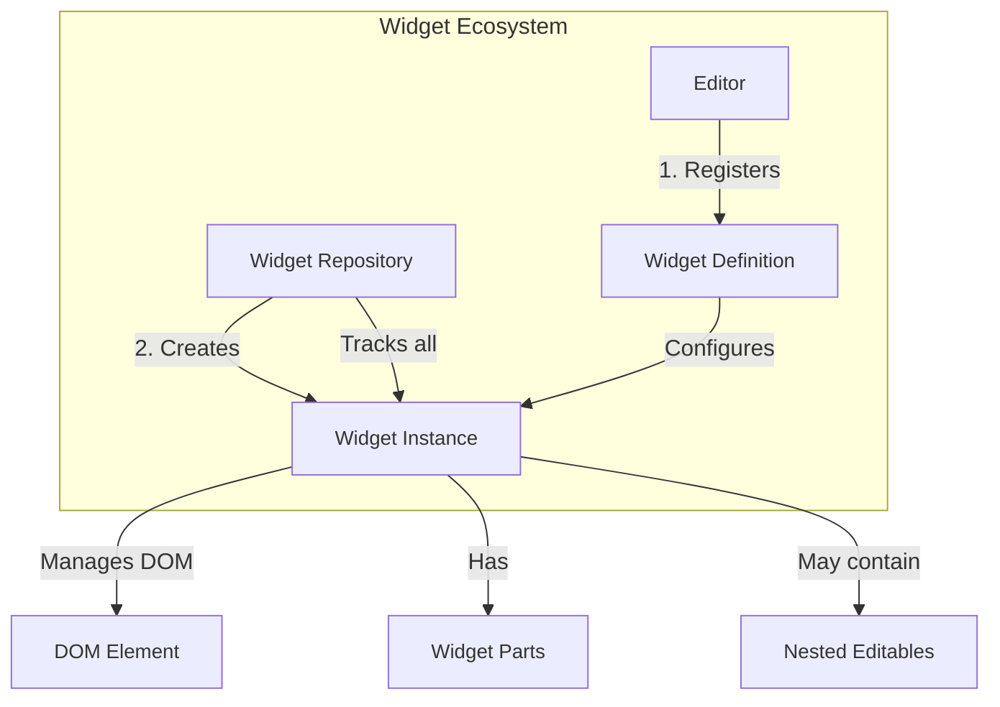
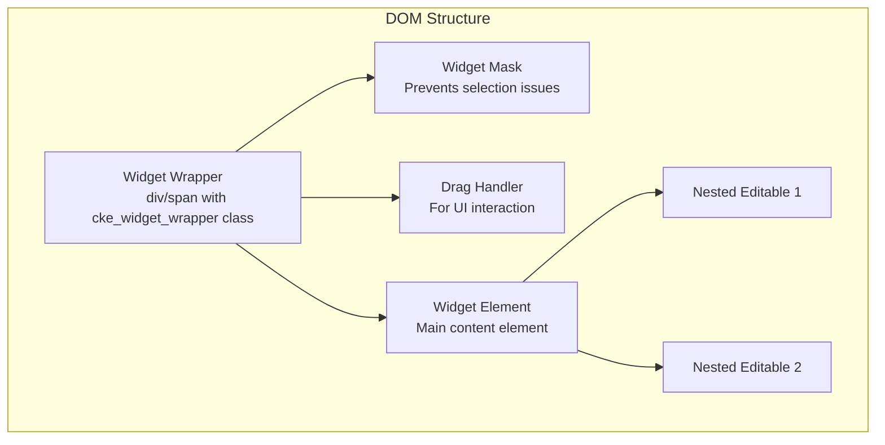
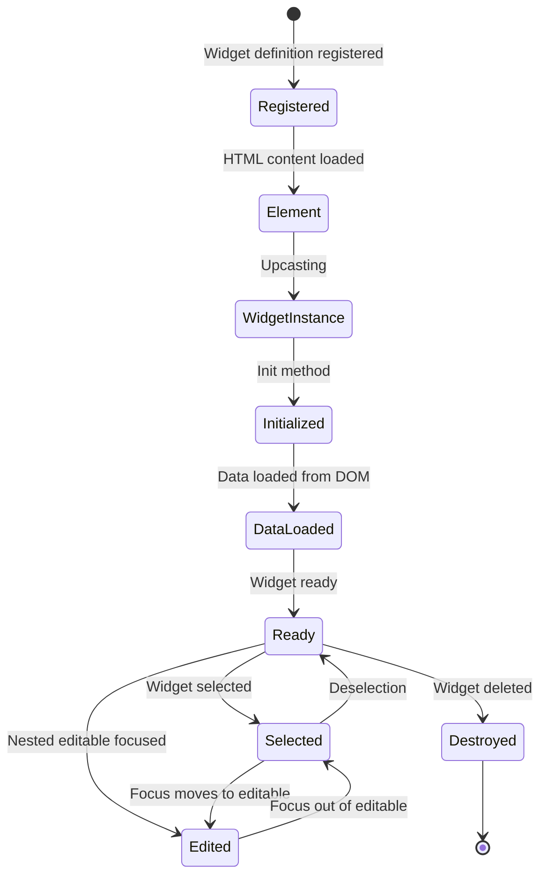
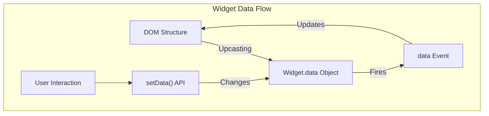
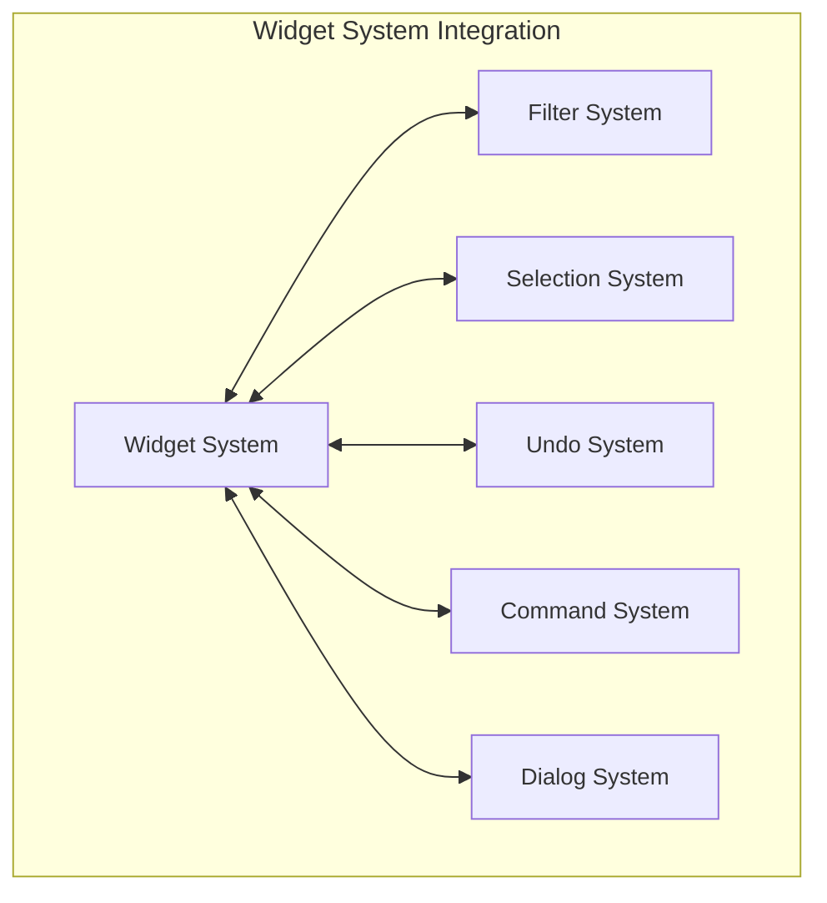

# Widget System

<details>
<summary>Relevant source files</summary>

The following files were used as context for generating this wiki page:

- [core/ckeditor.js](https://github.com/ckeditor/ckeditor4/blob/c7e59ec1/core/ckeditor.js)
- [core/config.js](https://github.com/ckeditor/ckeditor4/blob/c7e59ec1/core/config.js)
- [core/creators/inline.js](https://github.com/ckeditor/ckeditor4/blob/c7e59ec1/core/creators/inline.js)
- [core/creators/themedui.js](https://github.com/ckeditor/ckeditor4/blob/c7e59ec1/core/creators/themedui.js)
- [core/dom/document.js](https://github.com/ckeditor/ckeditor4/blob/c7e59ec1/core/dom/document.js)
- [core/dom/element.js](https://github.com/ckeditor/ckeditor4/blob/c7e59ec1/core/dom/element.js)
- [core/dom/range.js](https://github.com/ckeditor/ckeditor4/blob/c7e59ec1/core/dom/range.js)
- [core/dom/walker.js](https://github.com/ckeditor/ckeditor4/blob/c7e59ec1/core/dom/walker.js)
- [core/editable.js](https://github.com/ckeditor/ckeditor4/blob/c7e59ec1/core/editable.js)
- [core/editor.js](https://github.com/ckeditor/ckeditor4/blob/c7e59ec1/core/editor.js)
- [core/filter.js](https://github.com/ckeditor/ckeditor4/blob/c7e59ec1/core/filter.js)
- [core/htmldataprocessor.js](https://github.com/ckeditor/ckeditor4/blob/c7e59ec1/core/htmldataprocessor.js)
- [core/htmlparser/basicwriter.js](https://github.com/ckeditor/ckeditor4/blob/c7e59ec1/core/htmlparser/basicwriter.js)
- [core/htmlparser/cdata.js](https://github.com/ckeditor/ckeditor4/blob/c7e59ec1/core/htmlparser/cdata.js)
- [core/htmlparser/comment.js](https://github.com/ckeditor/ckeditor4/blob/c7e59ec1/core/htmlparser/comment.js)
- [core/htmlparser/element.js](https://github.com/ckeditor/ckeditor4/blob/c7e59ec1/core/htmlparser/element.js)
- [core/htmlparser/filter.js](https://github.com/ckeditor/ckeditor4/blob/c7e59ec1/core/htmlparser/filter.js)
- [core/htmlparser/filterRulesDefinition.js](https://github.com/ckeditor/ckeditor4/blob/c7e59ec1/core/htmlparser/filterRulesDefinition.js)
- [core/htmlparser/fragment.js](https://github.com/ckeditor/ckeditor4/blob/c7e59ec1/core/htmlparser/fragment.js)
- [core/htmlparser/nameTransformRule.js](https://github.com/ckeditor/ckeditor4/blob/c7e59ec1/core/htmlparser/nameTransformRule.js)
- [core/htmlparser/node.js](https://github.com/ckeditor/ckeditor4/blob/c7e59ec1/core/htmlparser/node.js)
- [core/htmlparser/text.js](https://github.com/ckeditor/ckeditor4/blob/c7e59ec1/core/htmlparser/text.js)
- [core/selection.js](https://github.com/ckeditor/ckeditor4/blob/c7e59ec1/core/selection.js)
- [plugins/widget/plugin.js](https://github.com/ckeditor/ckeditor4/blob/c7e59ec1/plugins/widget/plugin.js)
- [plugins/wysiwygarea/plugin.js](https://github.com/ckeditor/ckeditor4/blob/c7e59ec1/plugins/wysiwygarea/plugin.js)
- [tests/core/dom/range/movetoeditable.js](https://github.com/ckeditor/ckeditor4/blob/c7e59ec1/tests/core/dom/range/movetoeditable.js)

</details>


The Widget System is one of the core frameworks in CKEditor 4, providing a comprehensive infrastructure for managing complex content objects within the editor. Unlike simple text content, widgets encapsulate intricate HTML structures and provide a unified way to interact with them, enabling features like drag-and-drop, resizing, focused editing, and data transformations.

If you're looking for information about specific widget implementations like images or equations, see [Image Widgets](#3.1).

## Overview of the Widget System

The Widget System provides an abstraction layer to handle complex editable elements as single objects while preserving their internal structure. It solves several problems that occur when working with rich content in contenteditable areas, such as:

- Selection consistency and focus management
- Unified drag-and-drop behavior 
- Protection of widget structure from accidental modifications
- Nested editability (editable areas inside non-editable containers)
- Simplified data model for complex DOM structures



Sources: [plugins/widget/plugin.js:129-209](https://github.com/ckeditor/ckeditor4/blob/c7e59ec1/plugins/widget/plugin.js#L129-L209), [plugins/widget/plugin.js:796-986](https://github.com/ckeditor/ckeditor4/blob/c7e59ec1/plugins/widget/plugin.js#L796-L986)

## Core Components

The Widget System consists of three main components that work together:

### Widget Repository

The `CKEDITOR.plugins.widget.repository` class is the central management system for all widgets in an editor instance. It maintains references to all widget definitions and instances, handles widget initialization, and manages widget selection.

Each editor has exactly one repository instance available as `editor.widgets`. The repository is responsible for:

- Registering widget definitions
- Creating widget instances
- Tracking all active widget instances
- Converting DOM elements to widgets
- Handling widget selection

```javascript
// Example of accessing the widget repository
var repository = editor.widgets;
var widgetDefinition = repository.registered.widgetName;
var widgetInstance = repository.instances[widgetId];
```

Sources: [plugins/widget/plugin.js:140-209](https://github.com/ckeditor/ckeditor4/blob/c7e59ec1/plugins/widget/plugin.js#L140-L209). [plugins/widget/plugin.js:211-269](https://github.com/ckeditor/ckeditor4/blob/c7e59ec1/plugins/widget/plugin.js#L211-L269)

### Widget Definition

Widget definitions are configuration objects that specify how a particular type of widget should behave. They define:

- The name of the widget
- How to identify elements that should be turned into widgets (upcasting)
- How to convert widgets back to raw HTML (downcasting)
- The template for creating new widget instances
- Event handlers for various widget operations
- Editable areas within the widget

Widget definitions are registered with the repository using the `editor.widgets.add()` method:

```javascript
editor.widgets.add('simplebox', {
    // Widget must have a template to be inserted
    template: '<div class="simplebox"><h2 class="simplebox-title">Title</h2><div class="simplebox-content"></div></div>',
    
    // Recognize elements that should become this widget
    upcast: function(element) {
        return element.hasClass('simplebox');
    },
    
    // Initialize widget parts
    init: function() {
        // Define editable areas within the widget
        this.initEditable('title', {
            selector: '.simplebox-title'
        });
        this.initEditable('content', {
            selector: '.simplebox-content'
        });
    }
});
```

Sources: [plugins/widget/plugin.js:796-986](https://github.com/ckeditor/ckeditor4/blob/c7e59ec1/plugins/widget/plugin.js#L796-L986). [plugins/widget/plugin.js:211-269](https://github.com/ckeditor/ckeditor4/blob/c7e59ec1/plugins/widget/plugin.js#L211-L269)

### Widget Instance

Instances of the `CKEDITOR.plugins.widget` class represent individual widgets within the editor. Each instance is associated with a specific DOM element and manages its behavior.

Widget instances provide:

- Access to the widget's DOM element and wrapper
- Management of the widget's data model
- APIs for interacting with nested editables
- Event handling for widget operations
- Focus and selection management

```mermaid
classDiagram
    class Widget {
        +element: CKEDITOR.dom.element
        +wrapper: CKEDITOR.dom.element
        +data: Object
        +parts: Object
        +editables: Object
        +name: String
        +inline: Boolean
        +ready: Boolean
        +data(): void
        +destroy(): void
        +edit(): void
        +focus(): void
        +setData(): void
    }
    
    class WidgetRepository {
        +registered: Object
        +instances: Object
        +selected: Array
        +focused: Widget
        +add(): Widget
        +destroy(): void
        +initOn(): Widget
        +del(): void
        +checkWidgets(): void
    }
    
    WidgetRepository --> Widget : manages
    Widget --> Widget : nested widgets
    
    classDef default font-size:14px;
```

Sources: [plugins/widget/plugin.js:796-986](https://github.com/ckeditor/ckeditor4/blob/c7e59ec1/plugins/widget/plugin.js#L796-L986). [plugins/widget/plugin.js:1046-1066](https://github.com/ckeditor/ckeditor4/blob/c7e59ec1/plugins/widget/plugin.js#L1046-L1066)

## Widget Structure and DOM Representation

A widget in the DOM consists of several key elements:

### Widget Wrapper

Every widget is wrapped in a container element (either a `<div>` or `<span>` depending on whether it's an inline or block widget). This wrapper has:
- A `cke_widget_wrapper` class
- A `data-cke-widget-id` attribute to identify the widget instance
- Additional helper elements for UI features (like drag handler)

### Widget Element

The widget element is the actual DOM element that represents the widget's content, nested inside the wrapper. This element:
- Has a `data-widget` attribute with the widget name
- Contains the actual widget content and structure
- May contain nested editable areas

### Nested Editables

Widgets can define areas inside them that remain editable while the rest of the widget structure is protected. These areas:
- Have a `data-cke-widget-editable` attribute
- Can be focused and edited independently
- Maintain their own editing context within the widget



Sources: [plugins/widget/plugin.js:25-89](https://github.com/ckeditor/ckeditor4/blob/c7e59ec1/plugins/widget/plugin.js#L25-L89). [plugins/widget/plugin.js:665-749](https://github.com/ckeditor/ckeditor4/blob/c7e59ec1/plugins/widget/plugin.js#L665-L749)

## Widget Lifecycle

The lifecycle of a widget encompasses several phases from creation to destruction:

### Initialization and Creation

1. **Registration**: Widget definition is registered using `editor.widgets.add()`
2. **Upcasting**: Matching elements in the content are identified during editor data loading
3. **Instantiation**: DOM elements are wrapped and widget instances are created
4. **Initialization**: The `init()` method is called and parts and editables are set up
5. **Data Loading**: The widget's data model is populated from DOM attributes and structures
6. **Ready State**: The widget fires the `ready` event when fully initialized

### Widget Selection and Focus

1. **Selection**: Clicking a widget selects it (multiple widgets can be selected)
2. **Focus**: A single widget can have focus at a time, indicated by selection styling
3. **Nested Editable Focus**: When a nested editable is focused, the parent widget tracks this state

### Widget Destruction

1. **Manual Deletion**: Using the Delete/Backspace keys or the `editor.widgets.del()` method
2. **Content Filtering**: When content is filtered out by editor rules
3. **Editor Destruction**: When the editor instance is destroyed



Sources: [plugins/widget/plugin.js:861-1044](https://github.com/ckeditor/ckeditor4/blob/c7e59ec1/plugins/widget/plugin.js#L861-L1044). [plugins/widget/plugin.js:339-382](https://github.com/ckeditor/ckeditor4/blob/c7e59ec1/plugins/widget/plugin.js#L339-L382). [plugins/widget/plugin.js:375-422](https://github.com/ckeditor/ckeditor4/blob/c7e59ec1/plugins/widget/plugin.js#L375-L422)

## Widget Data Management

Widgets maintain a separation between their visual representation in the DOM and their logical data model:

### Data Model

- The widget's data is stored in the `widget.data` object
- Data properties can be set with the `setData()` method
- Changes to data trigger the `data` event
- Custom widget implementations typically implement a translation between data properties and DOM structure

### Data Transformation Flow

1. The DOM structure is translated to data properties during initialization
2. Changes to data via `setData()` update the widget's DOM representation
3. When the editor saves content, the widget's data is saved as part of the HTML output



Sources: [plugins/widget/plugin.js:861-911](https://github.com/ckeditor/ckeditor4/blob/c7e59ec1/plugins/widget/plugin.js#L861-L911). [plugins/widget/plugin.js:1046-1066](https://github.com/ckeditor/ckeditor4/blob/c7e59ec1/plugins/widget/plugin.js#L1046-L1066)

## Widget Selection and Focus

The Widget System implements a specialized selection mechanism that works alongside the native browser selection:

### Selection Types

1. **Widget Selection**: Clicking on a widget selects it as a whole unit
2. **Nested Editable Selection**: Clicking inside a nested editable area focuses that area
3. **Fake Selection**: When multiple widgets are selected, a "fake" selection is created

### Focus Management

- A selected widget gets a visual indicator through CSS
- Only one widget can have focus at a time
- The `editor.widgets.focused` property tracks the focused widget
- The `editor.widgets.selected` array tracks all selected widgets

```javascript
// Check if a widget has focus
if (editor.widgets.focused && editor.widgets.focused.name === 'myWidget') {
    // Do something with the focused widget
}

// Process all selected widgets
editor.widgets.selected.forEach(function(widget) {
    // Process each selected widget
});
```

Sources: [plugins/widget/plugin.js:174-187](https://github.com/ckeditor/ckeditor4/blob/c7e59ec1/plugins/widget/plugin.js#L174-L187). [plugins/widget/plugin.js:290-320](https://github.com/ckeditor/ckeditor4/blob/c7e59ec1/plugins/widget/plugin.js#L290-L320). [core/selection.js:84-162](https://github.com/ckeditor/ckeditor4/blob/c7e59ec1/core/selection.js#L84-L162)

## Widget Event System

Widgets have their own event system that's used to handle various lifecycle and interaction events:

### Key Widget Events

| Event Name | Description |
|------------|-------------|
| `ready` | Fired when a widget is fully initialized |
| `data` | Fired when widget data changes |
| `edit` | Fired when a widget enters edit mode |
| `dialog` | Fired when a widget's dialog is requested |
| `focus` | Fired when a widget receives focus |
| `blur` | Fired when a widget loses focus |
| `destroy` | Fired when a widget is being destroyed |

### Listening for Widget Events

```javascript
// In widget definition
editor.widgets.add('myWidget', {
    init: function() {
        // Listen to the widget's own events
        this.on('focus', function() {
            console.log('Widget focused');
        });
    }
});

// Listen to events from all widgets of a specific type
editor.widgets.onWidget('myWidget', 'data', function() {
    console.log('myWidget data changed');
});
```

Sources: [plugins/widget/plugin.js:584-623](https://github.com/ckeditor/ckeditor4/blob/c7e59ec1/plugins/widget/plugin.js#L584-L623). [plugins/widget/plugin.js:1028-1044](https://github.com/ckeditor/ckeditor4/blob/c7e59ec1/plugins/widget/plugin.js#L1028-L1044)

## Nested Editables

One of the most powerful features of the Widget System is the ability to define editable areas within an otherwise protected widget structure:

### Defining Nested Editables

Nested editables are defined in the widget's `init()` method using the `initEditable()` method:

```javascript
init: function() {
    this.initEditable('title', {
        selector: '.title-area',
        allowedContent: 'strong em'  // Restrict content in this editable
    });
    
    this.initEditable('content', {
        selector: '.content-area'
    });
}
```

### Nested Editable Features

- Each nested editable can have its own content filtering rules
- Focus can be moved between nested editables using keyboard navigation
- Nested editables can be made read-only independently of the widget
- The parent widget tracks which nested editable has focus

Sources: [plugins/widget/plugin.js:959-962](https://github.com/ckeditor/ckeditor4/blob/c7e59ec1/plugins/widget/plugin.js#L959-L962). [core/editable.js:67-118](https://github.com/ckeditor/ckeditor4/blob/c7e59ec1/core/editable.js#L67-L118)

## Widget Commands and UI Integration

Widgets typically provide commands that can be used to insert or edit them:

### Widget Commands

When a widget definition is registered, a command with the same name is automatically created that:
- Inserts a new widget instance when executed
- Opens the widget's dialog (if defined) when a widget is selected
- Can be used to programmatically insert or edit widgets

### Dialog Integration

Widgets can define a dialog to configure their properties:

```javascript
editor.widgets.add('myWidget', {
    dialog: 'myWidget',  // Name of the dialog to open
    
    // Automatically updates widget when dialog saves
    data: function() {
        // Update widget DOM based on this.data
    }
});
```

Sources: [plugins/widget/plugin.js:227-265](https://github.com/ckeditor/ckeditor4/blob/c7e59ec1/plugins/widget/plugin.js#L227-L265). [plugins/widget/plugin.js:435-470](https://github.com/ckeditor/ckeditor4/blob/c7e59ec1/plugins/widget/plugin.js#L435-L470)

## Creating Custom Widgets

Creating a custom widget involves several key steps:

### Basic Widget Definition Structure

```javascript
CKEDITOR.plugins.add('myCustomWidget', {
    requires: 'widget',
    
    init: function(editor) {
        editor.widgets.add('myWidget', {
            // Widget name used for command creation
            
            // Template for inserting new widgets
            template: '<div class="my-widget"><h2 class="title"></h2><div class="content"></div></div>',
            
            // Button definition (requires plugin 'button')
            button: 'Create My Widget',
            
            // Dialog definition (requires plugin 'dialog')
            dialog: 'myWidget',
            
            // Widget upcasting - convert elements to widgets
            upcast: function(element) {
                return element.hasClass('my-widget');
            },
            
            // Initialize the widget
            init: function() {
                // Define widget parts for easy access
                this.parts = {
                    title: this.element.findOne('.title'),
                    content: this.element.findOne('.content')
                };
                
                // Define nested editables
                this.initEditable('title', {
                    selector: '.title'
                });
                
                this.initEditable('content', {
                    selector: '.content'
                });
            },
            
            // Handle data changes
            data: function() {
                if (this.data.title) {
                    this.parts.title.setText(this.data.title);
                }
            }
        });
    }
});
```

### Upcasting and Downcasting

- **Upcasting**: Converting HTML elements to widget instances during editor loading
- **Downcasting**: Converting widget instances back to HTML when retrieving editor data

```javascript
// Upcast example
upcast: function(element, data) {
    // Check if this element should be converted to a widget
    if (element.hasClass('my-component')) {
        // Optionally extract data from the element
        data.title = element.findOne('.title').getText();
        return true; // Convert to widget
    }
    return false; // Don't convert
},

// Downcast example (less common, as the default behavior works for most cases)
downcast: function(element) {
    // Customize how the widget is serialized
    element.removeClass('some-editing-class');
    return element;
}
```

Sources: [plugins/widget/plugin.js:796-986](https://github.com/ckeditor/ckeditor4/blob/c7e59ec1/plugins/widget/plugin.js#L796-L986). [plugins/widget/plugin.js:211-269](https://github.com/ckeditor/ckeditor4/blob/c7e59ec1/plugins/widget/plugin.js#L211-L269)

## Integration with Editor Subsystems

The Widget System integrates with several other CKEditor subsystems:

### Integration with Editor Filter

- Widgets can define allowed content rules
- Nested editables can have their own content filtering rules
- Filter integration ensures stability of widget structure

### Integration with Selection System

- Custom selection behavior for widget elements
- Fake selection for multiple widget selection
- Integration with keyboard navigation

### Integration with Undo/Redo System

- Widget operations are tracked in the undo stack
- Undo/redo maintains widget integrity



Sources: [plugins/widget/plugin.js:93-127](https://github.com/ckeditor/ckeditor4/blob/c7e59ec1/plugins/widget/plugin.js#L93-L127). [core/selection.js:84-162](https://github.com/ckeditor/ckeditor4/blob/c7e59ec1/core/selection.js#L84-L162). [plugins/widget/plugin.js:125-127](https://github.com/ckeditor/ckeditor4/blob/c7e59ec1/plugins/widget/plugin.js#L125-L127)

## Advanced Widget Features

### Drag and Drop

Widgets support drag and drop functionality through:
- A drag handler icon shown when hovering widgets
- Protected drag operations that maintain widget integrity
- Support for repositioning widgets within the editor

### Widget Templates

Widgets can define templates for creating new instances:
- Templates are processed using `CKEDITOR.template`
- Template placeholders can be populated with default values
- Templates ensure consistent widget structure

### Widget Mask

Widgets use a mask element to:
- Prevent unwanted selection within the widget
- Enable proper drag-and-drop behavior
- Ensure focus management works correctly

Sources: [plugins/widget/plugin.js:48-73](https://github.com/ckeditor/ckeditor4/blob/c7e59ec1/plugins/widget/plugin.js#L48-L73). [plugins/widget/plugin.js:238-241](https://github.com/ckeditor/ckeditor4/blob/c7e59ec1/plugins/widget/plugin.js#L238-L241)

## Troubleshooting and Best Practices

### Common Widget Issues

1. **Widget not recognized during upcasting**
   - Ensure the `upcast` function correctly identifies elements
   - Check that required plugins are loaded

2. **Widget structure breaks during editing**
   - Review content filtering rules
   - Ensure proper nesting of editable areas

3. **Widgets not saving data correctly**
   - Implement proper data handling in the `data` method
   - Verify downcasting behavior

### Best Practices

1. Use widget parts system for accessing elements rather than DOM traversal
2. Clearly define allowed content for nested editables
3. Implement proper data model synchronization
4. Use widget focus events rather than DOM events when possible
5. Leverage the repository for widget management operations

Sources: [plugins/widget/plugin.js:93-127](https://github.com/ckeditor/ckeditor4/blob/c7e59ec1/plugins/widget/plugin.js#L93-L127). [plugins/widget/plugin.js:796-986](https://github.com/ckeditor/ckeditor4/blob/c7e59ec1/plugins/widget/plugin.js#L796-L986)

## Summary

The Widget System provides a powerful framework for creating complex content objects within CKEditor 4. By encapsulating DOM structures as manageable entities, it enables rich editing experiences that would be difficult to achieve with raw HTML editing.

Key advantages of the Widget System include:
- Unified handling of complex content structures
- Protection of content integrity
- Flexible nested editability
- Consistent user interaction model
- Robust selection and focus management