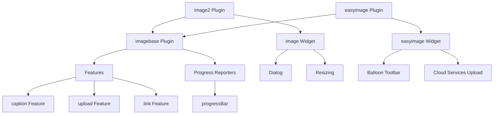
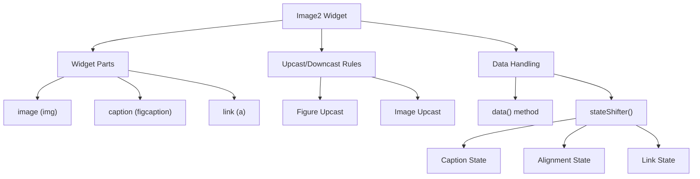
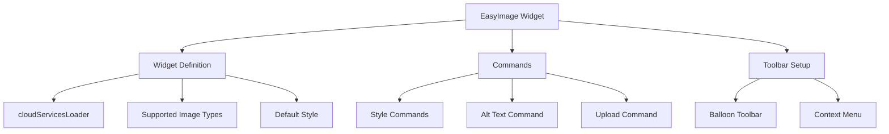
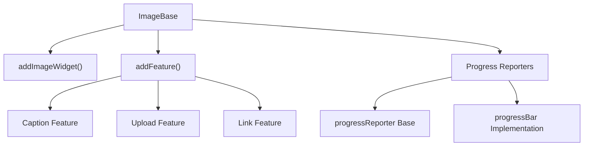
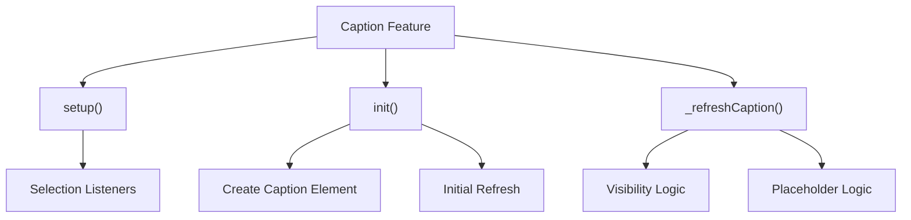
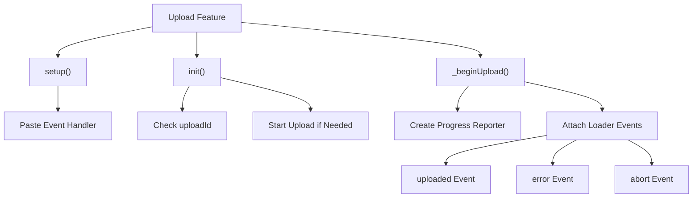
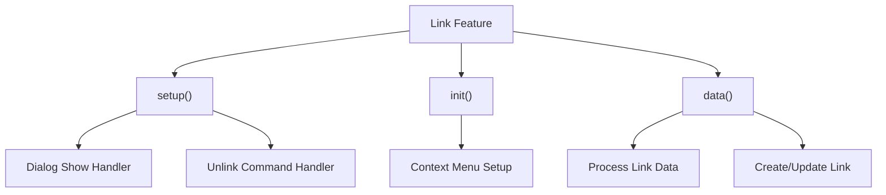
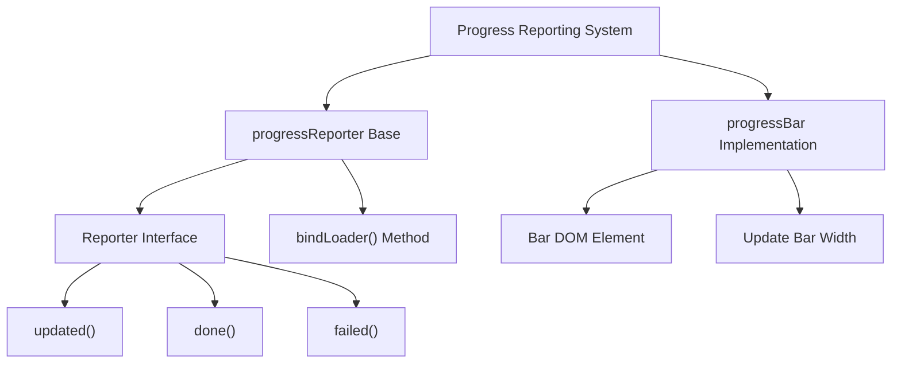
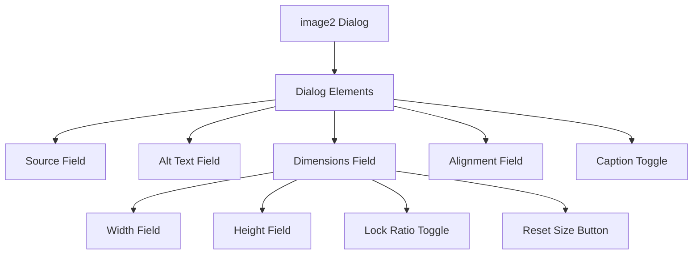

# Image Widgets

<details>
<summary>Relevant source files</summary>

The following files were used as context for generating this wiki page:

- [core/env.js](https://github.com/ckeditor/ckeditor4/blob/c7e59ec1/core/env.js)
- [plugins/easyimage/plugin.js](https://github.com/ckeditor/ckeditor4/blob/c7e59ec1/plugins/easyimage/plugin.js)
- [plugins/image2/dev/image2.html](https://github.com/ckeditor/ckeditor4/blob/c7e59ec1/plugins/image2/dev/image2.html)
- [plugins/image2/dialogs/image2.js](https://github.com/ckeditor/ckeditor4/blob/c7e59ec1/plugins/image2/dialogs/image2.js)
- [plugins/image2/lang/en.js](https://github.com/ckeditor/ckeditor4/blob/c7e59ec1/plugins/image2/lang/en.js)
- [plugins/image2/plugin.js](https://github.com/ckeditor/ckeditor4/blob/c7e59ec1/plugins/image2/plugin.js)
- [plugins/image2/samples/image2.html](https://github.com/ckeditor/ckeditor4/blob/c7e59ec1/plugins/image2/samples/image2.html)
- [plugins/imagebase/lang/en.js](https://github.com/ckeditor/ckeditor4/blob/c7e59ec1/plugins/imagebase/lang/en.js)
- [plugins/imagebase/plugin.js](https://github.com/ckeditor/ckeditor4/blob/c7e59ec1/plugins/imagebase/plugin.js)
- [plugins/imagebase/styles/imagebase.css](https://github.com/ckeditor/ckeditor4/blob/c7e59ec1/plugins/imagebase/styles/imagebase.css)
- [plugins/lineutils/dev/dnd.html](https://github.com/ckeditor/ckeditor4/blob/c7e59ec1/plugins/lineutils/dev/dnd.html)
- [plugins/lineutils/dev/magicfinger.html](https://github.com/ckeditor/ckeditor4/blob/c7e59ec1/plugins/lineutils/dev/magicfinger.html)
- [plugins/mathjax/dev/mathjax.html](https://github.com/ckeditor/ckeditor4/blob/c7e59ec1/plugins/mathjax/dev/mathjax.html)
- [plugins/mathjax/dialogs/mathjax.js](https://github.com/ckeditor/ckeditor4/blob/c7e59ec1/plugins/mathjax/dialogs/mathjax.js)
- [plugins/mathjax/icons/hidpi/mathjax.png](https://github.com/ckeditor/ckeditor4/blob/c7e59ec1/plugins/mathjax/icons/hidpi/mathjax.png)
- [plugins/mathjax/icons/mathjax.png](https://github.com/ckeditor/ckeditor4/blob/c7e59ec1/plugins/mathjax/icons/mathjax.png)
- [plugins/mathjax/lang/en.js](https://github.com/ckeditor/ckeditor4/blob/c7e59ec1/plugins/mathjax/lang/en.js)
- [plugins/mathjax/plugin.js](https://github.com/ckeditor/ckeditor4/blob/c7e59ec1/plugins/mathjax/plugin.js)
- [plugins/mathjax/samples/mathjax.html](https://github.com/ckeditor/ckeditor4/blob/c7e59ec1/plugins/mathjax/samples/mathjax.html)
- [plugins/placeholder/lang/en.js](https://github.com/ckeditor/ckeditor4/blob/c7e59ec1/plugins/placeholder/lang/en.js)
- [plugins/placeholder/plugin.js](https://github.com/ckeditor/ckeditor4/blob/c7e59ec1/plugins/placeholder/plugin.js)
- [tests/plugins/easyimage/_helpers/tools.js](https://github.com/ckeditor/ckeditor4/blob/c7e59ec1/tests/plugins/easyimage/_helpers/tools.js)
- [tests/plugins/easyimage/manual/_assets/progress.css](https://github.com/ckeditor/ckeditor4/blob/c7e59ec1/tests/plugins/easyimage/manual/_assets/progress.css)
- [tests/plugins/easyimage/manual/customprogressbar.html](https://github.com/ckeditor/ckeditor4/blob/c7e59ec1/tests/plugins/easyimage/manual/customprogressbar.html)
- [tests/plugins/easyimage/manual/imagestretch.html](https://github.com/ckeditor/ckeditor4/blob/c7e59ec1/tests/plugins/easyimage/manual/imagestretch.html)
- [tests/plugins/easyimage/manual/pastefromword.html](https://github.com/ckeditor/ckeditor4/blob/c7e59ec1/tests/plugins/easyimage/manual/pastefromword.html)
- [tests/plugins/easyimage/manual/progressbar.html](https://github.com/ckeditor/ckeditor4/blob/c7e59ec1/tests/plugins/easyimage/manual/progressbar.html)
- [tests/plugins/easyimage/manual/removeafterpaste.html](https://github.com/ckeditor/ckeditor4/blob/c7e59ec1/tests/plugins/easyimage/manual/removeafterpaste.html)
- [tests/plugins/easyimage/manual/undo.html](https://github.com/ckeditor/ckeditor4/blob/c7e59ec1/tests/plugins/easyimage/manual/undo.html)
- [tests/plugins/easyimage/manual/undo.md](https://github.com/ckeditor/ckeditor4/blob/c7e59ec1/tests/plugins/easyimage/manual/undo.md)
- [tests/plugins/easyimage/manual/upload.html](https://github.com/ckeditor/ckeditor4/blob/c7e59ec1/tests/plugins/easyimage/manual/upload.html)
- [tests/plugins/easyimage/uploadintegrations.html](https://github.com/ckeditor/ckeditor4/blob/c7e59ec1/tests/plugins/easyimage/uploadintegrations.html)
- [tests/plugins/easyimage/uploadintegrations.js](https://github.com/ckeditor/ckeditor4/blob/c7e59ec1/tests/plugins/easyimage/uploadintegrations.js)
- [tests/plugins/imagebase/features/_helpers/tools.js](https://github.com/ckeditor/ckeditor4/blob/c7e59ec1/tests/plugins/imagebase/features/_helpers/tools.js)
- [tests/plugins/imagebase/features/caption.html](https://github.com/ckeditor/ckeditor4/blob/c7e59ec1/tests/plugins/imagebase/features/caption.html)
- [tests/plugins/imagebase/features/caption.js](https://github.com/ckeditor/ckeditor4/blob/c7e59ec1/tests/plugins/imagebase/features/caption.js)
- [tests/plugins/imagebase/features/manual/captionafterpaste.html](https://github.com/ckeditor/ckeditor4/blob/c7e59ec1/tests/plugins/imagebase/features/manual/captionafterpaste.html)
- [tests/plugins/imagebase/features/manual/captionafterpaste.md](https://github.com/ckeditor/ckeditor4/blob/c7e59ec1/tests/plugins/imagebase/features/manual/captionafterpaste.md)
- [tests/plugins/imagebase/features/manual/captionemptyplaceholder.html](https://github.com/ckeditor/ckeditor4/blob/c7e59ec1/tests/plugins/imagebase/features/manual/captionemptyplaceholder.html)
- [tests/plugins/imagebase/features/manual/captionemptyplaceholder.md](https://github.com/ckeditor/ckeditor4/blob/c7e59ec1/tests/plugins/imagebase/features/manual/captionemptyplaceholder.md)
- [tests/plugins/imagebase/features/manual/upload.html](https://github.com/ckeditor/ckeditor4/blob/c7e59ec1/tests/plugins/imagebase/features/manual/upload.html)
- [tests/plugins/imagebase/features/manual/upload.md](https://github.com/ckeditor/ckeditor4/blob/c7e59ec1/tests/plugins/imagebase/features/manual/upload.md)
- [tests/plugins/imagebase/features/manual/uploadsimple.html](https://github.com/ckeditor/ckeditor4/blob/c7e59ec1/tests/plugins/imagebase/features/manual/uploadsimple.html)
- [tests/plugins/imagebase/features/manual/uploadsimple.md](https://github.com/ckeditor/ckeditor4/blob/c7e59ec1/tests/plugins/imagebase/features/manual/uploadsimple.md)
- [tests/plugins/imagebase/features/upload.js](https://github.com/ckeditor/ckeditor4/blob/c7e59ec1/tests/plugins/imagebase/features/upload.js)
- [tests/plugins/imagebase/manual/progressbar.html](https://github.com/ckeditor/ckeditor4/blob/c7e59ec1/tests/plugins/imagebase/manual/progressbar.html)
- [tests/plugins/imagebase/manual/progressbar.md](https://github.com/ckeditor/ckeditor4/blob/c7e59ec1/tests/plugins/imagebase/manual/progressbar.md)
- [tests/plugins/imagebase/manual/progressbarrtl.html](https://github.com/ckeditor/ckeditor4/blob/c7e59ec1/tests/plugins/imagebase/manual/progressbarrtl.html)
- [tests/plugins/imagebase/manual/progressbarrtl.md](https://github.com/ckeditor/ckeditor4/blob/c7e59ec1/tests/plugins/imagebase/manual/progressbarrtl.md)
- [tests/plugins/imagebase/progressbar.html](https://github.com/ckeditor/ckeditor4/blob/c7e59ec1/tests/plugins/imagebase/progressbar.html)
- [tests/plugins/imagebase/progressbar.js](https://github.com/ckeditor/ckeditor4/blob/c7e59ec1/tests/plugins/imagebase/progressbar.js)

</details>


Image Widgets in CKEditor 4 provide a comprehensive framework for embedding, editing, and managing images within the editor. This document covers the two main image widget implementations - Image2 and EasyImage - along with the common foundation they're built upon.

For information about the broader Widget system, see [Widget System](#3). For image upload handling, see [Clipboard and Content Processing](#4).

## Overview

CKEditor 4 offers two primary image widget implementations:

1. **Image2** (`image2` plugin) - The standard image widget that provides captioning, alignment, and resizing capabilities
2. **EasyImage** (`easyimage` plugin) - A more modern implementation with improved upload handling and simplified UI

Both are built on the **ImageBase** (`imagebase` plugin) foundation, which provides a common architecture for implementing image widget features.



Sources: [plugins/image2/plugin.js](https://github.com/ckeditor/ckeditor4/blob/c7e59ec1/plugins/image2/plugin.js). [plugins/easyimage/plugin.js](https://github.com/ckeditor/ckeditor4/blob/c7e59ec1/plugins/easyimage/plugin.js). [plugins/imagebase/plugin.js](https://github.com/ckeditor/ckeditor4/blob/c7e59ec1/plugins/imagebase/plugin.js).

## Key Components

### Image2 Widget

The Image2 widget is the standard implementation that handles images with the following features:

- Captioning (using `<figcaption>`)
- Alignment options (left, right, center)
- Resizing with aspect ratio locking
- Alt text management
- Caption visibility based on focus state



Sources: [plugins/image2/plugin.js:19-133](https://github.com/ckeditor/ckeditor4/blob/c7e59ec1/plugins/image2/plugin.js#L19-L133). [plugins/image2/plugin.js:227-509](https://github.com/ckeditor/ckeditor4/blob/c7e59ec1/plugins/image2/plugin.js#L227-L509).

#### Widget States

The Image2 widget handles multiple states with different DOM structures:

**Non-captioned widget:** 
- Simple `` or wrapped in a link/alignment element
- Can have different alignments using CSS float or alignment classes

**Captioned widget:**
- Uses `<figure>` with `` and `<figcaption>`
- Alignment applied to the figure element

The widget automatically transforms between these states when configuration changes.

Sources: [plugins/image2/plugin.js:135-223](https://github.com/ckeditor/ckeditor4/blob/c7e59ec1/plugins/image2/plugin.js#L135-L223). [plugins/image2/plugin.js:517-753](https://github.com/ckeditor/ckeditor4/blob/c7e59ec1/plugins/image2/plugin.js#L517-L753).

### EasyImage Widget

The EasyImage widget provides a modern approach to image handling with:

- Integration with cloud services for uploads
- Simplified balloon toolbar UI
- Customizable styles
- Improved handling of responsive images (srcset)
- Progress reporting during uploads



Sources: [plugins/easyimage/plugin.js:231-397](https://github.com/ckeditor/ckeditor4/blob/c7e59ec1/plugins/easyimage/plugin.js#L231-L397). [plugins/easyimage/plugin.js:519-586](https://github.com/ckeditor/ckeditor4/blob/c7e59ec1/plugins/easyimage/plugin.js#L519-L586).

### ImageBase Foundation

Both image widgets are built on the ImageBase foundation, which provides:

- Common widget definition structure
- Feature system for extending widgets
- Progress reporting for uploads



Sources: [plugins/imagebase/plugin.js:626-710](https://github.com/ckeditor/ckeditor4/blob/c7e59ec1/plugins/imagebase/plugin.js#L626-L710). [plugins/imagebase/plugin.js:726-848](https://github.com/ckeditor/ckeditor4/blob/c7e59ec1/plugins/imagebase/plugin.js#L726-L848).

## Core Features

### Caption Feature

The Caption feature allows adding editable text descriptions below images:

- Automatically creates a `<figcaption>` element 
- Shows/hides caption based on focus state
- Provides placeholder text for empty captions
- Makes captions permanently visible once they contain content



Sources: [plugins/imagebase/plugin.js:512-617](https://github.com/ckeditor/ckeditor4/blob/c7e59ec1/plugins/imagebase/plugin.js#L512-L617). [tests/plugins/imagebase/features/caption.js](https://github.com/ckeditor/ckeditor4/blob/c7e59ec1/tests/plugins/imagebase/features/caption.js).

### Upload Feature

The Upload feature manages file uploads and progress reporting:

- Handles paste and drop events for images
- Integrates with CKEditor's file upload system
- Provides progress reporting during uploads
- Manages success/failure states



Sources: [plugins/imagebase/plugin.js:229-511](https://github.com/ckeditor/ckeditor4/blob/c7e59ec1/plugins/imagebase/plugin.js#L229-L511). [tests/plugins/imagebase/features/upload.js](https://github.com/ckeditor/ckeditor4/blob/c7e59ec1/tests/plugins/imagebase/features/upload.js). [tests/plugins/easyimage/uploadintegrations.js](https://github.com/ckeditor/ckeditor4/blob/c7e59ec1/tests/plugins/easyimage/uploadintegrations.js).

### Link Feature

The Link feature enables linking images to URLs:

- Integrates with CKEditor's Link plugin
- Modifies link dialog to work with image widgets
- Handles creating and removing links around images
- Integrates with context menu



Sources: [plugins/imagebase/plugin.js:54-227](https://github.com/ckeditor/ckeditor4/blob/c7e59ec1/plugins/imagebase/plugin.js#L54-L227).

## Progress Reporting

The progress reporting system provides visual feedback during uploads:



Sources: [plugins/imagebase/plugin.js:726-848](https://github.com/ckeditor/ckeditor4/blob/c7e59ec1/plugins/imagebase/plugin.js#L726-L848). [tests/plugins/imagebase/progressbar.js](https://github.com/ckeditor/ckeditor4/blob/c7e59ec1/tests/plugins/imagebase/progressbar.js).

## Dialog Integration

The Image2 widget provides a comprehensive dialog for configuration:



The dialog provides:
- Image source URL input with browse server option
- Alt text field
- Width/height controls with aspect ratio locking
- Alignment options (none, left, center, right)
- Caption toggle checkbox

Sources: [plugins/image2/dialogs/image2.js:12-556](https://github.com/ckeditor/ckeditor4/blob/c7e59ec1/plugins/image2/dialogs/image2.js#L12-L556).

## Configuration Options

### Image2 Configuration

| Option | Type | Default | Description |
|--------|------|---------|-------------|
| `image2_alignClasses` | Array | `null` | Classes to use for alignment instead of inline styles |
| `image2_captionedClass` | String | `'image'` | Class applied to captioned images |
| `image2_altRequired` | Boolean | `false` | Whether alt text is required |
| `image2_defaultLockRatio` | Boolean | - | Default lock ratio state |
| `image2_disableResizer` | Boolean | `false` | Whether to disable the resizer |
| `image2_prefillDimensions` | Boolean | `true` | Whether to prefill dimension fields |

Sources: [plugins/image2/plugin.js:83-95](https://github.com/ckeditor/ckeditor4/blob/c7e59ec1/plugins/image2/plugin.js#L83-L95).

### EasyImage Configuration

| Option | Type | Default | Description |
|--------|------|---------|-------------|
| `easyimage_class` | String | `'easyimage'` | Class for identifying EasyImage widgets |
| `easyimage_styles` | Object | `{}` | Styles for the image (full, side, alignLeft, etc.) |
| `easyimage_defaultStyle` | String | `'full'` | Default style to apply to new images |
| `easyimage_toolbar` | Array | `[...]` | Buttons to display in the toolbar |

Sources: [plugins/easyimage/plugin.js:588-704](https://github.com/ckeditor/ckeditor4/blob/c7e59ec1/plugins/easyimage/plugin.js#L588-L704).

## HTML Structure

### Image2 Widget HTML

**Non-captioned image:**
```html

```

**Aligned non-captioned image:**
```html

```

**Captioned image:**
```html
<figure class="image">
    
    <figcaption>Image caption text</figcaption>
</figure>
```

**Aligned captioned image:**
```html
<figure class="image" style="float:right">
    
    <figcaption>Image caption text</figcaption>
</figure>
```

### EasyImage Widget HTML

```html
<figure class="easyimage easyimage-full">
    
    <figcaption>Image caption text</figcaption>
</figure>
```

## Event System

Image widgets emit various events that can be used for customization:

| Event | Source | Description |
|-------|--------|-------------|
| `uploadStarted` | Upload Feature | Fired when upload begins |
| `uploadDone` | Upload Feature | Fired when upload completes successfully |
| `uploadFailed` | Upload Feature | Fired when upload fails |
| `contextMenu` | Widget | Fired when context menu is displayed |
| `ready` | Widget | Fired when widget is initialized |
| `data` | Widget | Fired when widget data changes |

Sources: [plugins/imagebase/plugin.js:474-506](https://github.com/ckeditor/ckeditor4/blob/c7e59ec1/plugins/imagebase/plugin.js#L474-L506). [plugins/image2/plugin.js:450-460](https://github.com/ckeditor/ckeditor4/blob/c7e59ec1/plugins/image2/plugin.js#L450-L460).

## Integration Examples

### Adding EasyImage Widget

```javascript
CKEDITOR.replace('editor', {
    extraPlugins: 'easyimage',
    cloudServices_tokenUrl: 'your-token-url', 
    cloudServices_uploadUrl: 'your-upload-url',
    easyimage_styles: {
        custom: {
            attributes: { 'class': 'custom-style' },
            label: 'Custom Style'
        }
    }
});
```

### Adding Image2 Widget

```javascript
CKEDITOR.replace('editor', {
    extraPlugins: 'image2',
    image2_alignClasses: ['align-left', 'align-center', 'align-right'],
    image2_defaultLockRatio: true
});
```

## Mathematical Formulas Comparison

For handling mathematical formulas, CKEditor 4 provides the MathJax widget, which operates on a similar widget architecture but is specialized for math content. For more information, see [widgets/mathjax/plugin.js](https://github.com/ckeditor/ckeditor4/blob/c7e59ec1/plugins/mathjax/plugin.js).

Sources: [plugins/mathjax/plugin.js:12-439](https://github.com/ckeditor/ckeditor4/blob/c7e59ec1/plugins/mathjax/plugin.js#L12-L439). [plugins/mathjax/samples/mathjax.html:40-45](https://github.com/ckeditor/ckeditor4/blob/c7e59ec1/plugins/mathjax/samples/mathjax.html#L40-L45).

## Conclusion