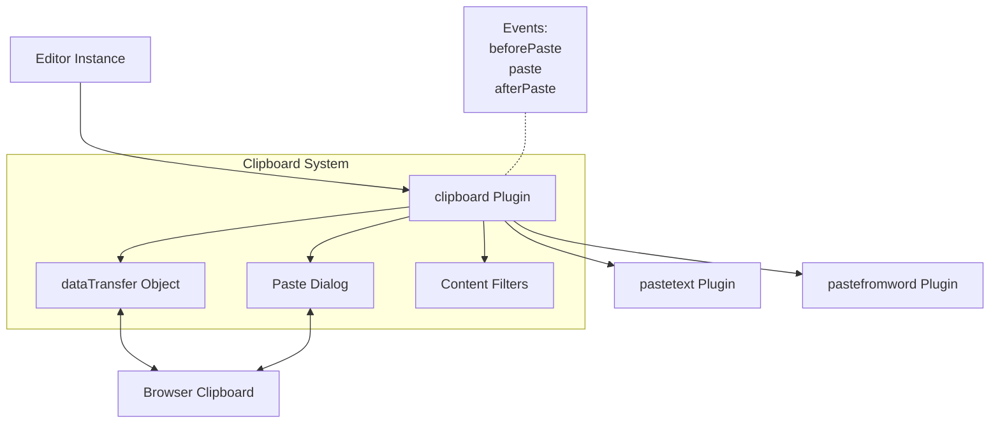
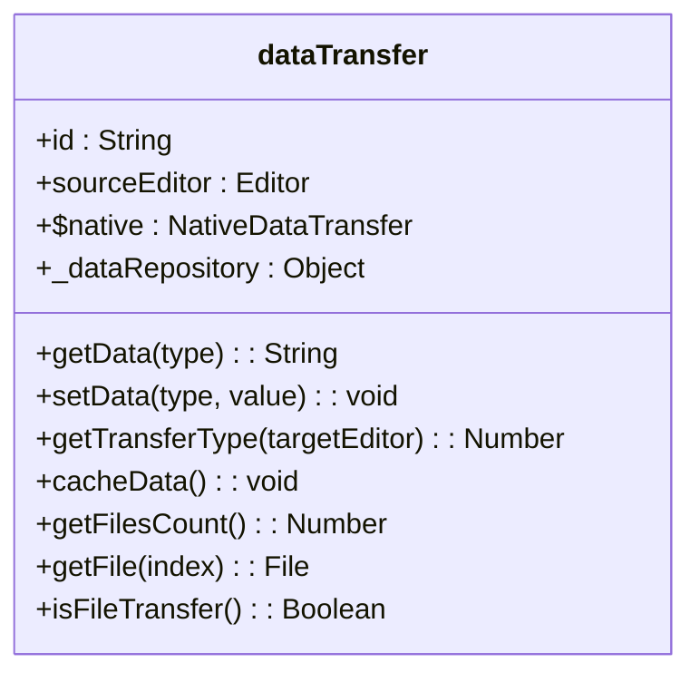
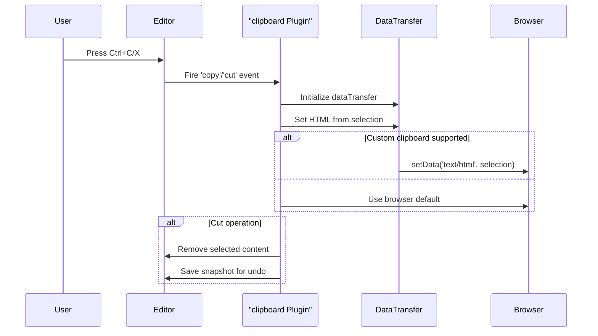
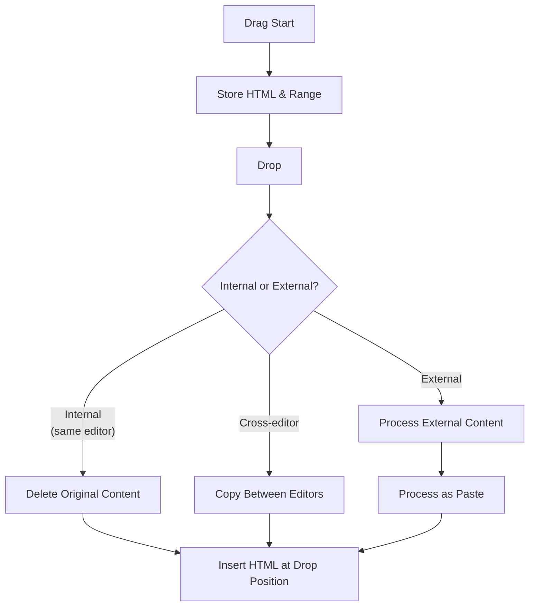
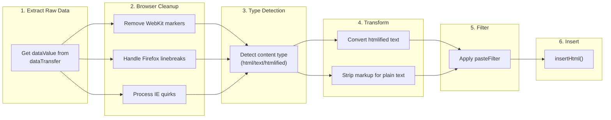

# Clipboard and Content Processing

<details>
<summary>Relevant source files</summary>

The following files were used as context for generating this wiki page:

- [dev/langtool/meta/ckeditor.plugin-clipboard/meta.txt](https://github.com/ckeditor/ckeditor4/blob/c7e59ec1/dev/langtool/meta/ckeditor.plugin-clipboard/meta.txt)
- [dev/langtool/meta/ckeditor.plugin-pastetext/meta.txt](https://github.com/ckeditor/ckeditor4/blob/c7e59ec1/dev/langtool/meta/ckeditor.plugin-pastetext/meta.txt)
- [plugins/clipboard/dialogs/paste.js](https://github.com/ckeditor/ckeditor4/blob/c7e59ec1/plugins/clipboard/dialogs/paste.js)
- [plugins/clipboard/lang/en.js](https://github.com/ckeditor/ckeditor4/blob/c7e59ec1/plugins/clipboard/lang/en.js)
- [plugins/clipboard/plugin.js](https://github.com/ckeditor/ckeditor4/blob/c7e59ec1/plugins/clipboard/plugin.js)
- [plugins/newpage/plugin.js](https://github.com/ckeditor/ckeditor4/blob/c7e59ec1/plugins/newpage/plugin.js)
- [plugins/pastetext/lang/en.js](https://github.com/ckeditor/ckeditor4/blob/c7e59ec1/plugins/pastetext/lang/en.js)
- [plugins/pastetext/plugin.js](https://github.com/ckeditor/ckeditor4/blob/c7e59ec1/plugins/pastetext/plugin.js)
- [tests/plugins/clipboard/_helpers/pasting.js](https://github.com/ckeditor/ckeditor4/blob/c7e59ec1/tests/plugins/clipboard/_helpers/pasting.js)
- [tests/plugins/clipboard/datatransfer.js](https://github.com/ckeditor/ckeditor4/blob/c7e59ec1/tests/plugins/clipboard/datatransfer.js)
- [tests/plugins/clipboard/drop.js](https://github.com/ckeditor/ckeditor4/blob/c7e59ec1/tests/plugins/clipboard/drop.js)
- [tests/plugins/clipboard/dropimage.js](https://github.com/ckeditor/ckeditor4/blob/c7e59ec1/tests/plugins/clipboard/dropimage.js)
- [tests/plugins/clipboard/manual/isfiletransfer.html](https://github.com/ckeditor/ckeditor4/blob/c7e59ec1/tests/plugins/clipboard/manual/isfiletransfer.html)
- [tests/plugins/clipboard/manual/isfiletransfer.md](https://github.com/ckeditor/ckeditor4/blob/c7e59ec1/tests/plugins/clipboard/manual/isfiletransfer.md)
- [tests/plugins/clipboard/manual/pastedialogwordbreak.html](https://github.com/ckeditor/ckeditor4/blob/c7e59ec1/tests/plugins/clipboard/manual/pastedialogwordbreak.html)
- [tests/plugins/clipboard/manual/pastedialogwordbreak.md](https://github.com/ckeditor/ckeditor4/blob/c7e59ec1/tests/plugins/clipboard/manual/pastedialogwordbreak.md)
- [tests/plugins/clipboard/manual/pasteideographicspace.html](https://github.com/ckeditor/ckeditor4/blob/c7e59ec1/tests/plugins/clipboard/manual/pasteideographicspace.html)
- [tests/plugins/clipboard/manual/pasteideographicspace.md](https://github.com/ckeditor/ckeditor4/blob/c7e59ec1/tests/plugins/clipboard/manual/pasteideographicspace.md)
- [tests/plugins/clipboard/notifications.js](https://github.com/ckeditor/ckeditor4/blob/c7e59ec1/tests/plugins/clipboard/notifications.js)
- [tests/plugins/clipboard/paste.js](https://github.com/ckeditor/ckeditor4/blob/c7e59ec1/tests/plugins/clipboard/paste.js)
- [tests/plugins/clipboard/pastecommands.js](https://github.com/ckeditor/ckeditor4/blob/c7e59ec1/tests/plugins/clipboard/pastecommands.js)
- [tests/plugins/clipboard/pastedialog.js](https://github.com/ckeditor/ckeditor4/blob/c7e59ec1/tests/plugins/clipboard/pastedialog.js)
- [tests/plugins/clipboard/pasteimage.js](https://github.com/ckeditor/ckeditor4/blob/c7e59ec1/tests/plugins/clipboard/pasteimage.js)
- [tests/plugins/pastefromword/command.js](https://github.com/ckeditor/ckeditor4/blob/c7e59ec1/tests/plugins/pastefromword/command.js)
- [tests/plugins/pastefromword/customfilter.js](https://github.com/ckeditor/ckeditor4/blob/c7e59ec1/tests/plugins/pastefromword/customfilter.js)
- [tests/plugins/pastefromword/datatransfer.js](https://github.com/ckeditor/ckeditor4/blob/c7e59ec1/tests/plugins/pastefromword/datatransfer.js)
- [tests/plugins/pastefromword/metageneratordetection.js](https://github.com/ckeditor/ckeditor4/blob/c7e59ec1/tests/plugins/pastefromword/metageneratordetection.js)
- [tests/plugins/pastefromword/multiplehandlers.js](https://github.com/ckeditor/ckeditor4/blob/c7e59ec1/tests/plugins/pastefromword/multiplehandlers.js)
- [tests/plugins/pastetext/pastetext.js](https://github.com/ckeditor/ckeditor4/blob/c7e59ec1/tests/plugins/pastetext/pastetext.js)
- [tests/tickets/13468/1.html](https://github.com/ckeditor/ckeditor4/blob/c7e59ec1/tests/tickets/13468/1.html)
- [tests/tickets/13468/1.md](https://github.com/ckeditor/ckeditor4/blob/c7e59ec1/tests/tickets/13468/1.md)

</details>


This page documents the clipboard system in CKEditor 4, including how it handles copy, cut, paste, and drag/drop operations, as well as how clipboard content is processed during these operations. For information about paste filtering, see [Paste Filtering](#4.1), and for details on copy formatting, see [Copy Formatting](#4.2).

## System Overview

The clipboard system is a core component of CKEditor 4 that manages all interactions with the browser's clipboard and provides consistent clipboard behavior across different browsers. The system is responsible for:

- Managing copy, cut, and paste operations
- Handling drag and drop functionality
- Processing and filtering clipboard content
- Type detection and conversion
- Supporting file uploads through paste/drop



Sources: [plugins/clipboard/plugin.js:119-149](https://github.com/ckeditor/ckeditor4/blob/c7e59ec1/plugins/clipboard/plugin.js#L119-L149), [plugins/clipboard/plugin.js:10-113](https://github.com/ckeditor/ckeditor4/blob/c7e59ec1/plugins/clipboard/plugin.js#L10-L113)

## Key Components

### Clipboard Plugin

The core implementation of clipboard functionality that handles clipboard-related commands, events, and data processing.

- Initializes clipboard event listeners
- Creates and registers copy, cut, and paste commands
- Manages clipboard data flow
- Handles content type detection and transformation
- Processes clipboard data before insertion

**Plugin Integration Points:**
- Requires the dialog, notification, and toolbar plugins
- Integrates with pastetext and pastefromword plugins

### DataTransfer Object

A wrapper around the native browser DataTransfer object that provides a consistent cross-browser interface for clipboard operations with enhanced functionality.



**Key Capabilities:**
- Stores and retrieves clipboard data in various formats
- Normalizes data types across browsers
- Caches data for asynchronous access
- Tracks the source editor for cross-editor operations
- Handles file transfers for uploading

Sources: [tests/plugins/clipboard/datatransfer.js:9-107](https://github.com/ckeditor/ckeditor4/blob/c7e59ec1/tests/plugins/clipboard/datatransfer.js#L9-L107), [plugins/clipboard/plugin.js:304-332](https://github.com/ckeditor/ckeditor4/blob/c7e59ec1/plugins/clipboard/plugin.js#L304-L332)

### Paste Dialog

A fallback UI component that appears when direct clipboard access is restricted by browser security settings, allowing users to paste content into a dialog that CKEditor can then access.

Sources: [plugins/clipboard/dialogs/paste.js:6-238](https://github.com/ckeditor/ckeditor4/blob/c7e59ec1/plugins/clipboard/dialogs/paste.js#L6-L238)

## Clipboard Operation Flows

### Copy and Cut Operations



Sources: [plugins/clipboard/plugin.js:10-44](https://github.com/ckeditor/ckeditor4/blob/c7e59ec1/plugins/clipboard/plugin.js#L10-L44), [plugins/clipboard/plugin.js:725-753](https://github.com/ckeditor/ckeditor4/blob/c7e59ec1/plugins/clipboard/plugin.js#L725-L753)

### Paste Operation

```mermaid
graph TD
    start["User Pastes\n(Ctrl+V)"] --> beforePaste["Fire 'beforePaste' Event"]
    beforePaste --> canceled{"Canceled?"}
    canceled -->|Yes| end["End Processing"]
    canceled -->|No| getData["Get Clipboard Data"]
    getData --> firePaste["Fire 'paste' Event"]
    
    firePaste --> typeDet["Determine Content Type\n(html/text/auto)"]
    typeDet --> prefilter["Pre-filter Content\n(browser cleanup)"]
    prefilter --> sniff["Content Type Sniffing"]
    sniff --> transform["Content Transformation"]
    transform --> filter["Apply Paste Filters"]
    filter --> insert["Insert Content"]
    insert --> afterPaste["Fire 'afterPaste' Event"]
```

Sources: [plugins/clipboard/plugin.js:45-57](https://github.com/ckeditor/ckeditor4/blob/c7e59ec1/plugins/clipboard/plugin.js#L45-L57), [plugins/clipboard/plugin.js:497-532](https://github.com/ckeditor/ckeditor4/blob/c7e59ec1/plugins/clipboard/plugin.js#L497-L532), [plugins/clipboard/plugin.js:411-481](https://github.com/ckeditor/ckeditor4/blob/c7e59ec1/plugins/clipboard/plugin.js#L411-L481)

### Drag and Drop Handling



Sources: [plugins/clipboard/plugin.js:86-112](https://github.com/ckeditor/ckeditor4/blob/c7e59ec1/plugins/clipboard/plugin.js#L86-L112), [tests/plugins/clipboard/drop.js:1-183](https://github.com/ckeditor/ckeditor4/blob/c7e59ec1/tests/plugins/clipboard/drop.js#L1-L183)

## Content Processing

### Content Type Detection

CKEditor must determine the type of pasted content to apply appropriate processing:

1. **Text**: Simple plain text without formatting
2. **HTML**: Formatted content with markup
3. **Htmlified Text**: Plain text that browsers have converted to HTML (e.g., by adding `<br>` or `<div>` tags)

The system uses different detection strategies based on the browser:

| Browser | Detection Strategy |
|---------|-------------------|
| WebKit | Checks for specific div/br patterns |
| Firefox | Looks for br-only formatting |
| IE | Examines paragraph structure |
| Others | Conservative detection |

Sources: [plugins/clipboard/plugin.js:334-407](https://github.com/ckeditor/ckeditor4/blob/c7e59ec1/plugins/clipboard/plugin.js#L334-L407), [tests/plugins/clipboard/paste.js:380-417](https://github.com/ckeditor/ckeditor4/blob/c7e59ec1/tests/plugins/clipboard/paste.js#L380-L417)

### Content Processing Phases

1. **Data Extraction**: Get data from clipboard (text/html or text/plain)
2. **Browser Cleanup**: Remove browser-specific artifacts 
3. **Content Type Detection**: Determine if content is text, HTML, or htmlified text
4. **Content Transformation**: Convert between formats if needed
5. **Content Filtering**: Apply filters based on editor configuration
6. **Insertion**: Insert the processed content into the editor



Sources: [plugins/clipboard/plugin.js:60-85](https://github.com/ckeditor/ckeditor4/blob/c7e59ec1/plugins/clipboard/plugin.js#L60-L85), [plugins/clipboard/plugin.js:412-467](https://github.com/ckeditor/ckeditor4/blob/c7e59ec1/plugins/clipboard/plugin.js#L412-L467), [plugins/clipboard/plugin.js:468-482](https://github.com/ckeditor/ckeditor4/blob/c7e59ec1/plugins/clipboard/plugin.js#L468-L482)

### Special Content Handling

#### File and Image Handling

The system can detect and handle files pasted or dropped into the editor:

- Images are automatically converted to embedded base64 images
- Supported image types: PNG, JPEG, GIF
- Unsupported file types trigger notifications

Sources: [plugins/clipboard/plugin.js:189-236](https://github.com/ckeditor/ckeditor4/blob/c7e59ec1/plugins/clipboard/plugin.js#L189-L236), [tests/plugins/clipboard/pasteimage.js:33-67](https://github.com/ckeditor/ckeditor4/blob/c7e59ec1/tests/plugins/clipboard/pasteimage.js#L33-L67)

#### Htmlified Text Unification

Different browsers convert plain text to HTML in different ways:

- WebKit wraps lines in `<div>` elements and converts spaces to `<span>` elements
- Firefox uses `<br>` tags and `&nbsp;` entities
- IE creates `<P>` elements

CKEditor unifies these different formats into consistent HTML.

Sources: [tests/plugins/clipboard/paste.js:486-518](https://github.com/ckeditor/ckeditor4/blob/c7e59ec1/tests/plugins/clipboard/paste.js#L486-L518)

## Configuration Options

| Option | Description | Default |
|--------|-------------|---------|
| `forcePasteAsPlainText` | Forces all pasted content to be inserted as plain text | `false` |
| `clipboard_defaultContentType` | Default content type for paste operations | `'html'` |
| `pasteFilter` | Filter to be applied to all pasted content | Browser-specific |
| `clipboard_handleImages` | Whether to handle pasted images | `true` |
| `clipboard_notificationDuration` | Duration of clipboard notifications | `10000` |

Sources: [plugins/clipboard/plugin.js:135-147](https://github.com/ckeditor/ckeditor4/blob/c7e59ec1/plugins/clipboard/plugin.js#L135-L147), [plugins/pastetext/plugin.js:90-110](https://github.com/ckeditor/ckeditor4/blob/c7e59ec1/plugins/pastetext/plugin.js#L90-L110)

## Events

| Event | Description |
|-------|-------------|
| `beforePaste` | Fired before the paste process starts, can be canceled |
| `paste` | Fired when content is ready to be pasted, can be modified |
| `afterPaste` | Fired after content has been inserted |
| `pasteState` | Fired when the paste command state changes |
| `dragstart` | Fired when a drag operation starts |
| `drop` | Fired when content is dropped into the editor |

Sources: [plugins/clipboard/plugin.js:304-332](https://github.com/ckeditor/ckeditor4/blob/c7e59ec1/plugins/clipboard/plugin.js#L304-L332), [plugins/clipboard/plugin.js:468-482](https://github.com/ckeditor/ckeditor4/blob/c7e59ec1/plugins/clipboard/plugin.js#L468-L482)

## Integration with Other Plugins

### pastetext Plugin

Allows pasting content as plain text, stripping all formatting. It adds:
- A toolbar button
- A keyboard shortcut (Ctrl+Shift+V or Ctrl+Alt+Shift+V on Safari)
- A context menu option

Sources: [plugins/pastetext/plugin.js:10-86](https://github.com/ckeditor/ckeditor4/blob/c7e59ec1/plugins/pastetext/plugin.js#L10-L86)

### pastefromword Plugin

Provides specialized handling for content pasted from Microsoft Word:
- Detects Word content through meta tags or content patterns
- Applies special filters to clean up Word's extensive markup
- Preserves formatting structure and styles

## Advanced Customization

### Custom Paste Handling

```javascript
editor.on('paste', function(evt) {
    // Access the pasted data
    var data = evt.data.dataValue;
    
    // Modify the data
    evt.data.dataValue = data.replace(/foo/g, 'bar');
    
    // Change the content type
    evt.data.type = 'html';
});
```

### Custom File Type Handling

```javascript
CKEDITOR.plugins.clipboard.addFileMatcher(editor, function(file) {
    // Return true to indicate this file type is supported
    return /image\/webp/.test(file.type);
});
```

Sources: [plugins/clipboard/plugin.js:159-179](https://github.com/ckeditor/ckeditor4/blob/c7e59ec1/plugins/clipboard/plugin.js#L159-L179)

## Browser Compatibility Notes

The clipboard system includes numerous workarounds for browser-specific behaviors:

- Internet Explorer has different paste event handling
- Firefox handles drag and drop differently
- WebKit-based browsers have unique "htmlified" text formats
- All browsers have security restrictions that may limit direct clipboard access

The system abstracts these differences, providing a consistent clipboard experience across browsers.