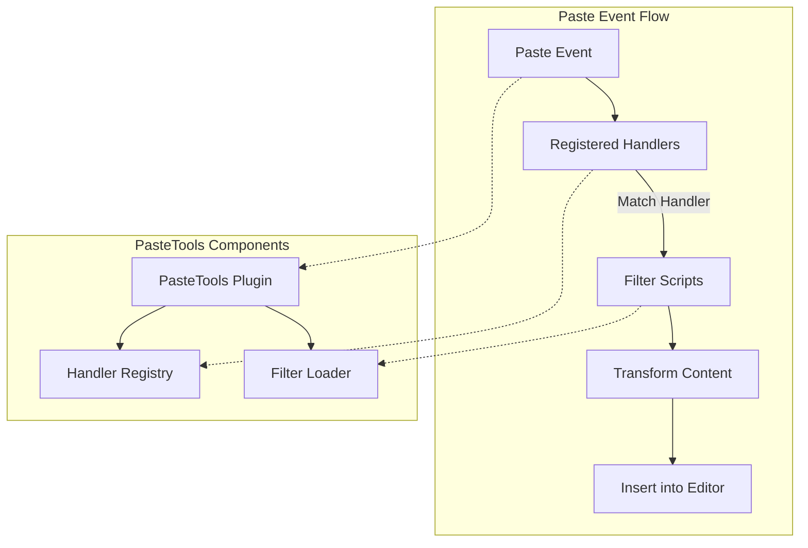
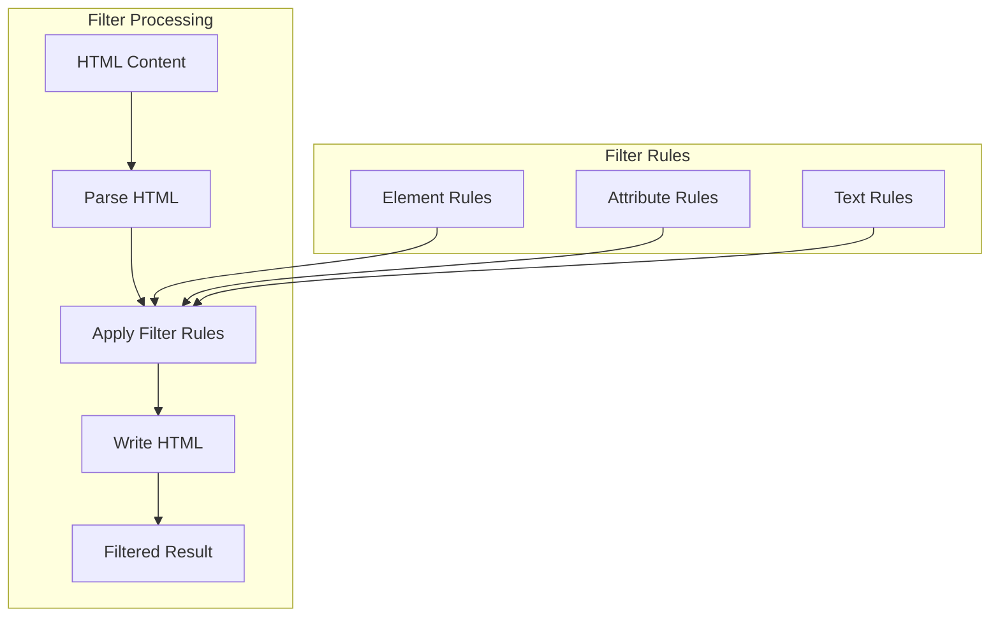
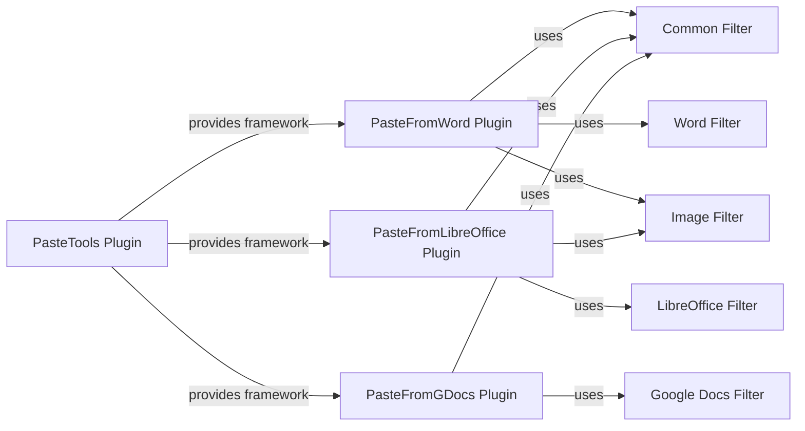

# Paste Filtering

<details>
<summary>Relevant source files</summary>

The following files were used as context for generating this wiki page:

- [plugins/pastefromgdocs/filter/default.js](https://github.com/ckeditor/ckeditor4/blob/c7e59ec1/plugins/pastefromgdocs/filter/default.js)
- [plugins/pastefromgdocs/plugin.js](https://github.com/ckeditor/ckeditor4/blob/c7e59ec1/plugins/pastefromgdocs/plugin.js)
- [plugins/pastefromlibreoffice/filter/default.js](https://github.com/ckeditor/ckeditor4/blob/c7e59ec1/plugins/pastefromlibreoffice/filter/default.js)
- [plugins/pastefromlibreoffice/plugin.js](https://github.com/ckeditor/ckeditor4/blob/c7e59ec1/plugins/pastefromlibreoffice/plugin.js)
- [plugins/pastefromword/filter/default.js](https://github.com/ckeditor/ckeditor4/blob/c7e59ec1/plugins/pastefromword/filter/default.js)
- [plugins/pastefromword/plugin.js](https://github.com/ckeditor/ckeditor4/blob/c7e59ec1/plugins/pastefromword/plugin.js)
- [plugins/pastetools/filter/common.js](https://github.com/ckeditor/ckeditor4/blob/c7e59ec1/plugins/pastetools/filter/common.js)
- [plugins/pastetools/filter/image.js](https://github.com/ckeditor/ckeditor4/blob/c7e59ec1/plugins/pastetools/filter/image.js)
- [plugins/pastetools/plugin.js](https://github.com/ckeditor/ckeditor4/blob/c7e59ec1/plugins/pastetools/plugin.js)
- [tests/plugins/pastefromword/generated/_helpers/pfwTools.js](https://github.com/ckeditor/ckeditor4/blob/c7e59ec1/tests/plugins/pastefromword/generated/_helpers/pfwTools.js)
- [tests/plugins/pastefromword/generated/functions.js](https://github.com/ckeditor/ckeditor4/blob/c7e59ec1/tests/plugins/pastefromword/generated/functions.js)
- [tests/plugins/pastefromword/generated/heuristics.html](https://github.com/ckeditor/ckeditor4/blob/c7e59ec1/tests/plugins/pastefromword/generated/heuristics.html)
- [tests/plugins/pastefromword/generated/heuristics.js](https://github.com/ckeditor/ckeditor4/blob/c7e59ec1/tests/plugins/pastefromword/generated/heuristics.js)
- [tests/plugins/pastefromword/pasteimage.js](https://github.com/ckeditor/ckeditor4/blob/c7e59ec1/tests/plugins/pastefromword/pasteimage.js)
- [tests/plugins/pastetools/_helpers/ptTools.js](https://github.com/ckeditor/ckeditor4/blob/c7e59ec1/tests/plugins/pastetools/_helpers/ptTools.js)
- [tests/plugins/pastetools/filter/_fixtures/imagewithhorizontalline.json](https://github.com/ckeditor/ckeditor4/blob/c7e59ec1/tests/plugins/pastetools/filter/_fixtures/imagewithhorizontalline.json)
- [tests/plugins/pastetools/filter/_fixtures/imagewithhorizontalline.rtf](https://github.com/ckeditor/ckeditor4/blob/c7e59ec1/tests/plugins/pastetools/filter/_fixtures/imagewithhorizontalline.rtf)
- [tests/plugins/pastetools/filter/common.js](https://github.com/ckeditor/ckeditor4/blob/c7e59ec1/tests/plugins/pastetools/filter/common.js)
- [tests/plugins/pastetools/filter/functions.js](https://github.com/ckeditor/ckeditor4/blob/c7e59ec1/tests/plugins/pastetools/filter/functions.js)
- [tests/plugins/pastetools/filter/image.js](https://github.com/ckeditor/ckeditor4/blob/c7e59ec1/tests/plugins/pastetools/filter/image.js)
- [tests/plugins/pastetools/filter/imagehelpers.js](https://github.com/ckeditor/ckeditor4/blob/c7e59ec1/tests/plugins/pastetools/filter/imagehelpers.js)
- [tests/plugins/pastetools/filter/parsestyles.html](https://github.com/ckeditor/ckeditor4/blob/c7e59ec1/tests/plugins/pastetools/filter/parsestyles.html)
- [tests/plugins/pastetools/filter/parsestyles.js](https://github.com/ckeditor/ckeditor4/blob/c7e59ec1/tests/plugins/pastetools/filter/parsestyles.js)
- [tests/plugins/pastetools/filter/rtf.js](https://github.com/ckeditor/ckeditor4/blob/c7e59ec1/tests/plugins/pastetools/filter/rtf.js)
- [tests/plugins/pastetools/loadingfilters.js](https://github.com/ckeditor/ckeditor4/blob/c7e59ec1/tests/plugins/pastetools/loadingfilters.js)
- [tests/plugins/pastetools/manual/_assets/filter1.js](https://github.com/ckeditor/ckeditor4/blob/c7e59ec1/tests/plugins/pastetools/manual/_assets/filter1.js)
- [tests/plugins/pastetools/manual/_assets/filter2.js](https://github.com/ckeditor/ckeditor4/blob/c7e59ec1/tests/plugins/pastetools/manual/_assets/filter2.js)
- [tests/plugins/pastetools/manual/loadingfilters.md](https://github.com/ckeditor/ckeditor4/blob/c7e59ec1/tests/plugins/pastetools/manual/loadingfilters.md)
- [tests/plugins/pastetools/manual/multiplehandlers.html](https://github.com/ckeditor/ckeditor4/blob/c7e59ec1/tests/plugins/pastetools/manual/multiplehandlers.html)
- [tests/plugins/pastetools/manual/multiplehandlers.md](https://github.com/ckeditor/ckeditor4/blob/c7e59ec1/tests/plugins/pastetools/manual/multiplehandlers.md)
- [tests/plugins/pastetools/pastetools.js](https://github.com/ckeditor/ckeditor4/blob/c7e59ec1/tests/plugins/pastetools/pastetools.js)

</details>


Paste filtering in CKEditor 4 refers to the process of transforming and cleaning up content that has been pasted into the editor. When users paste content from external sources like Microsoft Word, LibreOffice, Google Docs, or other web pages, the content often contains unwanted HTML markup, styling, and other elements that need to be processed to ensure proper display and compatibility within the editor.

This page documents the paste filtering system architecture, the built-in filters, and how paste filtering integrates with the editor's clipboard system. For information about specific paste sources like Microsoft Word, see [Clipboard and Content Processing](#4).

## Paste Filtering Architecture

The paste filtering system in CKEditor 4 is built around the PasteTools plugin, which provides a framework for registering paste handlers that detect specific content types and apply appropriate transformations.



Sources: [plugins/pastetools/plugin.js](https://github.com/ckeditor/ckeditor4/blob/c7e59ec1/plugins/pastetools/plugin.js)

### Handler Registration

Paste handlers are registered using `editor.pasteTools.register()`. Each handler specifies:

1. A `canHandle()` function that determines if it can process specific pasted content
2. A `handle()` function that processes the content
3. An array of filter scripts to load
4. A priority value (higher values indicate higher priority)

```javascript
editor.pasteTools.register({
    priority: 100,
    filters: [
        CKEDITOR.getUrl('path/to/filter1.js'),
        CKEDITOR.getUrl('path/to/filter2.js')
    ],
    canHandle: function(evt) {
        // Check if this handler can process the pasted content
        return true;
    },
    handle: function(evt, next) {
        // Process the content
        evt.data.dataValue = processedContent;
        next(); // Optional: Call next handler
    }
});
```

Sources: [plugins/pastetools/plugin.js:17-48](https://github.com/ckeditor/ckeditor4/blob/c7e59ec1/plugins/pastetools/plugin.js#L17-L48)

### Filter Loading

The PasteTools plugin manages the loading of filter scripts on demand. When content is pasted, it:

1. Identifies handlers that can process the content based on their `canHandle()` function
2. Loads any required filter scripts that haven't been loaded yet
3. Calls the handler's `handle()` function to process the content

This lazy-loading approach ensures that only the necessary filters are loaded, improving performance.

Sources: [plugins/pastetools/plugin.js:252-282](https://github.com/ckeditor/ckeditor4/blob/c7e59ec1/plugins/pastetools/plugin.js#L252-L282)

## Built-in Filters

CKEditor 4 includes several built-in filters for common paste scenarios:

### Common Filter

The common filter (`plugins/pastetools/filter/common.js`) provides base functionality used by all filters:

- Style normalization and transformation
- Element cleanup
- List processing
- Table formatting

This filter is typically used as a foundation for other more specialized filters.

Sources: [plugins/pastetools/filter/common.js:31-151](https://github.com/ckeditor/ckeditor4/blob/c7e59ec1/plugins/pastetools/filter/common.js#L31-L151)

### Word Filter

The Word filter (`plugins/pastefromword/filter/default.js`) is specifically designed to handle content pasted from Microsoft Word. It includes rules for:

- Removing Word-specific markup
- Converting Word lists to standard HTML lists
- Processing tables and images
- Normalizing styles and links

This is one of the most complex filters due to the nature of Word's HTML output.

Sources: [plugins/pastefromword/filter/default.js:68-456](https://github.com/ckeditor/ckeditor4/blob/c7e59ec1/plugins/pastefromword/filter/default.js#L68-L456)

### LibreOffice Filter

Similar to the Word filter, the LibreOffice filter (`plugins/pastefromlibreoffice/filter/default.js`) handles content from LibreOffice Writer. Its rules target LibreOffice-specific markup and formatting.

Sources: [plugins/pastefromlibreoffice/filter/default.js:30-167](https://github.com/ckeditor/ckeditor4/blob/c7e59ec1/plugins/pastefromlibreoffice/filter/default.js#L30-L167)

### Google Docs Filter

The Google Docs filter (`plugins/pastefromgdocs/filter/default.js`) processes content pasted from Google Docs. It removes Google Docs-specific elements and formatting.

Sources: [plugins/pastefromgdocs/filter/default.js:30-107](https://github.com/ckeditor/ckeditor4/blob/c7e59ec1/plugins/pastefromgdocs/filter/default.js#L30-L107)

### Image Filter

The image filter (`plugins/pastetools/filter/image.js`) handles images in pasted content:

- Extracts images from RTF data
- Converts blob URLs to base64 data
- Embeds images inline in the content

Sources: [plugins/pastetools/filter/image.js:25-444](https://github.com/ckeditor/ckeditor4/blob/c7e59ec1/plugins/pastetools/filter/image.js#L25-L444)

## How Filters Work



Filters in CKEditor 4 operate on HTML parser elements rather than DOM elements. The filtering process follows these steps:

1. The HTML content is parsed into a tree of `CKEDITOR.htmlParser.element` objects
2. Filter rules are applied to transform elements, attributes, and text
3. The transformed tree is written back to HTML

### Filter Rules

Filter rules are defined as JavaScript objects with methods for processing elements, attributes, and text:

```javascript
{
    elements: {
        'p': function(element) {
            // Process paragraph elements
        },
        'span': function(element) {
            // Process span elements
        }
    },
    attributes: {
        'style': function(value, element) {
            // Process style attributes
            return processedValue;
        }
    },
    text: function(text, node) {
        // Process text nodes
        return processedText;
    }
}
```

Sources: [plugins/pastefromword/filter/default.js:77-449](https://github.com/ckeditor/ckeditor4/blob/c7e59ec1/plugins/pastefromword/filter/default.js#L77-L449)

### Style Processing

Style processing is a critical part of paste filtering. The common filter includes several methods for handling styles:

- `normalizedStyles()`: Removes redundant styles
- `createStyleStack()`: Creates a stack of nested spans for inline styles
- `pushStylesLower()`: Moves styles from parent elements to children

Sources: [plugins/pastetools/filter/common.js:228-499](https://github.com/ckeditor/ckeditor4/blob/c7e59ec1/plugins/pastetools/filter/common.js#L228-L499)

## Integration with Paste Plugins



Each paste source (Word, LibreOffice, Google Docs) has its own plugin that registers a handler with the PasteTools plugin:

- **PasteFromWord** (`plugins/pastefromword/plugin.js`): Registers a handler for Word content
- **PasteFromLibreOffice** (`plugins/pastefromlibreoffice/plugin.js`): Registers a handler for LibreOffice content
- **PasteFromGDocs** (`plugins/pastefromgdocs/plugin.js`): Registers a handler for Google Docs content

These plugins use a combination of source detection and content transformation to process pasted content.

Sources: [plugins/pastefromword/plugin.js:72-139](https://github.com/ckeditor/ckeditor4/blob/c7e59ec1/plugins/pastefromword/plugin.js#L72-L139), [plugins/pastefromlibreoffice/plugin.js:31-73](https://github.com/ckeditor/ckeditor4/blob/c7e59ec1/plugins/pastefromlibreoffice/plugin.js#L31-L73), [plugins/pastefromgdocs/plugin.js:18-45](https://github.com/ckeditor/ckeditor4/blob/c7e59ec1/plugins/pastefromgdocs/plugin.js#L18-L45)

## Source Detection

A key aspect of paste filtering is detecting the source of the pasted content. This is done through:

1. **META tag analysis**: Checking for generator META tags that indicate the source (e.g., "Microsoft Word", "LibreOffice")
2. **Content patterns**: Looking for patterns in the HTML that are specific to certain sources
3. **RTF data**: Analyzing RTF data from the clipboard for additional clues

For example, the PasteFromWord plugin looks for Word-specific patterns like:

```javascript
var wordRegexp = /(class="?Mso|style=["'][^"]*?\bmso\-|w:WordDocument|<o:\w+>|<\/font>)/;
```

Sources: [plugins/pastefromword/plugin.js:81-85](https://github.com/ckeditor/ckeditor4/blob/c7e59ec1/plugins/pastefromword/plugin.js#L81-L85)

## Configuration Options

CKEditor 4 provides several configuration options for controlling paste filtering behavior:

| Option | Description | Default |
|--------|-------------|---------|
| `pasteFromWordRemoveFontStyles` | Whether to remove font styles when pasting from Word | `false` |
| `pasteFromWordRemoveStyles` | Whether to remove all styles when pasting from Word | `false` |
| `pasteFromWordPromptCleanup` | Whether to prompt before cleaning up Word content | `false` |
| `pasteFromWord_inlineImages` | Whether to embed inline images when pasting from Word | `true` |
| `forcePasteAsPlainText` | Force all pasted content to be plain text | `false` |

Sources: [plugins/pastefromword/plugin.js:147-195](https://github.com/ckeditor/ckeditor4/blob/c7e59ec1/plugins/pastefromword/plugin.js#L147-L195)

## Events

The paste filtering system fires several events that can be used to customize the filtering process:

| Event | Description |
|-------|-------------|
| `pasteFromWord` | Fired before processing Word content. Can be canceled to prevent processing. |
| `afterPasteFromWord` | Fired after Word content has been processed. |
| `paste` | The main paste event that triggers the filtering process. |

Example usage:

```javascript
editor.on('pasteFromWord', function(evt) {
    // Customize Word content before filtering
    evt.data.dataValue = customPreProcess(evt.data.dataValue);
    
    // Return false to prevent default processing
    return false;
});
```

Sources: [plugins/pastefromword/plugin.js:96-117](https://github.com/ckeditor/ckeditor4/blob/c7e59ec1/plugins/pastefromword/plugin.js#L96-L117)

## Creating Custom Filters

Developers can create custom filters by defining rules for processing elements, attributes, and text. A custom filter typically follows this pattern:

1. Define a rules function that returns an object with element, attribute, and text processing rules
2. Use `CKEDITOR.plugins.pastetools.createFilter()` to create a filter function
3. Register the filter with a paste handler

Example:

```javascript
CKEDITOR.plugins.pastetools.filters.mycustomfilter = {
    rules: function(html, editor) {
        return {
            elements: {
                'span': function(element) {
                    // Process span elements
                }
            },
            attributes: {
                'style': function(value, element) {
                    // Process style attributes
                    return processedValue;
                }
            }
        };
    }
};

CKEDITOR.pasteFilters.mycustomfilter = CKEDITOR.plugins.pastetools.createFilter({
    rules: [
        CKEDITOR.plugins.pastetools.filters.common.rules,
        CKEDITOR.plugins.pastetools.filters.mycustomfilter.rules
    ]
});
```

Sources: [plugins/pastetools/plugin.js:88-120](https://github.com/ckeditor/ckeditor4/blob/c7e59ec1/plugins/pastetools/plugin.js#L88-L120)

## Performance Considerations

Paste filtering can be performance-intensive, especially for large documents. Some performance optimizations in the system include:

1. **Lazy loading of filters**: Filters are only loaded when needed
2. **Selective processing**: Only processing elements that need transformation
3. **Caching**: Previously loaded filters are cached to avoid redundant loading

The paste filtering system is designed to balance between cleaning up unwanted content and maintaining good performance.