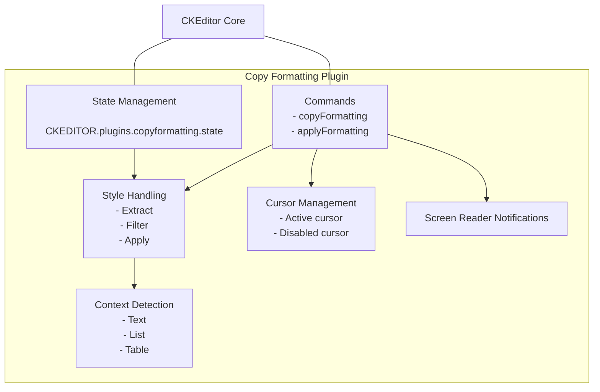
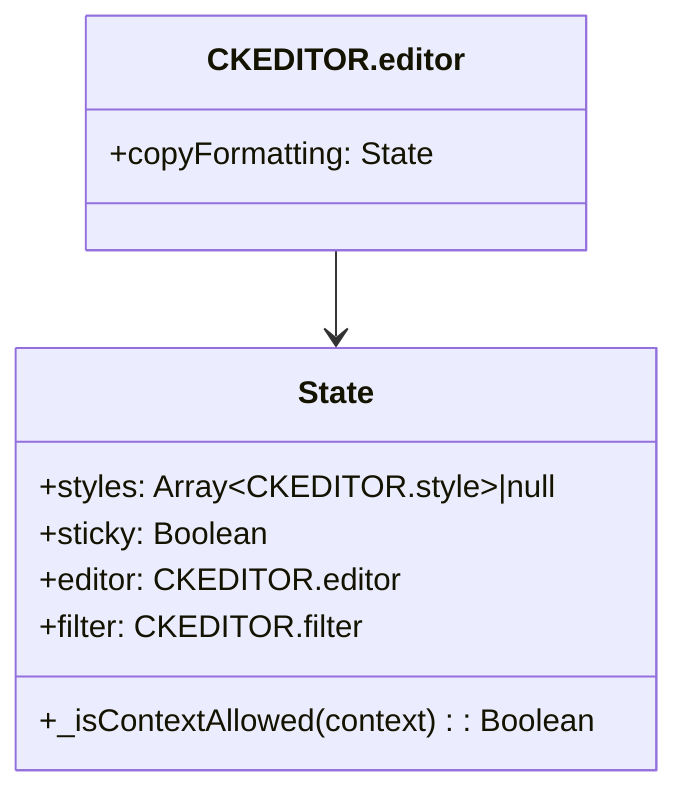
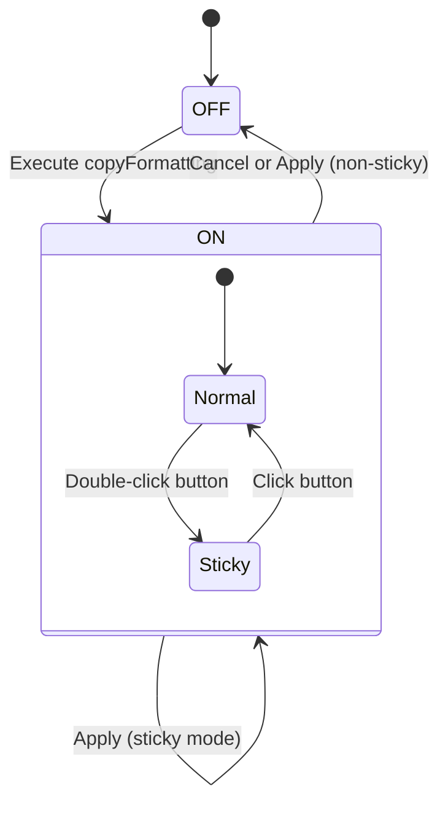
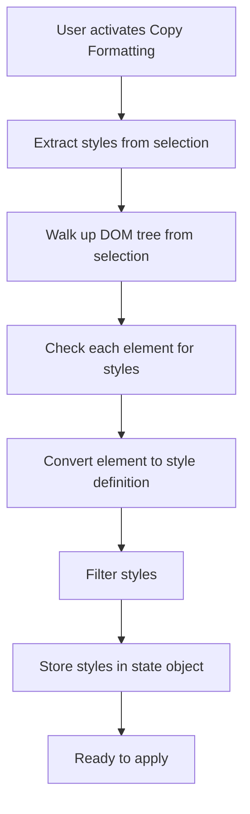
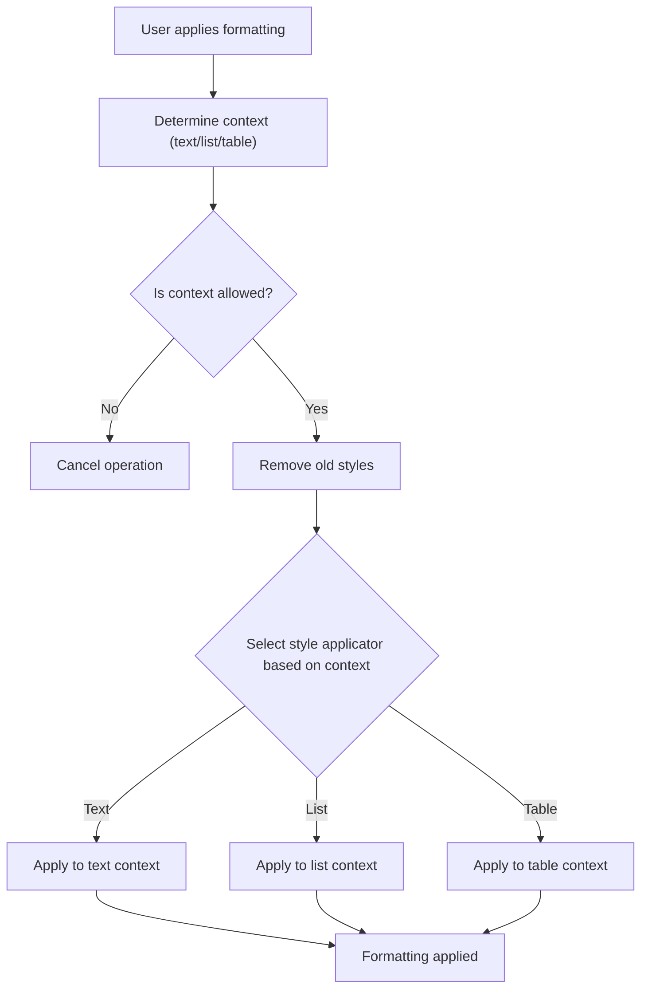
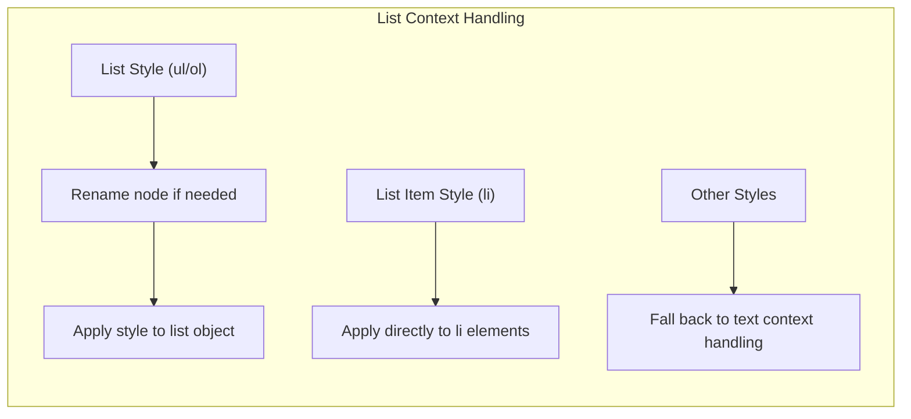
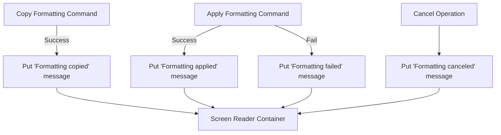
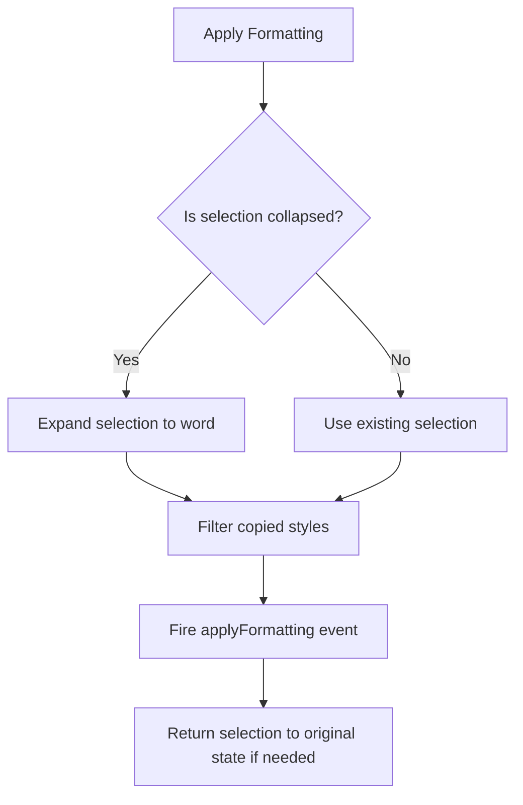

# Copy Formatting

Relevant source files

The following files were used as context for generating this wiki page:

- [plugins/copyformatting/icons/copyformatting.png](https://github.com/ckeditor/ckeditor4/blob/c7e59ec1/plugins/copyformatting/icons/copyformatting.png)
- [plugins/copyformatting/icons/hidpi/copyformatting.png](https://github.com/ckeditor/ckeditor4/blob/c7e59ec1/plugins/copyformatting/icons/hidpi/copyformatting.png)
- [plugins/copyformatting/lang/en.js](https://github.com/ckeditor/ckeditor4/blob/c7e59ec1/plugins/copyformatting/lang/en.js)
- [plugins/copyformatting/plugin.js](https://github.com/ckeditor/ckeditor4/blob/c7e59ec1/plugins/copyformatting/plugin.js)
- [plugins/copyformatting/styles/copyformatting.css](https://github.com/ckeditor/ckeditor4/blob/c7e59ec1/plugins/copyformatting/styles/copyformatting.css)
- [tests/plugins/copyformatting/_helpers/tools.js](https://github.com/ckeditor/ckeditor4/blob/c7e59ec1/tests/plugins/copyformatting/_helpers/tools.js)
- [tests/plugins/copyformatting/copyformatting.html](https://github.com/ckeditor/ckeditor4/blob/c7e59ec1/tests/plugins/copyformatting/copyformatting.html)
- [tests/plugins/copyformatting/copyformatting.js](https://github.com/ckeditor/ckeditor4/blob/c7e59ec1/tests/plugins/copyformatting/copyformatting.js)
- [tests/plugins/copyformatting/manual/copyformatting.html](https://github.com/ckeditor/ckeditor4/blob/c7e59ec1/tests/plugins/copyformatting/manual/copyformatting.html)
- [tests/plugins/copyformatting/manual/copyformatting.md](https://github.com/ckeditor/ckeditor4/blob/c7e59ec1/tests/plugins/copyformatting/manual/copyformatting.md)
- [tests/plugins/copyformatting/manual/keystroke.html](https://github.com/ckeditor/ckeditor4/blob/c7e59ec1/tests/plugins/copyformatting/manual/keystroke.html)
- [tests/plugins/copyformatting/manual/keystroke.md](https://github.com/ckeditor/ckeditor4/blob/c7e59ec1/tests/plugins/copyformatting/manual/keystroke.md)
- [tests/plugins/copyformatting/manual/links.html](https://github.com/ckeditor/ckeditor4/blob/c7e59ec1/tests/plugins/copyformatting/manual/links.html)
- [tests/plugins/copyformatting/manual/links.md](https://github.com/ckeditor/ckeditor4/blob/c7e59ec1/tests/plugins/copyformatting/manual/links.md)
- [tests/plugins/copyformatting/manual/sticky.html](https://github.com/ckeditor/ckeditor4/blob/c7e59ec1/tests/plugins/copyformatting/manual/sticky.html)
- [tests/plugins/copyformatting/manual/sticky.md](https://github.com/ckeditor/ckeditor4/blob/c7e59ec1/tests/plugins/copyformatting/manual/sticky.md)

The Copy Formatting plugin enables users to copy text formatting styles from one place and apply them to another within the CKEditor 4 environment. It's similar to the "Format Painter" feature found in many word processing applications.

This document explains the technical implementation of the Copy Formatting feature, its components, and how it processes and applies styles in different contexts. For information about the Clipboard system that handles regular copy and paste operations, see [Clipboard and Content Processing](#4).

## Plugin Architecture

The Copy Formatting feature is implemented as a CKEditor plugin that adds style copying and applying capabilities to the editor. The plugin consists of several key components working together to provide this functionality.

Sources: [plugins/copyformatting/plugin.js:55-224](https://github.com/ckeditor/ckeditor4/blob/c7e59ec1/plugins/copyformatting/plugin.js#L55-L224), [plugins/copyformatting/plugin.js:225-290](https://github.com/ckeditor/ckeditor4/blob/c7e59ec1/plugins/copyformatting/plugin.js#L225-L290)

### State Management

The Copy Formatting plugin maintains state through the `CKEDITOR.plugins.copyformatting.state` class. This class keeps track of:

- Currently copied styles
- Whether the plugin is in "sticky" mode (persistent application mode)
- Filter configuration for allowed/disallowed styles

When the plugin is initialized, a state object is created and attached to the editor instance as `editor.copyFormatting`.

Sources: [plugins/copyformatting/plugin.js:225-290](https://github.com/ckeditor/ckeditor4/blob/c7e59ec1/plugins/copyformatting/plugin.js#L225-L290)

### Command Implementation

The plugin adds two main commands to the editor:

1. **copyFormatting**: Extracts and stores formatting styles from the current selection
2. **applyFormatting**: Applies stored styles to the current selection

The commands change state based on user interaction:

Sources: [plugins/copyformatting/plugin.js:371-451](https://github.com/ckeditor/ckeditor4/blob/c7e59ec1/plugins/copyformatting/plugin.js#L371-L451)

## Style Processing Flow

The Copy Formatting feature processes styles in several steps:

### 1. Style Extraction

When a user activates the Copy Formatting feature, styles are extracted from the current selection using the following process:

The plugin extracts style information from the selected element and its ancestors, up to certain boundary elements (defined in `breakOnElements`).

Sources: [plugins/copyformatting/plugin.js:496-524](https://github.com/ckeditor/ckeditor4/blob/c7e59ec1/plugins/copyformatting/plugin.js#L496-L524), [plugins/copyformatting/plugin.js:474-489](https://github.com/ckeditor/ckeditor4/blob/c7e59ec1/plugins/copyformatting/plugin.js#L474-L489)

### 2. Style Application

When applying styles, the plugin first determines the context of the target selection (text, list, or table) and then applies the appropriate handling:

Sources: [plugins/copyformatting/plugin.js:169-221](https://github.com/ckeditor/ckeditor4/blob/c7e59ec1/plugins/copyformatting/plugin.js#L169-L221), [plugins/copyformatting/plugin.js:796-821](https://github.com/ckeditor/ckeditor4/blob/c7e59ec1/plugins/copyformatting/plugin.js#L796-L821)

## Context-Specific Behavior

The Copy Formatting plugin handles different HTML contexts differently to ensure appropriate style application.

### Text Context

When applying styles to regular text (paragraphs, inline elements), the plugin:

1. Transforms block elements into inline spans when necessary
2. Excludes certain attributes and styles from transformation
3. Applies each style to the selection individually

Sources: [plugins/copyformatting/plugin.js:830-863](https://github.com/ckeditor/ckeditor4/blob/c7e59ec1/plugins/copyformatting/plugin.js#L830-L863)

### List Context

For list elements, special handling is required to preserve structure while applying styles:

1. List type conversion (ul/ol) if needed
2. Preservation of list attributes while applying styles
3. Special handling for nested lists

Sources: [plugins/copyformatting/plugin.js:872-908](https://github.com/ckeditor/ckeditor4/blob/c7e59ec1/plugins/copyformatting/plugin.js#L872-L908)

### Table Context

Tables require careful handling to maintain their structure:

1. Cell-specific style application
2. Row and table-level style application
3. Special treatment for thead/tbody elements

Sources: [plugins/copyformatting/plugin.js:917-958](https://github.com/ckeditor/ckeditor4/blob/c7e59ec1/plugins/copyformatting/plugin.js#L917-L958)

## Configuration Options

The Copy Formatting plugin provides several configuration options to customize its behavior:

| Option | Description | Default |
|--------|-------------|---------|
| `copyFormatting_allowRules` | Defines styles that are allowed to be copied | `true` (all styles) |
| `copyFormatting_disallowRules` | Defines styles that are not allowed to be copied | `''` (none) |
| `copyFormatting_allowedContexts` | Defines contexts where styles can be applied | `['text', 'list', 'table']` |
| `copyFormatting_keystrokeCopy` | Keyboard shortcut to copy formatting | CTRL+SHIFT+C |
| `copyFormatting_keystrokePaste` | Keyboard shortcut to apply formatting | CTRL+SHIFT+V |
| `copyFormatting_outerCursor` | Whether to show "disabled" cursor outside editor | `true` |

Sources: [plugins/copyformatting/plugin.js:263-288](https://github.com/ckeditor/ckeditor4/blob/c7e59ec1/plugins/copyformatting/plugin.js#L263-L288)

## User Interaction and Feedback

The plugin provides visual feedback to users through various mechanisms:

### Visual Cues

1. **Cursor changes**: The cursor changes to indicate Copy Formatting mode
2. **Button state**: The Copy Formatting button shows active/inactive state

### Screen Reader Support

For accessibility, the plugin provides screen reader announcements using ARIA live regions:

- "Formatting copied" when styles are copied
- "Formatting applied" when styles are applied
- "Formatting canceled" when operation is canceled
- "Formatting failed" when application fails

Sources: [plugins/copyformatting/plugin.js:1020-1027](https://github.com/ckeditor/ckeditor4/blob/c7e59ec1/plugins/copyformatting/plugin.js#L1020-L1027), [plugins/copyformatting/plugin.js:1034-1070](https://github.com/ckeditor/ckeditor4/blob/c7e59ec1/plugins/copyformatting/plugin.js#L1034-L1070)

## Implementation Details

### Style Extraction Logic

The plugin extracts styles by walking the DOM tree, starting from the selected element:

1. Get the selected element
2. Extract style information (element type, attributes, CSS styles)
3. Convert to a style definition that can be stored and applied
4. Continue up the DOM tree until a boundary element is reached or the editable area is reached

Sources: [plugins/copyformatting/plugin.js:496-524](https://github.com/ckeditor/ckeditor4/blob/c7e59ec1/plugins/copyformatting/plugin.js#L496-L524)

### Style Application Logic

When applying styles, the plugin:

1. Determines the context of the target selection
2. Removes existing styles from the selection (unless prevented)
3. Applies each copied style to the selection according to context-specific rules
4. Handles collapsed selections by expanding to the surrounding word

Sources: [plugins/copyformatting/plugin.js:973-1012](https://github.com/ckeditor/ckeditor4/blob/c7e59ec1/plugins/copyformatting/plugin.js#L973-L1012)

### Word Detection

For convenience, when users click in the middle of a word with a collapsed selection, the plugin automatically expands the selection to the entire word:

1. Get the selected range
2. If collapsed, find word boundaries using regex pattern matching
3. Create a new range encompassing the whole word
4. Apply formatting to the expanded range

Sources: [plugins/copyformatting/plugin.js:589-754](https://github.com/ckeditor/ckeditor4/blob/c7e59ec1/plugins/copyformatting/plugin.js#L589-L754)

## Integration with Editor Components

The Copy Formatting plugin integrates with several CKEditor components:

### Plugin Initialization

Upon initialization, the plugin:

1. Registers the plugin with CKEditor
2. Creates a button in the toolbar
3. Sets up event listeners for mouse and keyboard interactions
4. Loads necessary CSS styles

Sources: [plugins/copyformatting/plugin.js:55-148](https://github.com/ckeditor/ckeditor4/blob/c7e59ec1/plugins/copyformatting/plugin.js#L55-L148)

### Event System

The plugin uses CKEditor's event system extensively:

- Editor events (`key`, `contentDom`) for detecting user actions
- Custom events (`extractFormatting`, `applyFormatting`) for plugin-specific operations

Sources: [plugins/copyformatting/plugin.js:94-147](https://github.com/ckeditor/ckeditor4/blob/c7e59ec1/plugins/copyformatting/plugin.js#L94-L147), [plugins/copyformatting/plugin.js:149-222](https://github.com/ckeditor/ckeditor4/blob/c7e59ec1/plugins/copyformatting/plugin.js#L149-L222)

## Summary

The Copy Formatting plugin provides a way to copy formatting styles between elements in CKEditor 4. It:

1. Extracts styles from selected elements
2. Stores them in a state object
3. Applies them to other elements based on context
4. Provides visual feedback and accessibility features
5. Supports keyboard shortcuts and sticky mode