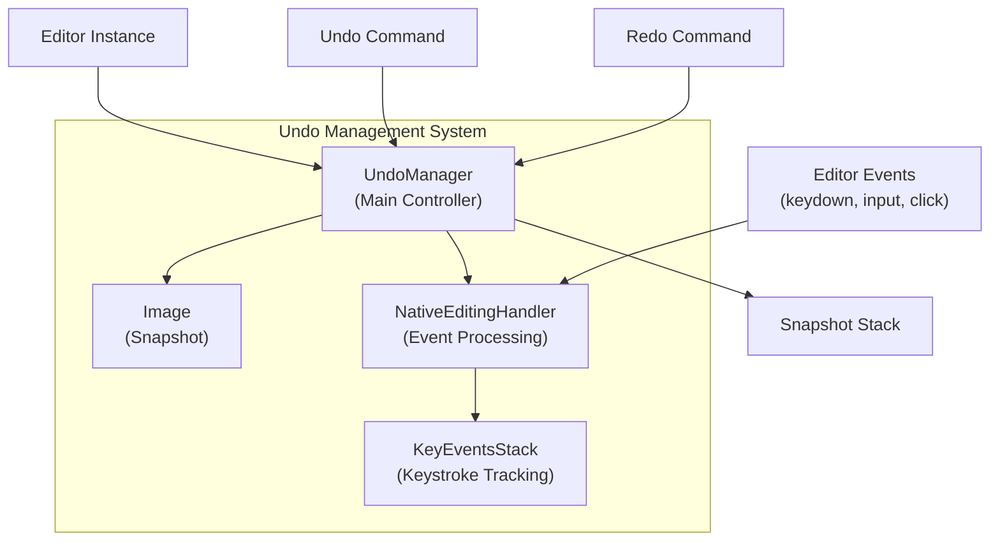
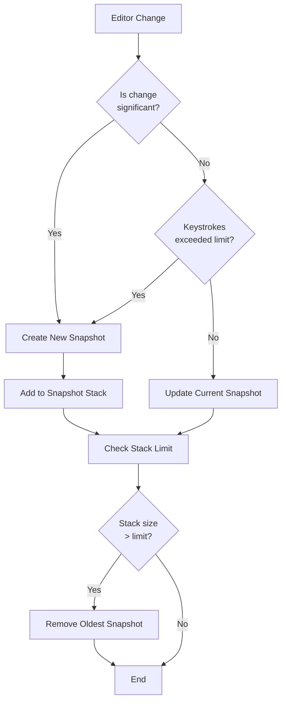
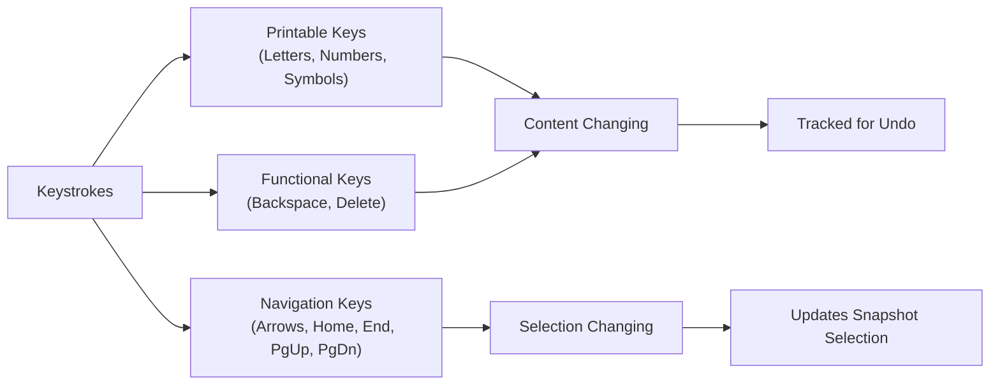

# Undo Management

<details>
<summary>Relevant source files</summary>

The following files were used as context for generating this wiki page:

- [plugins/undo/plugin.js](https://github.com/ckeditor/ckeditor4/blob/c7e59ec1/plugins/undo/plugin.js)
- [tests/plugins/undo/_helpers/tools.js](https://github.com/ckeditor/ckeditor4/blob/c7e59ec1/tests/plugins/undo/_helpers/tools.js)
- [tests/plugins/undo/change.html](https://github.com/ckeditor/ckeditor4/blob/c7e59ec1/tests/plugins/undo/change.html)
- [tests/plugins/undo/change.js](https://github.com/ckeditor/ckeditor4/blob/c7e59ec1/tests/plugins/undo/change.js)
- [tests/plugins/undo/integrations.js](https://github.com/ckeditor/ckeditor4/blob/c7e59ec1/tests/plugins/undo/integrations.js)
- [tests/plugins/undo/keyboard.html](https://github.com/ckeditor/ckeditor4/blob/c7e59ec1/tests/plugins/undo/keyboard.html)
- [tests/plugins/undo/keyboard.js](https://github.com/ckeditor/ckeditor4/blob/c7e59ec1/tests/plugins/undo/keyboard.js)
- [tests/plugins/undo/manual/changeevent.html](https://github.com/ckeditor/ckeditor4/blob/c7e59ec1/tests/plugins/undo/manual/changeevent.html)
- [tests/plugins/undo/manual/changeevent.md](https://github.com/ckeditor/ckeditor4/blob/c7e59ec1/tests/plugins/undo/manual/changeevent.md)
- [tests/plugins/undo/pointer.html](https://github.com/ckeditor/ckeditor4/blob/c7e59ec1/tests/plugins/undo/pointer.html)
- [tests/plugins/undo/pointer.js](https://github.com/ckeditor/ckeditor4/blob/c7e59ec1/tests/plugins/undo/pointer.js)

</details>


The Undo Management system in CKEditor 4 provides the functionality to track changes made to the editor content and allows users to navigate through these changes via undo and redo operations. This document details the architecture, core components, and workflows that enable this feature.

## 1. Overview

The Undo Management system tracks changes to the editor content by creating and managing "snapshots" (images of editor state) at strategic points during editing. These snapshots are used to restore previous or subsequent editor states when users invoke undo or redo commands. 

The system is designed to:
- Capture meaningful editor states while minimizing performance impact
- Group similar changes together to create logical undo/redo steps
- Provide keyboard shortcuts (Ctrl+Z, Ctrl+Y) and toolbar buttons for undo/redo operations
- Integrate with other editor systems like clipboard and commands



Sources: [plugins/undo/plugin.js:21-187](https://github.com/ckeditor/ckeditor4/blob/c7e59ec1/plugins/undo/plugin.js#L21-L187), [plugins/undo/plugin.js:199-702](https://github.com/ckeditor/ckeditor4/blob/c7e59ec1/plugins/undo/plugin.js#L199-L702), [plugins/undo/plugin.js:810-899](https://github.com/ckeditor/ckeditor4/blob/c7e59ec1/plugins/undo/plugin.js#L810-L899), [plugins/undo/plugin.js:913-1140](https://github.com/ckeditor/ckeditor4/blob/c7e59ec1/plugins/undo/plugin.js#L913-L1140)

## 2. Core Components

### 2.1 UndoManager

The `UndoManager` is the central component responsible for creating, storing, and managing snapshots of the editor state. It determines when to create snapshots and handles the undo/redo operations.

Key properties:
- `snapshots`: Array storing editor state snapshots
- `index`: Current position in the snapshot stack
- `limit`: Maximum number of snapshots to maintain (configurable via `config.undoStackSize`)
- `strokesLimit`: Maximum number of keystrokes before automatically creating a snapshot (25)

Key methods:
- `save()`: Creates and stores a new snapshot
- `undo()`: Restores the previous snapshot
- `redo()`: Restores the next snapshot
- `update()`: Updates the current snapshot with new content
- `type()`: Handles keystroke input

Sources: [plugins/undo/plugin.js:199-702](https://github.com/ckeditor/ckeditor4/blob/c7e59ec1/plugins/undo/plugin.js#L199-L702)

### 2.2 Image

The `Image` class represents a snapshot of the editor state at a specific point in time. Each snapshot contains:
- `contents`: HTML content of the editor
- `bookmarks`: Selection information (where the cursor was positioned)

Key methods:
- `equalsContent()`: Compares content with another snapshot
- `equalsSelection()`: Compares selection with another snapshot

Sources: [plugins/undo/plugin.js:810-899](https://github.com/ckeditor/ckeditor4/blob/c7e59ec1/plugins/undo/plugin.js#L810-L899)

### 2.3 NativeEditingHandler

The `NativeEditingHandler` captures and processes native browser events related to editing. It tracks keystroke patterns and determines when to create new snapshots.

Key methods:
- `onKeydown()`: Processes keydown events
- `onInput()`: Handles input events
- `onKeyup()`: Processes keyup events
- `onNavigationKey()`: Special handling for navigation keys

Sources: [plugins/undo/plugin.js:913-1140](https://github.com/ckeditor/ckeditor4/blob/c7e59ec1/plugins/undo/plugin.js#L913-L1140)

### 2.4 KeyEventsStack

The `KeyEventsStack` maintains information about keystrokes and their associated inputs. It helps track how many keystrokes of each type (printable or functional) have been made.

Sources: [plugins/undo/plugin.js:1151-1205](https://github.com/ckeditor/ckeditor4/blob/c7e59ec1/plugins/undo/plugin.js#L1151-L1205)

## 3. Snapshot Management Workflow



Sources: [plugins/undo/plugin.js:359-417](https://github.com/ckeditor/ckeditor4/blob/c7e59ec1/plugins/undo/plugin.js#L359-L417), [plugins/undo/plugin.js:559-579](https://github.com/ckeditor/ckeditor4/blob/c7e59ec1/plugins/undo/plugin.js#L559-L579)

### 3.1 When Snapshots Are Created

Snapshots are created in the following scenarios:

1. **On Editor Initialization**:
   ```javascript
   editor.on('instanceReady', function() {
      editor.fire('saveSnapshot');
   });
   ```

2. **After Command Execution**:
   ```javascript
   editor.on('beforeCommandExec', recordCommand);
   editor.on('afterCommandExec', recordCommand);
   ```

3. **On Keystroke Limit Reached**:
   After `strokesLimit` (25) keystrokes, a new snapshot is automatically created.

4. **On Navigation Key After Content Change**:
   When a navigation key is pressed after content has been modified.

5. **On Manual Save**:
   When `editor.fire('saveSnapshot')` is called explicitly.

Sources: [plugins/undo/plugin.js:70-91](https://github.com/ckeditor/ckeditor4/blob/c7e59ec1/plugins/undo/plugin.js#L70-L91), [plugins/undo/plugin.js:278-294](https://github.com/ckeditor/ckeditor4/blob/c7e59ec1/plugins/undo/plugin.js#L278-L294)

### 3.2 Snapshot Stack Management

The undo manager maintains a stack of snapshots with a configurable size limit (`config.undoStackSize`, default 20). When this limit is reached, the oldest snapshot is removed.

```javascript
// If we have reached the limit, remove the oldest one.
if (snapshots.length == this.limit)
    snapshots.shift();
```

Sources: [plugins/undo/plugin.js:405-407](https://github.com/ckeditor/ckeditor4/blob/c7e59ec1/plugins/undo/plugin.js#L405-L407)

## 4. Keystroke Handling

The undo system categorizes keys into different groups to determine their impact on content and when to create snapshots.

### 4.1 Key Groups



Sources: [plugins/undo/plugin.js:712-716](https://github.com/ckeditor/ckeditor4/blob/c7e59ec1/plugins/undo/plugin.js#L712-L716), [plugins/undo/plugin.js:733-736](https://github.com/ckeditor/ckeditor4/blob/c7e59ec1/plugins/undo/plugin.js#L733-L736)

### 4.2 Keystroke Counting

The undo manager counts keystrokes to determine when to automatically create a snapshot:

```javascript
if (strokesPerSnapshotExceeded) {
    // Reset the count of strokes
    strokesRecorded = 0;
    this.editor.fire('saveSnapshot');
} else {
    // Fire change event
    this.editor.fire('change');
}
```

Sources: [plugins/undo/plugin.js:290-298](https://github.com/ckeditor/ckeditor4/blob/c7e59ec1/plugins/undo/plugin.js#L290-L298)

### 4.3 Key Group Changes

When a user switches between key groups (e.g., from typing characters to using Backspace), the undo manager creates a new snapshot to represent this logical change:

```javascript
if (UndoManager.isNavigationKey(keyCode) || this.undoManager.keyGroupChanged(keyCode)) {
    if (undoManager.strokesRecorded[0] || undoManager.strokesRecorded[1]) {
        undoManager.save(false, this.lastKeydownImage, false);
        undoManager.resetType();
    }
}
```

Sources: [plugins/undo/plugin.js:987-994](https://github.com/ckeditor/ckeditor4/blob/c7e59ec1/plugins/undo/plugin.js#L987-L994)

## 5. Undo/Redo Operations

### 5.1 Undo Operation

The undo operation:
1. Checks if an undo is possible (`undoable()`)
2. Saves the current state
3. Retrieves the previous snapshot
4. Restores the editor to that snapshot's state

```javascript
undo: function() {
    if (this.undoable()) {
        this.save(true);
        var image = this.getNextImage(true);
        if (image)
            return this.restoreImage(image), true;
    }
    return false;
}
```

Sources: [plugins/undo/plugin.js:522-532](https://github.com/ckeditor/ckeditor4/blob/c7e59ec1/plugins/undo/plugin.js#L522-L532)

### 5.2 Redo Operation

The redo operation follows similar steps but moves forward in the snapshot stack:

```javascript
redo: function() {
    if (this.redoable()) {
        this.save(true);
        if (this.redoable()) {
            var image = this.getNextImage(false);
            if (image)
                return this.restoreImage(image), true;
        }
    }
    return false;
}
```

Sources: [plugins/undo/plugin.js:537-552](https://github.com/ckeditor/ckeditor4/blob/c7e59ec1/plugins/undo/plugin.js#L537-L552)

### 5.3 Snapshot Restoration

When restoring a snapshot, the system:
1. Loads the content
2. Restores the selection (bookmarks)
3. Updates the current image
4. Refreshes the UI state

```javascript
restoreImage: function(image) {
    // Bring editor focused to restore selection
    var editor = this.editor,
        sel;

    if (image.bookmarks) {
        editor.focus();
        sel = editor.getSelection();
    }

    this.locked = { level: 999 };
    this.editor.loadSnapshot(image.contents);

    if (image.bookmarks)
        sel.selectBookmarks(image.bookmarks);
    
    // ... additional code ...

    this.locked = null;

    this.index = image.index;
    this.currentImage = this.snapshots[this.index];
    this.update();
    this.refreshState();

    editor.fire('change');
}
```

Sources: [plugins/undo/plugin.js:424-465](https://github.com/ckeditor/ckeditor4/blob/c7e59ec1/plugins/undo/plugin.js#L424-L465)

## 6. Locking Mechanism

The undo manager provides a locking mechanism to prevent unwanted snapshots during certain operations (like auto paragraphing):

```javascript
lock: function(dontUpdate, forceUpdate) {
    if (!this.locked) {
        // ... locking logic ...
        this.locked = { update: update, level: 1 };
    } else {
        this.locked.level++;
    }
}

unlock: function() {
    if (this.locked) {
        if (!--this.locked.level) {
            var update = this.locked.update;
            this.locked = null;
            // ... update handling ...
        }
    }
}
```

Sources: [plugins/undo/plugin.js:630-690](https://github.com/ckeditor/ckeditor4/blob/c7e59ec1/plugins/undo/plugin.js#L630-L690)

## 7. Integration with Editor

### 7.1 Command Registration

The undo and redo commands are registered during plugin initialization:

```javascript
var undoCommand = editor.addCommand('undo', {
    exec: function() {
        if (undoManager.undo()) {
            editor.selectionChange();
            this.fire('afterUndo');
        }
    },
    startDisabled: true,
    canUndo: false
});

var redoCommand = editor.addCommand('redo', {
    exec: function() {
        if (undoManager.redo()) {
            editor.selectionChange();
            this.fire('afterRedo');
        }
    },
    startDisabled: true,
    canUndo: false
});
```

Sources: [plugins/undo/plugin.js:31-51](https://github.com/ckeditor/ckeditor4/blob/c7e59ec1/plugins/undo/plugin.js#L31-L51)

### 7.2 UI Integration

Toolbar buttons for undo and redo are added if the UI is available:

```javascript
if (editor.ui.addButton) {
    editor.ui.addButton('Undo', {
        label: editor.lang.undo.undo,
        command: 'undo',
        toolbar: 'undo,10'
    });

    editor.ui.addButton('Redo', {
        label: editor.lang.undo.redo,
        command: 'redo',
        toolbar: 'undo,20'
    });
}
```

Sources: [plugins/undo/plugin.js:104-116](https://github.com/ckeditor/ckeditor4/blob/c7e59ec1/plugins/undo/plugin.js#L104-L116)

### 7.3 Keyboard Shortcuts

Keyboard shortcuts are assigned for undo and redo operations:

```javascript
editor.setKeystroke([
    [keystrokes[0], 'undo'],     // Ctrl+Z
    [keystrokes[1], 'redo'],     // Ctrl+Y
    [keystrokes[2], 'redo']      // Ctrl+Shift+Z
]);
```

Sources: [plugins/undo/plugin.js:53-57](https://github.com/ckeditor/ckeditor4/blob/c7e59ec1/plugins/undo/plugin.js#L53-L57)

## 8. Event System

The undo system uses several custom events to communicate with other components:

| Event | Description |
|-------|-------------|
| `saveSnapshot` | Requests the creation of a new snapshot |
| `updateSnapshot` | Updates the current snapshot with new content |
| `lockSnapshot` | Temporarily prevents snapshot creation |
| `unlockSnapshot` | Resumes snapshot creation |
| `afterUndo` | Fired after an undo operation |
| `afterRedo` | Fired after a redo operation |

Sources: [plugins/undo/plugin.js:145-185](https://github.com/ckeditor/ckeditor4/blob/c7e59ec1/plugins/undo/plugin.js#L145-L185)

## 9. Performance Considerations

The undo system is designed to balance functionality with performance by:

1. Limiting the number of snapshots stored (configurable via `config.undoStackSize`)
2. Only creating snapshots when necessary (significant content changes, command execution)
3. Grouping similar changes together (e.g., consecutive typing)
4. Temporarily disabling in certain situations (read-only mode, source mode)

Sources: [plugins/undo/plugin.js:405-407](https://github.com/ckeditor/ckeditor4/blob/c7e59ec1/plugins/undo/plugin.js#L405-L407), [plugins/undo/plugin.js:93-102](https://github.com/ckeditor/ckeditor4/blob/c7e59ec1/plugins/undo/plugin.js#L93-L102)

## 10. Relation to Other Systems

The undo system integrates with other CKEditor 4 components:

1. **Clipboard System** ([Clipboard and Content Processing](#4)): When content is pasted, the undo system creates a snapshot
2. **Command System**: Commands can specify if they should create undo snapshots
3. **Selection System**: Selection state is saved with each snapshot and restored during undo/redo
4. **Editor Mode System**: The undo system is only enabled in WYSIWYG mode