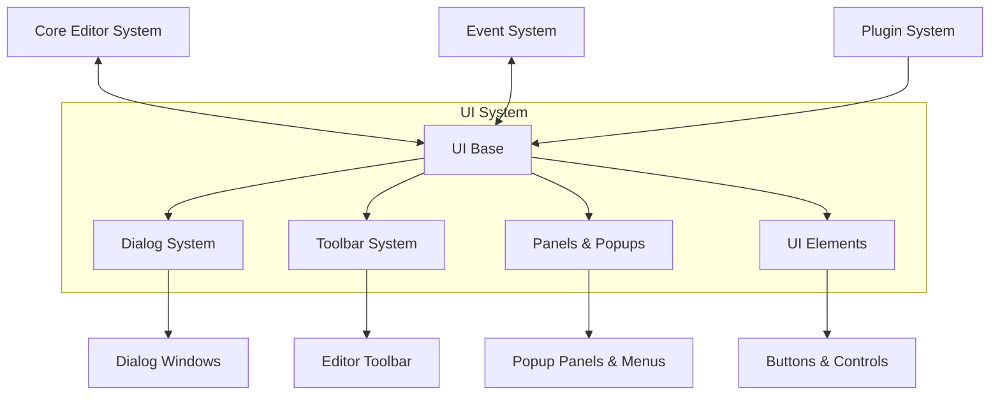
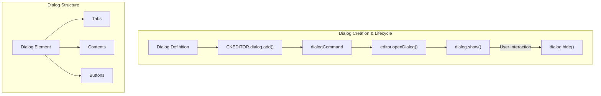
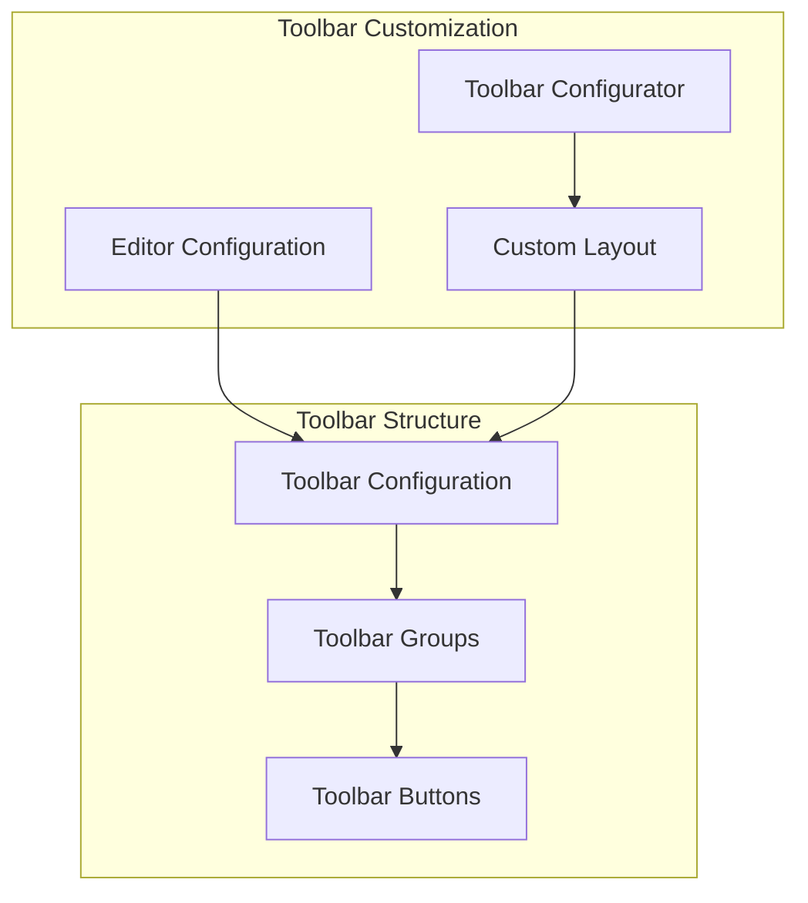
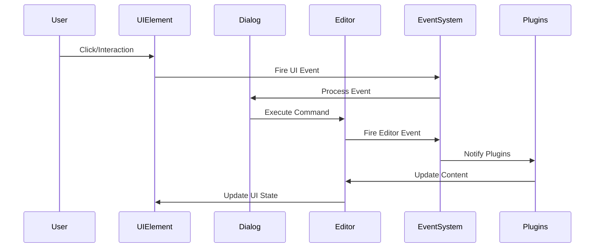
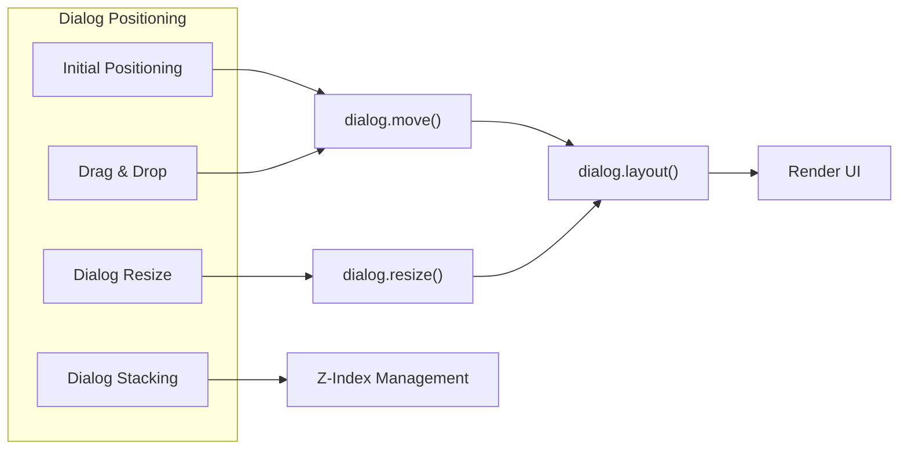

# UI System

<details>
<summary>Relevant source files</summary>

The following files were used as context for generating this wiki page:

- [dev/tasks/samples.js](https://github.com/ckeditor/ckeditor4/blob/c7e59ec1/dev/tasks/samples.js)
- [plugins/dialog/dialogDefinition.js](https://github.com/ckeditor/ckeditor4/blob/c7e59ec1/plugins/dialog/dialogDefinition.js)
- [plugins/dialog/plugin.js](https://github.com/ckeditor/ckeditor4/blob/c7e59ec1/plugins/dialog/plugin.js)
- [plugins/sourcedialog/samples/sourcedialog.html](https://github.com/ckeditor/ckeditor4/blob/c7e59ec1/plugins/sourcedialog/samples/sourcedialog.html)
- [samples/css/samples.css](https://github.com/ckeditor/ckeditor4/blob/c7e59ec1/samples/css/samples.css)
- [samples/img/github-top.png](https://github.com/ckeditor/ckeditor4/blob/c7e59ec1/samples/img/github-top.png)
- [samples/img/header-bg.png](https://github.com/ckeditor/ckeditor4/blob/c7e59ec1/samples/img/header-bg.png)
- [samples/img/header-separator.png](https://github.com/ckeditor/ckeditor4/blob/c7e59ec1/samples/img/header-separator.png)
- [samples/img/logo.png](https://github.com/ckeditor/ckeditor4/blob/c7e59ec1/samples/img/logo.png)
- [samples/img/logo.svg](https://github.com/ckeditor/ckeditor4/blob/c7e59ec1/samples/img/logo.svg)
- [samples/img/navigation-tip.png](https://github.com/ckeditor/ckeditor4/blob/c7e59ec1/samples/img/navigation-tip.png)
- [samples/index.html](https://github.com/ckeditor/ckeditor4/blob/c7e59ec1/samples/index.html)
- [samples/js/sf.js](https://github.com/ckeditor/ckeditor4/blob/c7e59ec1/samples/js/sf.js)
- [samples/less/custom.less](https://github.com/ckeditor/ckeditor4/blob/c7e59ec1/samples/less/custom.less)
- [samples/less/samples.less](https://github.com/ckeditor/ckeditor4/blob/c7e59ec1/samples/less/samples.less)
- [samples/toolbarconfigurator/index.html](https://github.com/ckeditor/ckeditor4/blob/c7e59ec1/samples/toolbarconfigurator/index.html)
- [samples/toolbarconfigurator/js/abstracttoolbarmodifier.js](https://github.com/ckeditor/ckeditor4/blob/c7e59ec1/samples/toolbarconfigurator/js/abstracttoolbarmodifier.js)
- [samples/toolbarconfigurator/js/fulltoolbareditor.js](https://github.com/ckeditor/ckeditor4/blob/c7e59ec1/samples/toolbarconfigurator/js/fulltoolbareditor.js)
- [samples/toolbarconfigurator/js/toolbarmodifier.js](https://github.com/ckeditor/ckeditor4/blob/c7e59ec1/samples/toolbarconfigurator/js/toolbarmodifier.js)
- [samples/toolbarconfigurator/js/toolbartextmodifier.js](https://github.com/ckeditor/ckeditor4/blob/c7e59ec1/samples/toolbarconfigurator/js/toolbartextmodifier.js)
- [samples/toolbarconfigurator/less/base.less](https://github.com/ckeditor/ckeditor4/blob/c7e59ec1/samples/toolbarconfigurator/less/base.less)
- [samples/toolbarconfigurator/less/toolbarmodifier.less](https://github.com/ckeditor/ckeditor4/blob/c7e59ec1/samples/toolbarconfigurator/less/toolbarmodifier.less)
- [tests/_assets/queue1.js](https://github.com/ckeditor/ckeditor4/blob/c7e59ec1/tests/_assets/queue1.js)
- [tests/_assets/queue2.js](https://github.com/ckeditor/ckeditor4/blob/c7e59ec1/tests/_assets/queue2.js)
- [tests/_assets/queue3.js](https://github.com/ckeditor/ckeditor4/blob/c7e59ec1/tests/_assets/queue3.js)
- [tests/_assets/sample.js](https://github.com/ckeditor/ckeditor4/blob/c7e59ec1/tests/_assets/sample.js)
- [tests/_benderjs/ckeditor/lib/index.js](https://github.com/ckeditor/ckeditor4/blob/c7e59ec1/tests/_benderjs/ckeditor/lib/index.js)
- [tests/_benderjs/ckeditor/lib/pagebuilder.js](https://github.com/ckeditor/ckeditor4/blob/c7e59ec1/tests/_benderjs/ckeditor/lib/pagebuilder.js)
- [tests/_benderjs/ckeditor/lib/testbuilder.js](https://github.com/ckeditor/ckeditor4/blob/c7e59ec1/tests/_benderjs/ckeditor/lib/testbuilder.js)
- [tests/_benderjs/ckeditor/static/activate.js](https://github.com/ckeditor/ckeditor4/blob/c7e59ec1/tests/_benderjs/ckeditor/static/activate.js)
- [tests/_benderjs/ckeditor/static/bot.js](https://github.com/ckeditor/ckeditor4/blob/c7e59ec1/tests/_benderjs/ckeditor/static/bot.js)
- [tests/_benderjs/ckeditor/static/extensions.js](https://github.com/ckeditor/ckeditor4/blob/c7e59ec1/tests/_benderjs/ckeditor/static/extensions.js)
- [tests/_benderjs/ckeditor/static/tools.js](https://github.com/ckeditor/ckeditor4/blob/c7e59ec1/tests/_benderjs/ckeditor/static/tools.js)
- [tests/core/dom/range/getclientrectswidget.js](https://github.com/ckeditor/ckeditor4/blob/c7e59ec1/tests/core/dom/range/getclientrectswidget.js)
- [tests/core/editor/_assets/custom_config_1.js](https://github.com/ckeditor/ckeditor4/blob/c7e59ec1/tests/core/editor/_assets/custom_config_1.js)
- [tests/plugins/dialog/_helpers/tools.js](https://github.com/ckeditor/ckeditor4/blob/c7e59ec1/tests/plugins/dialog/_helpers/tools.js)
- [tests/plugins/dialog/focus.js](https://github.com/ckeditor/ckeditor4/blob/c7e59ec1/tests/plugins/dialog/focus.js)
- [tests/plugins/dialog/manual/opennonfirsttabasdefault.html](https://github.com/ckeditor/ckeditor4/blob/c7e59ec1/tests/plugins/dialog/manual/opennonfirsttabasdefault.html)
- [tests/plugins/dialog/manual/opennonfirsttabasdefault.md](https://github.com/ckeditor/ckeditor4/blob/c7e59ec1/tests/plugins/dialog/manual/opennonfirsttabasdefault.md)
- [tests/plugins/dialog/plugin.js](https://github.com/ckeditor/ckeditor4/blob/c7e59ec1/tests/plugins/dialog/plugin.js)
- [tests/plugins/dialog/positioning.js](https://github.com/ckeditor/ckeditor4/blob/c7e59ec1/tests/plugins/dialog/positioning.js)
- [tests/plugins/pastefromword/generated/_helpers/promisePasteEvent.js](https://github.com/ckeditor/ckeditor4/blob/c7e59ec1/tests/plugins/pastefromword/generated/_helpers/promisePasteEvent.js)
- [tests/plugins/tabletools/manual/colordialogposition.html](https://github.com/ckeditor/ckeditor4/blob/c7e59ec1/tests/plugins/tabletools/manual/colordialogposition.html)
- [tests/plugins/tabletools/manual/colordialogposition.md](https://github.com/ckeditor/ckeditor4/blob/c7e59ec1/tests/plugins/tabletools/manual/colordialogposition.md)
- [tests/utils/assert/isnumberinrange.js](https://github.com/ckeditor/ckeditor4/blob/c7e59ec1/tests/utils/assert/isnumberinrange.js)
- [tests/utils/html/compareinnerhtml.js](https://github.com/ckeditor/ckeditor4/blob/c7e59ec1/tests/utils/html/compareinnerhtml.js)

</details>


The UI System in CKEditor 4 provides the framework for all user interface elements in the editor, including dialogs, toolbars, panels, and buttons. This document gives an overview of the UI architecture and explains how these components interact with other parts of the editor.

For detailed information about specific subsystems, see:
- [Dialog System](#5.1)
- [Color and UI Elements](#5.2)

## Architecture Overview

The UI System serves as an intermediary layer between the core editor functionality and the user interface elements that are presented to the user. It handles the creation, rendering, and interaction of UI components.



Sources: [plugins/dialog/plugin.js:62-694](https://github.com/ckeditor/ckeditor4/blob/c7e59ec1/plugins/dialog/plugin.js#L62-L694), [samples/toolbarconfigurator/index.html:52-153](https://github.com/ckeditor/ckeditor4/blob/c7e59ec1/samples/toolbarconfigurator/index.html#L52-L153)

## Core Components

### Dialog System

The Dialog System provides a framework for creating modal windows that allow user interactions such as configurations, settings, and content modifications. Dialogs in CKEditor 4 are highly customizable and follow a well-defined lifecycle.



Dialogs are created from definitions that specify their appearance and behavior. These definitions include properties like title, size constraints, contents, and event handlers.

Key components of the Dialog System:
- **Dialog Definitions**: Objects that define dialog properties and behavior
- **Dialog Windows**: The actual UI components that users interact with
- **Dialog API**: Methods for creating, showing, hiding, and manipulating dialogs

Sources: [plugins/dialog/plugin.js:226-694](https://github.com/ckeditor/ckeditor4/blob/c7e59ec1/plugins/dialog/plugin.js#L226-L694), [plugins/dialog/plugin.js:734-1171](https://github.com/ckeditor/ckeditor4/blob/c7e59ec1/plugins/dialog/plugin.js#L734-L1171)

### Toolbar System

The Toolbar System provides the editor's main interface for accessing commands and functionality. It consists of toolbars, toolbar groups, and toolbar buttons organized in a configurable layout.



The toolbar can be configured in different ways:
- **Basic Configuration**: Using predefined toolbar groups and buttons
- **Advanced Configuration**: Custom toolbar layout with specific buttons and groups
- **Toolbar Configurator**: A visual tool for creating toolbar configurations

Sources: [samples/toolbarconfigurator/index.html:89-132](https://github.com/ckeditor/ckeditor4/blob/c7e59ec1/samples/toolbarconfigurator/index.html#L89-L132), [samples/toolbarconfigurator/js/toolbarmodifier.js:15-57](https://github.com/ckeditor/ckeditor4/blob/c7e59ec1/samples/toolbarconfigurator/js/toolbarmodifier.js#L15-L57)

### UI Elements

CKEditor 4 includes various UI elements that make up the user interface:

| UI Element Type | Description | Examples |
|-----------------|-------------|----------|
| Buttons | Interactive controls that trigger commands | OK, Cancel, Bold buttons |
| Panels | Containers for groups of controls | Format panel, color picker |
| Popups | Floating elements that appear on demand | Context menus, tooltips |
| Inputs | Form elements for user data entry | Text fields, checkboxes |
| Tabs | Elements for organizing content into pages | Dialog tabs, editor tabs |

Sources: [plugins/dialog/plugin.js:175-224](https://github.com/ckeditor/ckeditor4/blob/c7e59ec1/plugins/dialog/plugin.js#L175-L224), [samples/css/samples.css:573-723](https://github.com/ckeditor/ckeditor4/blob/c7e59ec1/samples/css/samples.css#L573-L723)

## UI Event Flow

UI components in CKEditor 4 use a robust event system to handle user interactions and communicate with other parts of the editor.



Key aspects of the UI event flow:
- Events bubble up through the DOM hierarchy
- Events can be captured, handled, or prevented at different levels
- The editor maintains state based on events (focused, busy, etc.)
- Dialog state transitions (idle/busy) are managed through events

Sources: [plugins/dialog/plugin.js:371-429](https://github.com/ckeditor/ckeditor4/blob/c7e59ec1/plugins/dialog/plugin.js#L371-L429), [tests/_benderjs/ckeditor/static/bot.js:131-165](https://github.com/ckeditor/ckeditor4/blob/c7e59ec1/tests/_benderjs/ckeditor/static/bot.js#L131-L165)

## Dialog Positioning and Styling

CKEditor 4 implements an advanced dialog positioning system that handles:

- Initial positioning (centered in the viewport)
- Drag and drop repositioning
- Resizing based on configuration settings
- Stacking of multiple dialogs
- Responsive behavior on window resize



Dialog appearance is controlled through CSS, with specific classes for different dialog states and components.

Sources: [plugins/dialog/plugin.js:749-1021](https://github.com/ckeditor/ckeditor4/blob/c7e59ec1/plugins/dialog/plugin.js#L749-L1021), [tests/plugins/dialog/positioning.js:19-58](https://github.com/ckeditor/ckeditor4/blob/c7e59ec1/tests/plugins/dialog/positioning.js#L19-L58)

## Customization and Configuration

The UI System in CKEditor 4 is designed to be highly customizable through both configuration options and programmatic changes.

### Toolbar Customization

The toolbar can be customized using:
- The `config.toolbar` option for direct configuration
- The `config.toolbarGroups` option for group-based configuration
- The toolbar configurator tool for visual configuration

Example toolbar configuration:

```javascript
config.toolbar = [
    { name: 'document', items: [ 'Source', '-', 'Save', 'NewPage', 'Preview', 'Print', '-', 'Templates' ] },
    { name: 'clipboard', items: [ 'Cut', 'Copy', 'Paste', 'PasteText', 'PasteFromWord', '-', 'Undo', 'Redo' ] },
    '/',
    { name: 'basicstyles', items: [ 'Bold', 'Italic' ] }
];
```

### Dialog Customization

Dialogs can be customized through:
- Custom dialog definitions
- The `dialogDefinition` event for modifying existing dialogs
- Custom styling through CSS

Sources: [samples/toolbarconfigurator/js/toolbarmodifier.js:179-255](https://github.com/ckeditor/ckeditor4/blob/c7e59ec1/samples/toolbarconfigurator/js/toolbarmodifier.js#L179-L255), [plugins/dialog/plugin.js:319-347](https://github.com/ckeditor/ckeditor4/blob/c7e59ec1/plugins/dialog/plugin.js#L319-L347)

## Best Practices

When working with the UI System in CKEditor 4, consider these best practices:

1. **Use the configuration API** rather than direct DOM manipulation
2. **Listen for events** to respond to UI changes
3. **Separate UI logic** from content-manipulation logic
4. **Follow the dialog lifecycle** when creating custom dialogs
5. **Use the toolbar configurator** for complex toolbar layouts
6. **Test across browsers** as UI rendering can vary

Sources: [tests/plugins/dialog/focus.js:34-66](https://github.com/ckeditor/ckeditor4/blob/c7e59ec1/tests/plugins/dialog/focus.js#L34-L66), [tests/plugins/dialog/plugin.js:85-119](https://github.com/ckeditor/ckeditor4/blob/c7e59ec1/tests/plugins/dialog/plugin.js#L85-L119)

## Related Components

The UI System integrates with several other CKEditor 4 components:

- **Event System**: Provides the foundation for UI event handling
- **Plugin System**: Extends the UI with additional functionality
- **Style System**: Influences the appearance of UI elements
- **Widget System**: Creates complex UI elements for content editing