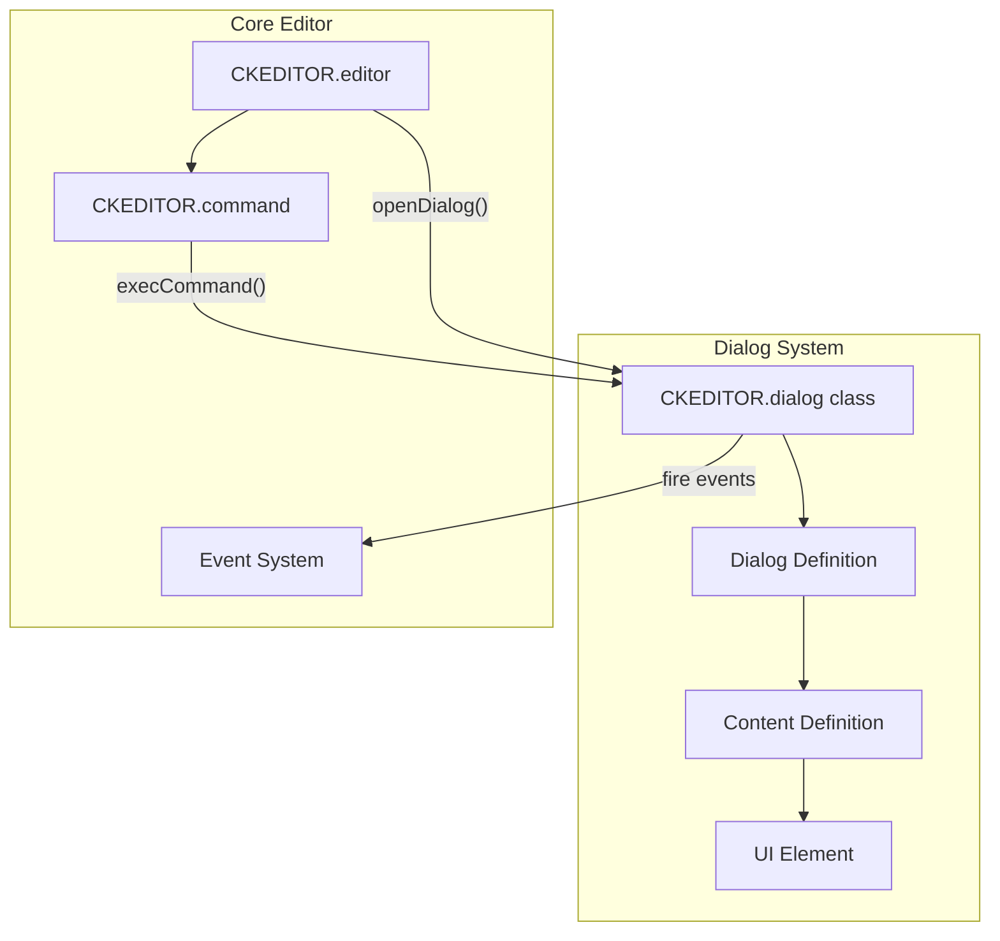
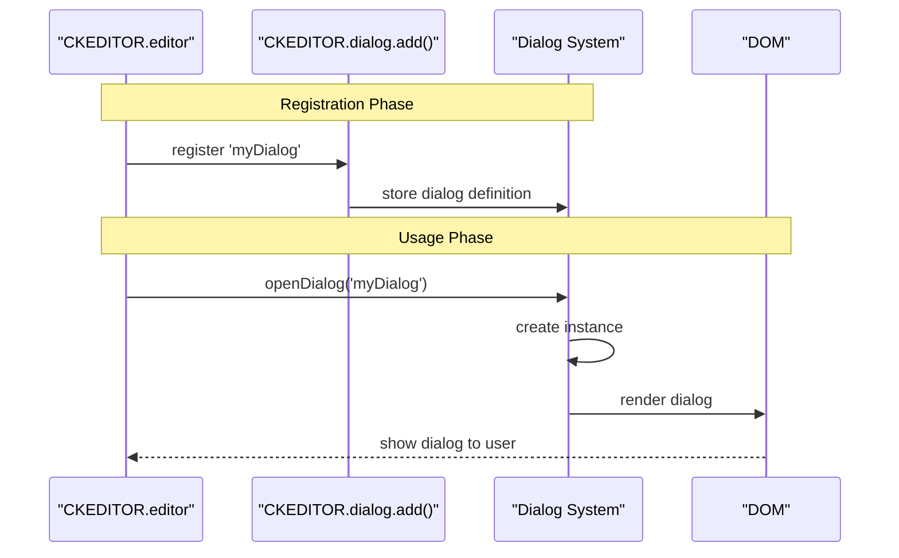
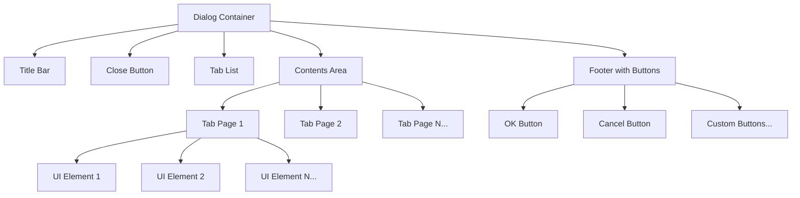
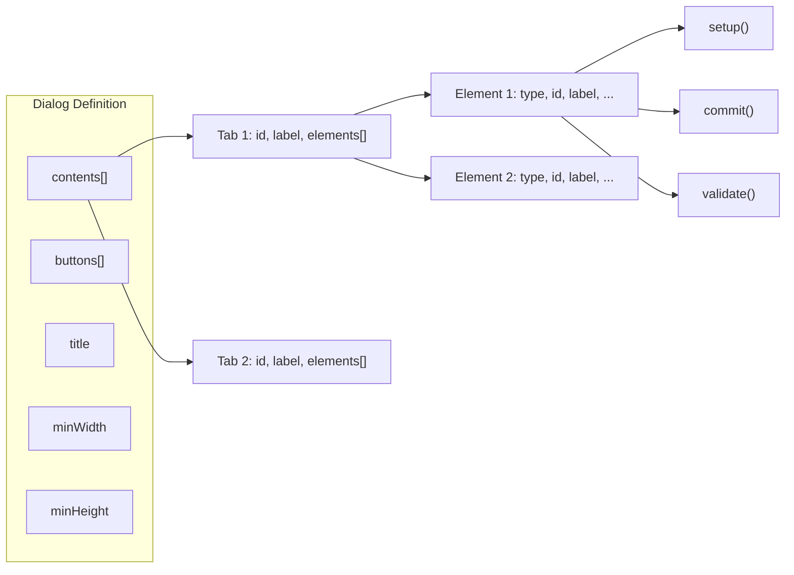
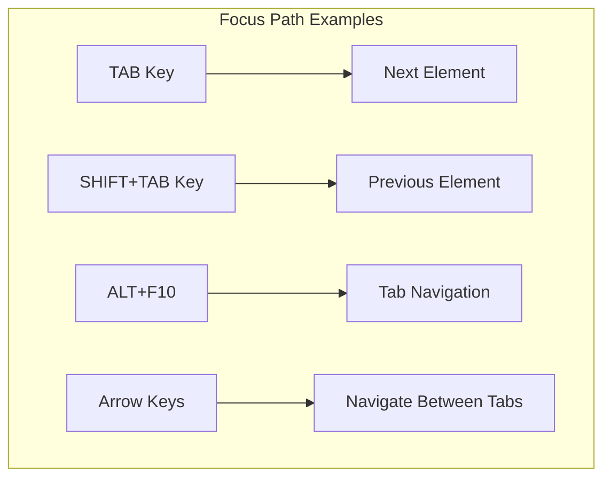
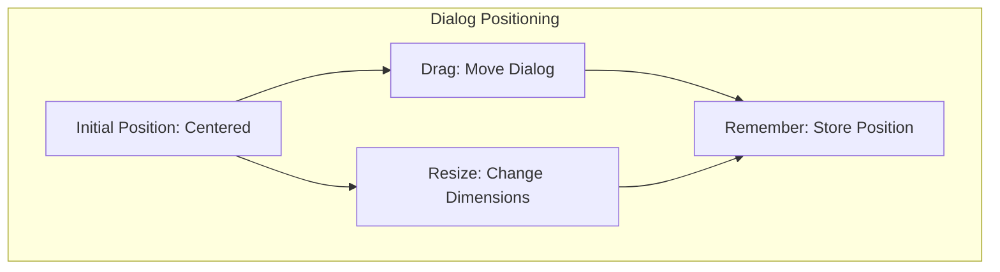
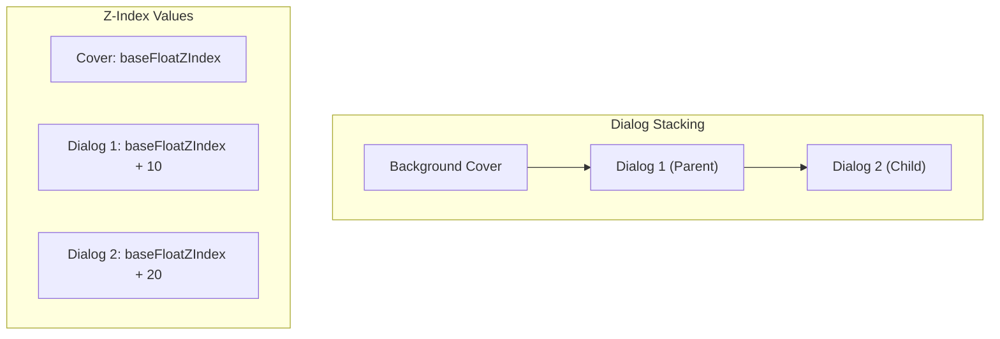
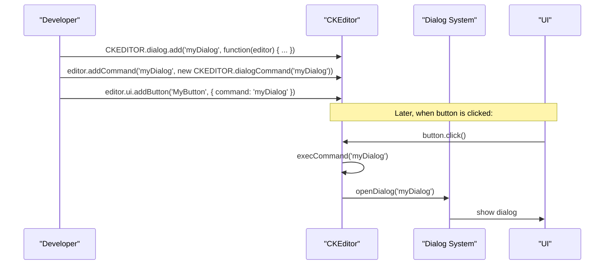

# Dialog System

Relevant source files

The following files were used as context for generating this wiki page:

- [plugins/dialog/dialogDefinition.js](https://github.com/ckeditor/ckeditor4/blob/c7e59ec1/plugins/dialog/dialogDefinition.js)
- [plugins/dialog/plugin.js](https://github.com/ckeditor/ckeditor4/blob/c7e59ec1/plugins/dialog/plugin.js)
- [tests/_assets/queue1.js](https://github.com/ckeditor/ckeditor4/blob/c7e59ec1/tests/_assets/queue1.js)
- [tests/_assets/queue2.js](https://github.com/ckeditor/ckeditor4/blob/c7e59ec1/tests/_assets/queue2.js)
- [tests/_assets/queue3.js](https://github.com/ckeditor/ckeditor4/blob/c7e59ec1/tests/_assets/queue3.js)
- [tests/_assets/sample.js](https://github.com/ckeditor/ckeditor4/blob/c7e59ec1/tests/_assets/sample.js)
- [tests/_benderjs/ckeditor/lib/index.js](https://github.com/ckeditor/ckeditor4/blob/c7e59ec1/tests/_benderjs/ckeditor/lib/index.js)
- [tests/_benderjs/ckeditor/lib/pagebuilder.js](https://github.com/ckeditor/ckeditor4/blob/c7e59ec1/tests/_benderjs/ckeditor/lib/pagebuilder.js)
- [tests/_benderjs/ckeditor/lib/testbuilder.js](https://github.com/ckeditor/ckeditor4/blob/c7e59ec1/tests/_benderjs/ckeditor/lib/testbuilder.js)
- [tests/_benderjs/ckeditor/static/activate.js](https://github.com/ckeditor/ckeditor4/blob/c7e59ec1/tests/_benderjs/ckeditor/static/activate.js)
- [tests/_benderjs/ckeditor/static/bot.js](https://github.com/ckeditor/ckeditor4/blob/c7e59ec1/tests/_benderjs/ckeditor/static/bot.js)
- [tests/_benderjs/ckeditor/static/extensions.js](https://github.com/ckeditor/ckeditor4/blob/c7e59ec1/tests/_benderjs/ckeditor/static/extensions.js)
- [tests/_benderjs/ckeditor/static/tools.js](https://github.com/ckeditor/ckeditor4/blob/c7e59ec1/tests/_benderjs/ckeditor/static/tools.js)
- [tests/core/dom/range/getclientrectswidget.js](https://github.com/ckeditor/ckeditor4/blob/c7e59ec1/tests/core/dom/range/getclientrectswidget.js)
- [tests/plugins/dialog/_helpers/tools.js](https://github.com/ckeditor/ckeditor4/blob/c7e59ec1/tests/plugins/dialog/_helpers/tools.js)
- [tests/plugins/dialog/focus.js](https://github.com/ckeditor/ckeditor4/blob/c7e59ec1/tests/plugins/dialog/focus.js)
- [tests/plugins/dialog/manual/opennonfirsttabasdefault.html](https://github.com/ckeditor/ckeditor4/blob/c7e59ec1/tests/plugins/dialog/manual/opennonfirsttabasdefault.html)
- [tests/plugins/dialog/manual/opennonfirsttabasdefault.md](https://github.com/ckeditor/ckeditor4/blob/c7e59ec1/tests/plugins/dialog/manual/opennonfirsttabasdefault.md)
- [tests/plugins/dialog/plugin.js](https://github.com/ckeditor/ckeditor4/blob/c7e59ec1/tests/plugins/dialog/plugin.js)
- [tests/plugins/dialog/positioning.js](https://github.com/ckeditor/ckeditor4/blob/c7e59ec1/tests/plugins/dialog/positioning.js)
- [tests/plugins/pastefromword/generated/_helpers/promisePasteEvent.js](https://github.com/ckeditor/ckeditor4/blob/c7e59ec1/tests/plugins/pastefromword/generated/_helpers/promisePasteEvent.js)
- [tests/plugins/tabletools/manual/colordialogposition.html](https://github.com/ckeditor/ckeditor4/blob/c7e59ec1/tests/plugins/tabletools/manual/colordialogposition.html)
- [tests/plugins/tabletools/manual/colordialogposition.md](https://github.com/ckeditor/ckeditor4/blob/c7e59ec1/tests/plugins/tabletools/manual/colordialogposition.md)
- [tests/utils/assert/isnumberinrange.js](https://github.com/ckeditor/ckeditor4/blob/c7e59ec1/tests/utils/assert/isnumberinrange.js)
- [tests/utils/html/compareinnerhtml.js](https://github.com/ckeditor/ckeditor4/blob/c7e59ec1/tests/utils/html/compareinnerhtml.js)

The Dialog System in CKEditor 4 provides a framework for creating, managing, and rendering modal dialog windows for user interaction. These dialogs are used throughout the editor for tasks such as inserting links, images, tables, and configuring various content elements.

For information about general UI components, see [UI System](#5).

## 1. Dialog Architecture

The Dialog System consists of several key components working together to create and manage dialog windows. At its core is the `CKEDITOR.dialog` class which manages dialog instances, their lifecycle, and user interactions.

Dialog windows are defined through configuration objects that specify their appearance, behavior, and contents. The dialog system then renders these definitions as DOM elements and manages their lifecycle.

Sources: [plugins/dialog/plugin.js:226-236](https://github.com/ckeditor/ckeditor4/blob/c7e59ec1/plugins/dialog/plugin.js#L226-L236), [plugins/dialog/plugin.js:237-294](https://github.com/ckeditor/ckeditor4/blob/c7e59ec1/plugins/dialog/plugin.js#L237-L294), [plugins/dialog/dialogDefinition.js:1-162](https://github.com/ckeditor/ckeditor4/blob/c7e59ec1/plugins/dialog/dialogDefinition.js#L1-L162)

## 2. Dialog Constants and States

CKEditor defines several constants for dialog resizing and states:

| Constant | Value | Description |
|----------|-------|-------------|
| `CKEDITOR.DIALOG_RESIZE_NONE` | 0 | No resize capability |
| `CKEDITOR.DIALOG_RESIZE_WIDTH` | 1 | Horizontal resize only |
| `CKEDITOR.DIALOG_RESIZE_HEIGHT` | 2 | Vertical resize only |
| `CKEDITOR.DIALOG_RESIZE_BOTH` | 3 | Both directions resize |
| `CKEDITOR.DIALOG_STATE_IDLE` | 1 | Dialog is idle and interactive |
| `CKEDITOR.DIALOG_STATE_BUSY` | 2 | Dialog is processing something |

These constants are used to configure dialog behavior and manage their state during operation.

Sources: [plugins/dialog/plugin.js:10-62](https://github.com/ckeditor/ckeditor4/blob/c7e59ec1/plugins/dialog/plugin.js#L10-L62)

## 3. Dialog Creation and Registration

Dialogs are defined and registered with the editor using the `CKEDITOR.dialog.add()` method. Each dialog is identified by a unique name and is associated with a definition object or a URL to load the definition from.

Dialog definitions can be loaded on-demand from external JavaScript files, which helps reduce the initial loading time of the editor.

Sources: [plugins/dialog/plugin.js:64-74](https://github.com/ckeditor/ckeditor4/blob/c7e59ec1/plugins/dialog/plugin.js#L64-L74), [tests/plugins/dialog/plugin.js:60-81](https://github.com/ckeditor/ckeditor4/blob/c7e59ec1/tests/plugins/dialog/plugin.js#L60-L81)

## 4. Dialog Structure and Elements

A dialog consists of several key parts: a title bar, tabs, content panels, and a footer with buttons. The structure is defined in HTML templates within the code.

The dialog HTML structure is created by the `buildDialog` function which creates a DOM template including:
- Dialog container with proper styling
- Title area with heading text
- Close button 
- Tab navigation area
- Content area for each tab
- Footer with action buttons

Sources: [plugins/dialog/plugin.js:149-177](https://github.com/ckeditor/ckeditor4/blob/c7e59ec1/plugins/dialog/plugin.js#L149-L177), [plugins/dialog/plugin.js:178-224](https://github.com/ckeditor/ckeditor4/blob/c7e59ec1/plugins/dialog/plugin.js#L178-L224)

## 5. Dialog Lifecycle and Events

Dialogs have a well-defined lifecycle with various events that can be hooked into by developers:

1. **Creation**: When `editor.openDialog()` is called
2. **Loading**: External definitions are loaded if needed
3. **Showing**: Dialog is rendered and displayed
4. **Interaction**: User interacts with dialog
5. **Validation**: Input is validated when OK is clicked
6. **Data Transfer**: Data is transferred to the editor
7. **Hiding**: Dialog is hidden
8. **Destruction**: When editor is destroyed

Key events include:
- `load`: Fired once when the dialog is first loaded
- `show`: Fired each time the dialog is displayed
- `ok`: Fired when the OK button is clicked
- `cancel`: Fired when the Cancel button is clicked
- `hide`: Fired when the dialog is hidden
- `dialogDefinition`: Fired when a dialog definition is loaded

Sources: [plugins/dialog/plugin.js:349-379](https://github.com/ckeditor/ckeditor4/blob/c7e59ec1/plugins/dialog/plugin.js#L349-L379), [plugins/dialog/plugin.js:869-984](https://github.com/ckeditor/ckeditor4/blob/c7e59ec1/plugins/dialog/plugin.js#L869-L984), [plugins/dialog/plugin.js:1103-1171](https://github.com/ckeditor/ckeditor4/blob/c7e59ec1/plugins/dialog/plugin.js#L1103-L1171)

## 6. Dialog Content and UI Elements

Dialog content is organized into tabs (pages), each containing various UI elements. The dialog system supports many different element types:

| Element Type | Description |
|-------------|-------------|
| `text` | Text input field |
| `textarea` | Multiline text input |
| `radio` | Radio button group |
| `select` | Dropdown select |
| `checkbox` | Checkbox input |
| `button` | Button element |
| `html` | Custom HTML content |
| `hbox` | Horizontal layout container |
| `vbox` | Vertical layout container |
| `file` | File input field |

Each element has its own set of properties and events that can be configured in the dialog definition.

Sources: [plugins/dialog/dialogDefinition.js:46-162](https://github.com/ckeditor/ckeditor4/blob/c7e59ec1/plugins/dialog/dialogDefinition.js#L46-L162), [plugins/dialog/dialogDefinition.js:200-290](https://github.com/ckeditor/ckeditor4/blob/c7e59ec1/plugins/dialog/dialogDefinition.js#L200-L290)

## 7. Focus Management

The Dialog System implements a sophisticated focus management system to handle keyboard navigation within dialogs. This includes:

1. **Focus Cycle**: Tab key navigates through focusable elements
2. **Initial Focus**: The first focusable element receives focus when dialog opens
3. **Tab Bars**: Special handling for tabbed interfaces
4. **Radio Groups**: Special handling for radio button groups

The focus order is determined by the `tabIndex` property or the order of elements in the DOM. The dialog system tracks the current focus and provides methods to move focus between elements.

Sources: [plugins/dialog/plugin.js:430-500](https://github.com/ckeditor/ckeditor4/blob/c7e59ec1/plugins/dialog/plugin.js#L430-L500), [tests/plugins/dialog/focus.js:8-23](https://github.com/ckeditor/ckeditor4/blob/c7e59ec1/tests/plugins/dialog/focus.js#L8-L23), [tests/plugins/dialog/focus.js:33-127](https://github.com/ckeditor/ckeditor4/blob/c7e59ec1/tests/plugins/dialog/focus.js#L33-L127)

## 8. Dialog Positioning and Resizing

Dialogs can be positioned and resized according to their configuration. By default, dialogs are centered in the viewport and can be moved by dragging the title bar.

The dialog system handles:
- Initial positioning (centered in viewport)
- Dragging to reposition
- Resizing based on resize mode
- Remembering position between openings
- Adjusting to viewport changes

Sources: [plugins/dialog/plugin.js:723-803](https://github.com/ckeditor/ckeditor4/blob/c7e59ec1/plugins/dialog/plugin.js#L723-L803), [plugins/dialog/plugin.js:804-891](https://github.com/ckeditor/ckeditor4/blob/c7e59ec1/plugins/dialog/plugin.js#L804-L891), [plugins/dialog/plugin.js:991-1020](https://github.com/ckeditor/ckeditor4/blob/c7e59ec1/plugins/dialog/plugin.js#L991-L1020), [tests/plugins/dialog/positioning.js:89-194](https://github.com/ckeditor/ckeditor4/blob/c7e59ec1/tests/plugins/dialog/positioning.js#L89-L194)

## 9. Dialog Stacking and Cover

When multiple dialogs are opened, the Dialog System manages their stacking order with proper z-index values. A semi-transparent cover is placed under dialogs to prevent interaction with the editor while a dialog is open.

When a child dialog is opened from a parent dialog, the parent dialog's z-index is reduced, and the cover's z-index is adjusted to be between them.

Sources: [plugins/dialog/plugin.js:896-939](https://github.com/ckeditor/ckeditor4/blob/c7e59ec1/plugins/dialog/plugin.js#L896-L939), [plugins/dialog/plugin.js:1120-1163](https://github.com/ckeditor/ckeditor4/blob/c7e59ec1/plugins/dialog/plugin.js#L1120-L1163), [tests/plugins/dialog/positioning.js:195-282](https://github.com/ckeditor/ckeditor4/blob/c7e59ec1/tests/plugins/dialog/positioning.js#L195-L282)

## 10. Implementing Custom Dialogs

Creating a custom dialog involves defining a dialog and registering it with the editor:

1. Define dialog using `CKEDITOR.dialog.add()`
2. Create a command to open the dialog
3. Attach the command to a button or context menu

Example flow:

Sources: [tests/plugins/dialog/plugin.js:9-75](https://github.com/ckeditor/ckeditor4/blob/c7e59ec1/tests/plugins/dialog/plugin.js#L9-L75), [tests/plugins/dialog/plugin.js:83-124](https://github.com/ckeditor/ckeditor4/blob/c7e59ec1/tests/plugins/dialog/plugin.js#L83-L124)

## 11. Dialog Testing Utilities

CKEditor provides several testing utilities specifically for dialogs, making it easier to test dialog functionality:

- `bender.tools.mockDialog()`: Creates a dialog mock
- `bender.editorBot.dialog()`: Opens a dialog in testing environment
- `bender.editorBot.asyncDialog()`: Returns a promise with the dialog

These utilities help automate the testing of dialogs, including their behavior, validation, and callbacks.

Sources: [tests/_benderjs/ckeditor/static/tools.js:845-869](https://github.com/ckeditor/ckeditor4/blob/c7e59ec1/tests/_benderjs/ckeditor/static/tools.js#L845-L869), [tests/_benderjs/ckeditor/static/bot.js:166-190](https://github.com/ckeditor/ckeditor4/blob/c7e59ec1/tests/_benderjs/ckeditor/static/bot.js#L166-L190), [tests/_benderjs/ckeditor/static/bot.js:191-224](https://github.com/ckeditor/ckeditor4/blob/c7e59ec1/tests/_benderjs/ckeditor/static/bot.js#L191-L224)

## 12. Best Practices

When implementing dialogs, consider these best practices:

1. **Performance**: Load dialog definitions on-demand when possible
2. **Accessibility**: Ensure proper tab order and keyboard navigation
3. **Validation**: Validate input before closing the dialog
4. **Resizing**: Only enable resizing when necessary
5. **Content**: Keep dialog content concise and focused
6. **Tab Order**: Arrange elements in a logical tab order
7. **Defaults**: Provide sensible default values
8. **Error Handling**: Provide clear error messages for validation failures
9. **Responsiveness**: Design dialogs to work well at different sizes