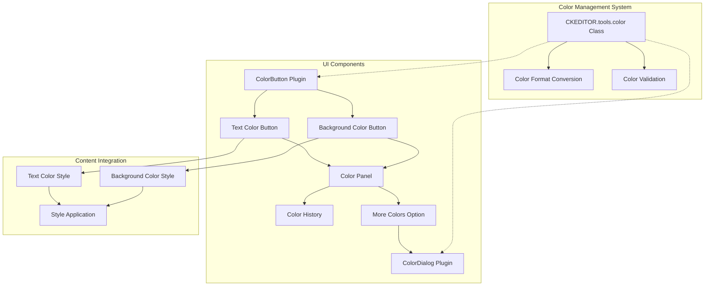
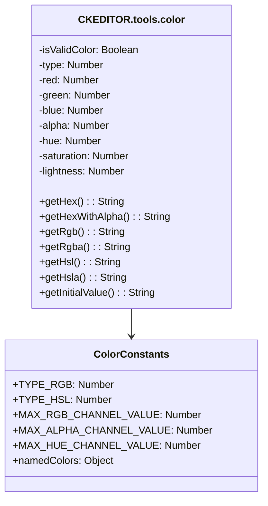
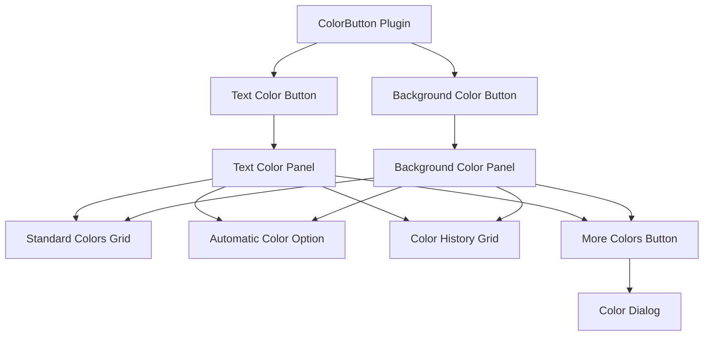
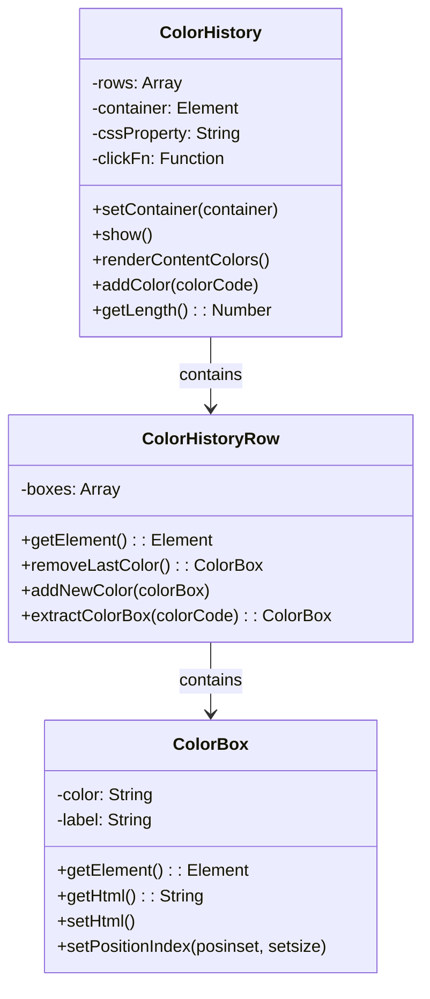
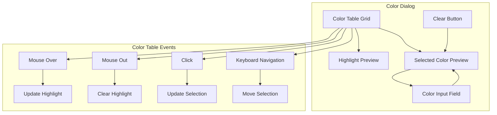
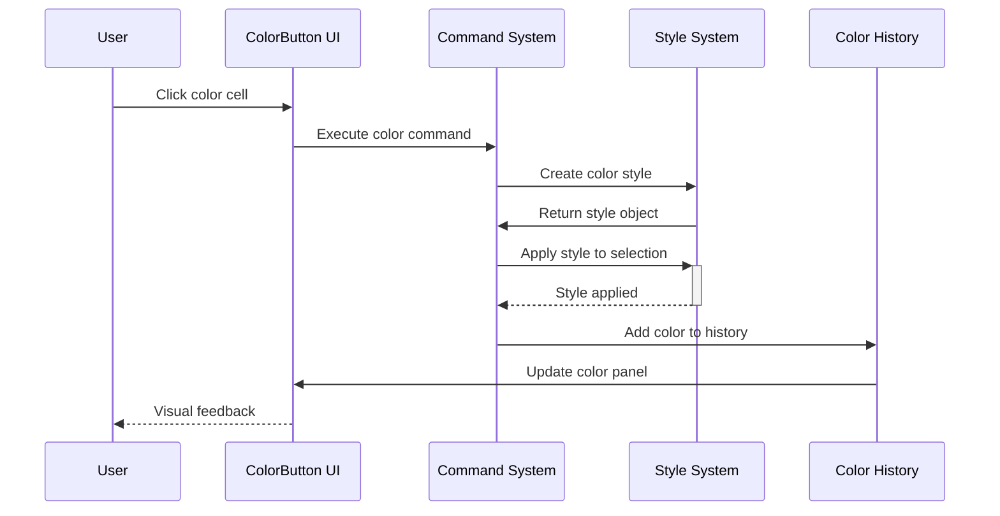

# Color and UI Elements

<details>
<summary>Relevant source files</summary>

The following files were used as context for generating this wiki page:

- [core/ckeditor_license-check.js](https://github.com/ckeditor/ckeditor4/blob/c7e59ec1/core/ckeditor_license-check.js)
- [core/loader.js](https://github.com/ckeditor/ckeditor4/blob/c7e59ec1/core/loader.js)
- [core/scriptloader.js](https://github.com/ckeditor/ckeditor4/blob/c7e59ec1/core/scriptloader.js)
- [core/tools/color.js](https://github.com/ckeditor/ckeditor4/blob/c7e59ec1/core/tools/color.js)
- [plugins/colorbutton/plugin.js](https://github.com/ckeditor/ckeditor4/blob/c7e59ec1/plugins/colorbutton/plugin.js)
- [plugins/colordialog/dialogs/colordialog.css](https://github.com/ckeditor/ckeditor4/blob/c7e59ec1/plugins/colordialog/dialogs/colordialog.css)
- [plugins/colordialog/dialogs/colordialog.js](https://github.com/ckeditor/ckeditor4/blob/c7e59ec1/plugins/colordialog/dialogs/colordialog.js)
- [plugins/colordialog/plugin.js](https://github.com/ckeditor/ckeditor4/blob/c7e59ec1/plugins/colordialog/plugin.js)
- [plugins/docprops/plugin.js](https://github.com/ckeditor/ckeditor4/blob/c7e59ec1/plugins/docprops/plugin.js)
- [plugins/entities/plugin.js](https://github.com/ckeditor/ckeditor4/blob/c7e59ec1/plugins/entities/plugin.js)
- [plugins/htmlwriter/plugin.js](https://github.com/ckeditor/ckeditor4/blob/c7e59ec1/plugins/htmlwriter/plugin.js)
- [tests/core/tools/isvalidcolorformat.js](https://github.com/ckeditor/ckeditor4/blob/c7e59ec1/tests/core/tools/isvalidcolorformat.js)
- [tests/plugins/colorbutton/colorcommand.js](https://github.com/ckeditor/ckeditor4/blob/c7e59ec1/tests/plugins/colorbutton/colorcommand.js)
- [tests/plugins/colorbutton/manual/_assets/customstyle.css](https://github.com/ckeditor/ckeditor4/blob/c7e59ec1/tests/plugins/colorbutton/manual/_assets/customstyle.css)
- [tests/plugins/colorbutton/manual/customstyle.html](https://github.com/ckeditor/ckeditor4/blob/c7e59ec1/tests/plugins/colorbutton/manual/customstyle.html)
- [tests/plugins/colorbutton/manual/customstyle.md](https://github.com/ckeditor/ckeditor4/blob/c7e59ec1/tests/plugins/colorbutton/manual/customstyle.md)
- [tests/plugins/dialog/manual/multipleradiogroup.html](https://github.com/ckeditor/ckeditor4/blob/c7e59ec1/tests/plugins/dialog/manual/multipleradiogroup.html)
- [tests/plugins/dialog/manual/multipleradiogroup.md](https://github.com/ckeditor/ckeditor4/blob/c7e59ec1/tests/plugins/dialog/manual/multipleradiogroup.md)
- [tests/plugins/dialog/manual/multipleradiogroupwithtab.html](https://github.com/ckeditor/ckeditor4/blob/c7e59ec1/tests/plugins/dialog/manual/multipleradiogroupwithtab.html)
- [tests/plugins/dialog/manual/multipleradiogroupwithtab.md](https://github.com/ckeditor/ckeditor4/blob/c7e59ec1/tests/plugins/dialog/manual/multipleradiogroupwithtab.md)
- [tests/plugins/dialog/manual/radiogroupfocus.html](https://github.com/ckeditor/ckeditor4/blob/c7e59ec1/tests/plugins/dialog/manual/radiogroupfocus.html)
- [tests/plugins/dialog/manual/radiogroupfocus.md](https://github.com/ckeditor/ckeditor4/blob/c7e59ec1/tests/plugins/dialog/manual/radiogroupfocus.md)
- [tests/plugins/htmlwriter/htmlwriter.js](https://github.com/ckeditor/ckeditor4/blob/c7e59ec1/tests/plugins/htmlwriter/htmlwriter.js)
- [tests/plugins/widget/inlineeditables.js](https://github.com/ckeditor/ckeditor4/blob/c7e59ec1/tests/plugins/widget/inlineeditables.js)
- [tests/plugins/widget/manual/inlineeditable.html](https://github.com/ckeditor/ckeditor4/blob/c7e59ec1/tests/plugins/widget/manual/inlineeditable.html)
- [tests/plugins/widget/manual/inlineeditable.md](https://github.com/ckeditor/ckeditor4/blob/c7e59ec1/tests/plugins/widget/manual/inlineeditable.md)
- [tests/plugins/widget/manual/startupdata.html](https://github.com/ckeditor/ckeditor4/blob/c7e59ec1/tests/plugins/widget/manual/startupdata.html)
- [tests/plugins/widget/manual/startupdata.md](https://github.com/ckeditor/ckeditor4/blob/c7e59ec1/tests/plugins/widget/manual/startupdata.md)
- [tests/plugins/widget/widgetapi.js](https://github.com/ckeditor/ckeditor4/blob/c7e59ec1/tests/plugins/widget/widgetapi.js)
- [vendor/promise.js](https://github.com/ckeditor/ckeditor4/blob/c7e59ec1/vendor/promise.js)

</details>


This document provides a technical overview of CKEditor 4's color management system and related UI components. It covers the core color handling infrastructure, color selection controls, and how colors are applied to content in the editor.

## Overview

CKEditor 4 includes a comprehensive color management system that enables text and background color manipulation through multiple UI interfaces. The system consists of core color processing utilities, UI buttons for common colors, and dialog-based advanced color selection.



Sources:
- [core/tools/color.js:5-977](https://github.com/ckeditor/ckeditor4/blob/c7e59ec1/core/tools/color.js#L5-L977)
- [plugins/colorbutton/plugin.js:1-1024](https://github.com/ckeditor/ckeditor4/blob/c7e59ec1/plugins/colorbutton/plugin.js#L1-L1024)
- [plugins/colordialog/plugin.js:1-95](https://github.com/ckeditor/ckeditor4/blob/c7e59ec1/plugins/colordialog/plugin.js#L1-L95)

## Core Color System

At the foundation of CKEditor's color capabilities is the `CKEDITOR.tools.color` class, which provides functionality for handling various color formats.

### Color Class Features

The `CKEDITOR.tools.color` class offers:

- Support for multiple color formats:
  - Named colors (e.g., "red", "blue")
  - Hexadecimal (e.g., "#FF0000", "#F00")
  - RGB/RGBA (e.g., "rgb(255,0,0)", "rgba(255,0,0,0.5)")
  - HSL/HSLA (e.g., "hsl(0,100%,50%)", "hsla(0,100%,50%,0.5)")
- Conversion between formats through methods like `getHex()`, `getRgb()`, `getHsl()`
- Validation to ensure color values are properly formatted
- Alpha channel support for transparent colors



Sources:
- [core/tools/color.js:14-201](https://github.com/ckeditor/ckeditor4/blob/c7e59ec1/core/tools/color.js#L14-L201)
- [core/tools/color.js:682-806](https://github.com/ckeditor/ckeditor4/blob/c7e59ec1/core/tools/color.js#L682-L806)

### Color Format Handling

The color class includes methods for processing and converting between different color formats:

```javascript
// Creating a color instance
var color = new CKEDITOR.tools.color( 'rgb(255, 0, 0)' );

// Converting to different formats
var hex = color.getHex(); // Returns "#FF0000"
var rgba = color.getRgba(); // Returns "rgba(255,0,0,1)"
```

The color system also includes utilities for normalizing color values, ensuring consistency throughout the editor:

```javascript
// Normalizing colors to a standard format
ColorBox.normalizeColor( '#f00' ); // Returns "FF0000"
```

Sources:
- [core/tools/color.js:354-389](https://github.com/ckeditor/ckeditor4/blob/c7e59ec1/core/tools/color.js#L354-L389)
- [plugins/colorbutton/plugin.js:509-525](https://github.com/ckeditor/ckeditor4/blob/c7e59ec1/plugins/colorbutton/plugin.js#L509-L525)

## ColorButton Plugin

The ColorButton plugin provides the main user interface for applying colors in the editor. It adds two toolbar buttons: one for text color and one for background color.

### Button Configuration

The plugin initializes two primary buttons:

1. **Text Color** (`TextColor`) - For applying color to text content
2. **Background Color** (`BGColor`) - For applying background color to elements



Sources:
- [plugins/colorbutton/plugin.js:24-53](https://github.com/ckeditor/ckeditor4/blob/c7e59ec1/plugins/colorbutton/plugin.js#L24-L53)
- [plugins/colorbutton/plugin.js:94-101](https://github.com/ckeditor/ckeditor4/blob/c7e59ec1/plugins/colorbutton/plugin.js#L94-L101)

### Color Panel Rendering

When a color button is clicked, the plugin displays a panel containing:

- A grid of predefined colors (configurable via `config.colorButton_colors`)
- An "Automatic" color option (if enabled via `config.colorButton_enableAutomatic`)
- A color history section (showing recently used colors)
- A "More Colors" button (if the colordialog plugin is loaded and `config.colorButton_enableMore` is true)

The panel rendering logic builds a color grid based on the configuration:

```javascript
// Example color grid generated in HTML
// <table role="presentation" cellspacing=0 cellpadding=0 width="100%">
//   <tbody>
//     <tr>
//       <td class="ColorCell cke_colorbox" role="gridcell">
//         <a class="cke_colorbox" title="Color name">
//           <span class="cke_colorbox" style="background-color:#RRGGBB"></span>
//         </a>
//       </td>
//       <!-- Additional color cells -->
//     </tr>
//     <!-- Additional rows -->
//   </tbody>
// </table>
```

Sources:
- [plugins/colorbutton/plugin.js:362-439](https://github.com/ckeditor/ckeditor4/blob/c7e59ec1/plugins/colorbutton/plugin.js#L362-L439)
- [plugins/colorbutton/plugin.js:150-284](https://github.com/ckeditor/ckeditor4/blob/c7e59ec1/plugins/colorbutton/plugin.js#L150-L284)

### Color History

The ColorButton plugin includes a color history feature that:

1. Tracks colors used in the current session
2. Can extract colors from existing content
3. Displays recently used colors in the color panel
4. Organizes colors by frequency of use



Sources:
- [plugins/colorbutton/plugin.js:560-825](https://github.com/ckeditor/ckeditor4/blob/c7e59ec1/plugins/colorbutton/plugin.js#L560-L825)
- [plugins/colorbutton/plugin.js:478-558](https://github.com/ckeditor/ckeditor4/blob/c7e59ec1/plugins/colorbutton/plugin.js#L478-L558)

## Color Dialog

The ColorDialog plugin provides an advanced color selection interface when the "More Colors" option is clicked. It's implemented as a separate plugin for modularity.

### Dialog Components

The color dialog consists of:

1. A color table with a wide range of color options
2. A highlight area that previews the currently focused color
3. A selected color area that shows the currently selected color
4. A text field for manual color code entry
5. A "Clear" button to reset the selection



Sources:
- [plugins/colordialog/dialogs/colordialog.js:6-369](https://github.com/ckeditor/ckeditor4/blob/c7e59ec1/plugins/colordialog/dialogs/colordialog.js#L6-L369)
- [plugins/colordialog/plugin.js:6-94](https://github.com/ckeditor/ckeditor4/blob/c7e59ec1/plugins/colordialog/plugin.js#L6-L94)

### Dialog Integration

The dialog is invoked through the editor's `getColorFromDialog` method:

```javascript
editor.getColorFromDialog(function(color) {
    // Handle the selected color
    if (color) {
        // Apply the color to content
    }
}, scope, options);
```

Sources:
- [plugins/colordialog/plugin.js:19-90](https://github.com/ckeditor/ckeditor4/blob/c7e59ec1/plugins/colordialog/plugin.js#L19-L90)

## Applying Colors to Content

When a color is selected, it's applied to the editor content using styles defined in the configuration.

### Color Styles

CKEditor uses two main styles for applying colors:

1. **Text Color Style** (`config.colorButton_foreStyle`)
    ```javascript
    {
      element: 'span',
      styles: { 'color': '#(color)' },
      overrides: [{ element: 'font', attributes: { 'color': null } }]
    }
    ```

2. **Background Color Style** (`config.colorButton_backStyle`)
    ```javascript
    {
      element: 'span',
      styles: { 'background-color': '#(color)' }
    }
    ```

The placeholder `#(color)` is replaced with the actual color value when the style is applied.

Sources:
- [plugins/colorbutton/plugin.js:911-917](https://github.com/ckeditor/ckeditor4/blob/c7e59ec1/plugins/colorbutton/plugin.js#L911-L917)
- [plugins/colorbutton/plugin.js:946-949](https://github.com/ckeditor/ckeditor4/blob/c7e59ec1/plugins/colorbutton/plugin.js#L946-L949)

### Color Application Process

When a color is selected:

1. The corresponding command (`textColor` or `bgColor`) is executed
2. The command creates a style with the selected color
3. The style is applied to the selected content
4. The color is added to the color history
5. The UI is updated to reflect the new color state



Sources:
- [plugins/colorbutton/plugin.js:119-148](https://github.com/ckeditor/ckeditor4/blob/c7e59ec1/plugins/colorbutton/plugin.js#L119-L148)
- [plugins/colorbutton/plugin.js:303-348](https://github.com/ckeditor/ckeditor4/blob/c7e59ec1/plugins/colorbutton/plugin.js#L303-L348)

## Configuration Options

The ColorButton plugin offers several configuration options to customize its behavior:

| Option | Default | Description |
|--------|---------|-------------|
| `colorButton_enableMore` | `true` | Enables the "More Colors" button |
| `colorButton_colors` | (predefined palette) | Comma-separated list of colors to display |
| `colorButton_foreStyle` | (span with color) | Style definition for text color |
| `colorButton_backStyle` | (span with background-color) | Style definition for background color |
| `colorButton_enableAutomatic` | `true` | Enables the "Automatic" color option |
| `colorButton_colorsPerRow` | `6` | Number of colors displayed per row |
| `colorButton_historyRowLimit` | `1` | Maximum number of color history rows |
| `colorButton_renderContentColors` | `true` | Whether to extract colors from content |
| `colorButton_normalizeBackground` | `true` | Converts background with color to background-color |
| `colorButton_contentsCss` | `[]` | CSS files for styling the color panel |

These options allow for extensive customization of the color UI elements and behavior.

Sources:
- [plugins/colorbutton/plugin.js:841-1023](https://github.com/ckeditor/ckeditor4/blob/c7e59ec1/plugins/colorbutton/plugin.js#L841-L1023)

## Integration with Other Components

The color system integrates with several other CKEditor components:

1. **Style System** - For applying colors as styles to content
2. **Command System** - For executing color application commands
3. **UI System** - For rendering buttons and panels
4. **Dialog System** - For advanced color selection

When developing plugins that need to interact with colors, you can use the core color utilities and the editor's `getColorFromDialog` method to leverage the existing color infrastructure.

Sources:
- [plugins/colorbutton/plugin.js:1-1024](https://github.com/ckeditor/ckeditor4/blob/c7e59ec1/plugins/colorbutton/plugin.js#L1-L1024)
- [plugins/colordialog/plugin.js:1-94](https://github.com/ckeditor/ckeditor4/blob/c7e59ec1/plugins/colordialog/plugin.js#L1-L94)