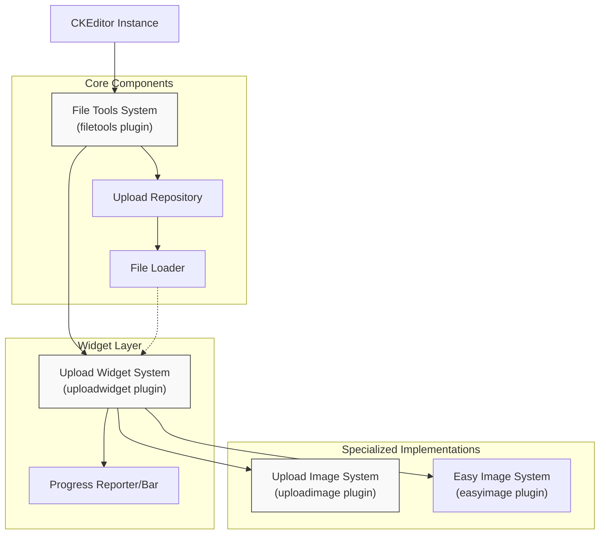
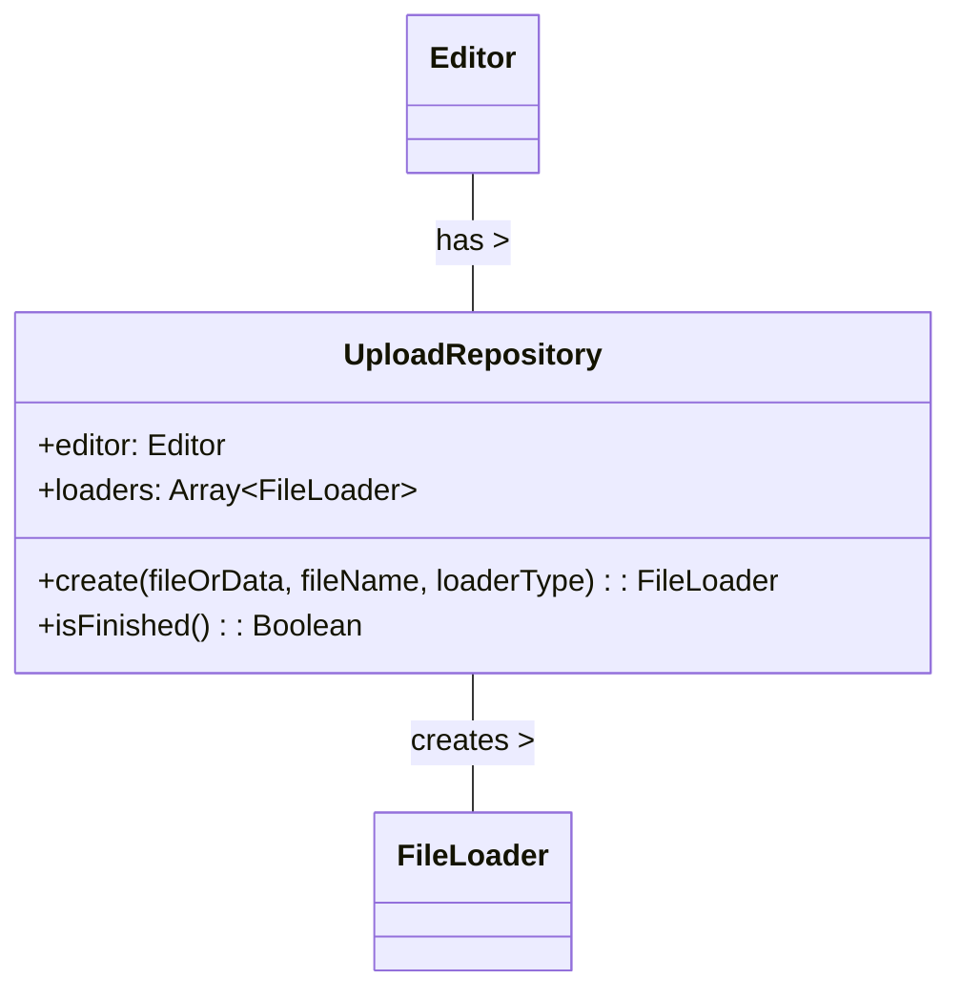
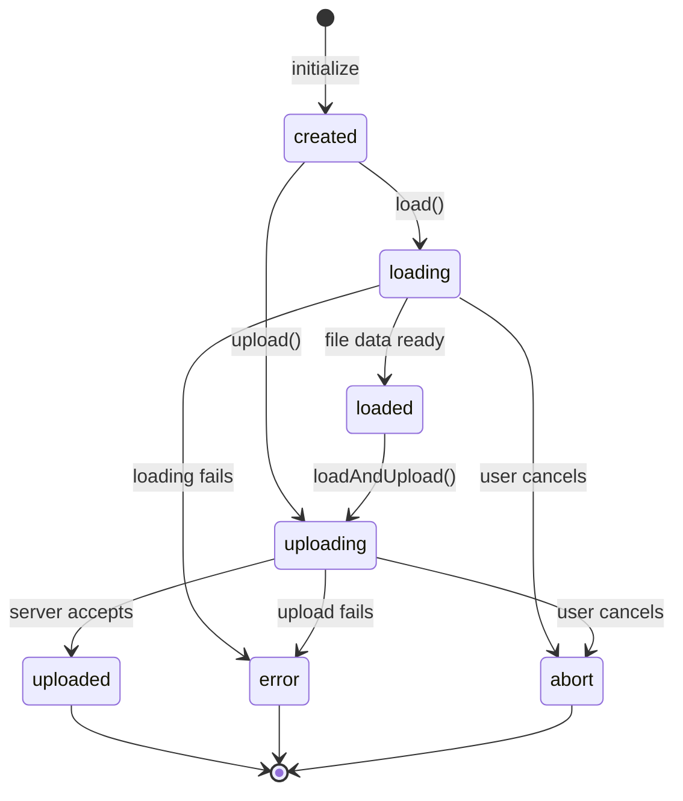
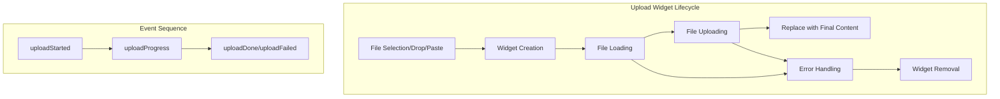
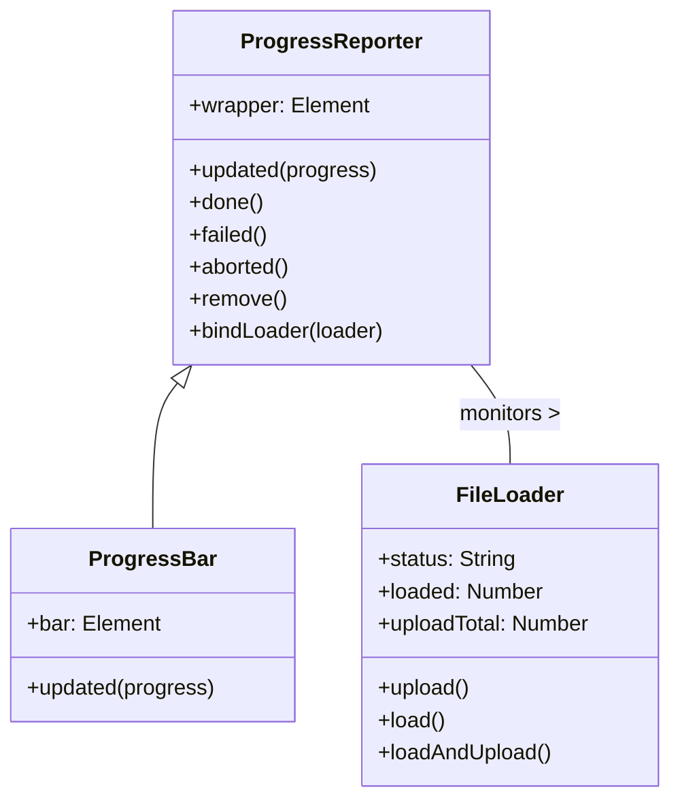
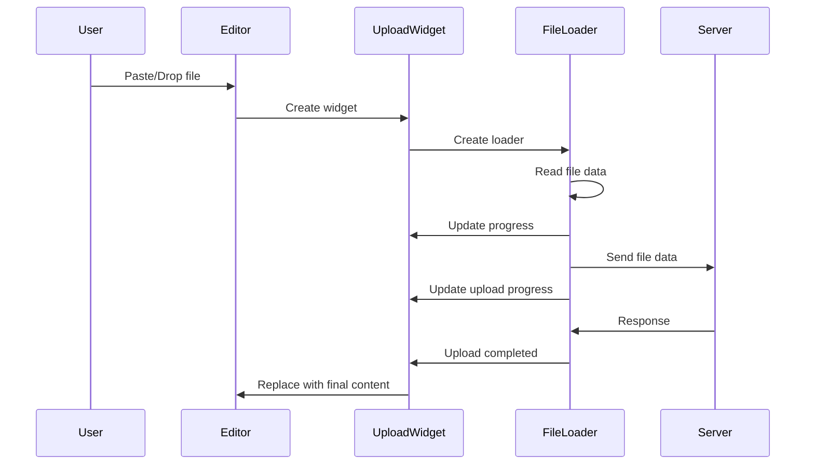
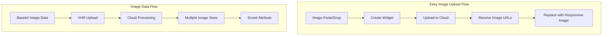
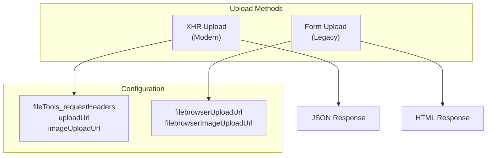

# File Upload System

<details>
<summary>Relevant source files</summary>

The following files were used as context for generating this wiki page:

- [plugins/dialogui/plugin.js](https://github.com/ckeditor/ckeditor4/blob/c7e59ec1/plugins/dialogui/plugin.js)
- [plugins/easyimage/plugin.js](https://github.com/ckeditor/ckeditor4/blob/c7e59ec1/plugins/easyimage/plugin.js)
- [plugins/filebrowser/plugin.js](https://github.com/ckeditor/ckeditor4/blob/c7e59ec1/plugins/filebrowser/plugin.js)
- [plugins/filetools/plugin.js](https://github.com/ckeditor/ckeditor4/blob/c7e59ec1/plugins/filetools/plugin.js)
- [plugins/imagebase/lang/en.js](https://github.com/ckeditor/ckeditor4/blob/c7e59ec1/plugins/imagebase/lang/en.js)
- [plugins/imagebase/plugin.js](https://github.com/ckeditor/ckeditor4/blob/c7e59ec1/plugins/imagebase/plugin.js)
- [plugins/imagebase/styles/imagebase.css](https://github.com/ckeditor/ckeditor4/blob/c7e59ec1/plugins/imagebase/styles/imagebase.css)
- [plugins/uploadimage/plugin.js](https://github.com/ckeditor/ckeditor4/blob/c7e59ec1/plugins/uploadimage/plugin.js)
- [plugins/uploadwidget/plugin.js](https://github.com/ckeditor/ckeditor4/blob/c7e59ec1/plugins/uploadwidget/plugin.js)
- [tests/plugins/easyimage/_helpers/tools.js](https://github.com/ckeditor/ckeditor4/blob/c7e59ec1/tests/plugins/easyimage/_helpers/tools.js)
- [tests/plugins/easyimage/manual/_assets/progress.css](https://github.com/ckeditor/ckeditor4/blob/c7e59ec1/tests/plugins/easyimage/manual/_assets/progress.css)
- [tests/plugins/easyimage/manual/customprogressbar.html](https://github.com/ckeditor/ckeditor4/blob/c7e59ec1/tests/plugins/easyimage/manual/customprogressbar.html)
- [tests/plugins/easyimage/manual/imagestretch.html](https://github.com/ckeditor/ckeditor4/blob/c7e59ec1/tests/plugins/easyimage/manual/imagestretch.html)
- [tests/plugins/easyimage/manual/pastefromword.html](https://github.com/ckeditor/ckeditor4/blob/c7e59ec1/tests/plugins/easyimage/manual/pastefromword.html)
- [tests/plugins/easyimage/manual/progressbar.html](https://github.com/ckeditor/ckeditor4/blob/c7e59ec1/tests/plugins/easyimage/manual/progressbar.html)
- [tests/plugins/easyimage/manual/removeafterpaste.html](https://github.com/ckeditor/ckeditor4/blob/c7e59ec1/tests/plugins/easyimage/manual/removeafterpaste.html)
- [tests/plugins/easyimage/manual/undo.html](https://github.com/ckeditor/ckeditor4/blob/c7e59ec1/tests/plugins/easyimage/manual/undo.html)
- [tests/plugins/easyimage/manual/undo.md](https://github.com/ckeditor/ckeditor4/blob/c7e59ec1/tests/plugins/easyimage/manual/undo.md)
- [tests/plugins/easyimage/manual/upload.html](https://github.com/ckeditor/ckeditor4/blob/c7e59ec1/tests/plugins/easyimage/manual/upload.html)
- [tests/plugins/easyimage/uploadintegrations.html](https://github.com/ckeditor/ckeditor4/blob/c7e59ec1/tests/plugins/easyimage/uploadintegrations.html)
- [tests/plugins/easyimage/uploadintegrations.js](https://github.com/ckeditor/ckeditor4/blob/c7e59ec1/tests/plugins/easyimage/uploadintegrations.js)
- [tests/plugins/filebrowser/manual/uploadxhr.html](https://github.com/ckeditor/ckeditor4/blob/c7e59ec1/tests/plugins/filebrowser/manual/uploadxhr.html)
- [tests/plugins/filebrowser/manual/uploadxhr.md](https://github.com/ckeditor/ckeditor4/blob/c7e59ec1/tests/plugins/filebrowser/manual/uploadxhr.md)
- [tests/plugins/filebrowser/manual/uploadxhrwitherror.html](https://github.com/ckeditor/ckeditor4/blob/c7e59ec1/tests/plugins/filebrowser/manual/uploadxhrwitherror.html)
- [tests/plugins/filebrowser/manual/uploadxhrwitherror.md](https://github.com/ckeditor/ckeditor4/blob/c7e59ec1/tests/plugins/filebrowser/manual/uploadxhrwitherror.md)
- [tests/plugins/filebrowser/uploadbutton.js](https://github.com/ckeditor/ckeditor4/blob/c7e59ec1/tests/plugins/filebrowser/uploadbutton.js)
- [tests/plugins/filetools/_helpers/tools.js](https://github.com/ckeditor/ckeditor4/blob/c7e59ec1/tests/plugins/filetools/_helpers/tools.js)
- [tests/plugins/filetools/fileloader.js](https://github.com/ckeditor/ckeditor4/blob/c7e59ec1/tests/plugins/filetools/fileloader.js)
- [tests/plugins/filetools/filetools.js](https://github.com/ckeditor/ckeditor4/blob/c7e59ec1/tests/plugins/filetools/filetools.js)
- [tests/plugins/filetools/static.js](https://github.com/ckeditor/ckeditor4/blob/c7e59ec1/tests/plugins/filetools/static.js)
- [tests/plugins/imagebase/features/_helpers/tools.js](https://github.com/ckeditor/ckeditor4/blob/c7e59ec1/tests/plugins/imagebase/features/_helpers/tools.js)
- [tests/plugins/imagebase/features/caption.html](https://github.com/ckeditor/ckeditor4/blob/c7e59ec1/tests/plugins/imagebase/features/caption.html)
- [tests/plugins/imagebase/features/caption.js](https://github.com/ckeditor/ckeditor4/blob/c7e59ec1/tests/plugins/imagebase/features/caption.js)
- [tests/plugins/imagebase/features/manual/captionafterpaste.html](https://github.com/ckeditor/ckeditor4/blob/c7e59ec1/tests/plugins/imagebase/features/manual/captionafterpaste.html)
- [tests/plugins/imagebase/features/manual/captionafterpaste.md](https://github.com/ckeditor/ckeditor4/blob/c7e59ec1/tests/plugins/imagebase/features/manual/captionafterpaste.md)
- [tests/plugins/imagebase/features/manual/captionemptyplaceholder.html](https://github.com/ckeditor/ckeditor4/blob/c7e59ec1/tests/plugins/imagebase/features/manual/captionemptyplaceholder.html)
- [tests/plugins/imagebase/features/manual/captionemptyplaceholder.md](https://github.com/ckeditor/ckeditor4/blob/c7e59ec1/tests/plugins/imagebase/features/manual/captionemptyplaceholder.md)
- [tests/plugins/imagebase/features/manual/upload.html](https://github.com/ckeditor/ckeditor4/blob/c7e59ec1/tests/plugins/imagebase/features/manual/upload.html)
- [tests/plugins/imagebase/features/manual/upload.md](https://github.com/ckeditor/ckeditor4/blob/c7e59ec1/tests/plugins/imagebase/features/manual/upload.md)
- [tests/plugins/imagebase/features/manual/uploadsimple.html](https://github.com/ckeditor/ckeditor4/blob/c7e59ec1/tests/plugins/imagebase/features/manual/uploadsimple.html)
- [tests/plugins/imagebase/features/manual/uploadsimple.md](https://github.com/ckeditor/ckeditor4/blob/c7e59ec1/tests/plugins/imagebase/features/manual/uploadsimple.md)
- [tests/plugins/imagebase/features/upload.js](https://github.com/ckeditor/ckeditor4/blob/c7e59ec1/tests/plugins/imagebase/features/upload.js)
- [tests/plugins/imagebase/manual/progressbar.html](https://github.com/ckeditor/ckeditor4/blob/c7e59ec1/tests/plugins/imagebase/manual/progressbar.html)
- [tests/plugins/imagebase/manual/progressbar.md](https://github.com/ckeditor/ckeditor4/blob/c7e59ec1/tests/plugins/imagebase/manual/progressbar.md)
- [tests/plugins/imagebase/manual/progressbarrtl.html](https://github.com/ckeditor/ckeditor4/blob/c7e59ec1/tests/plugins/imagebase/manual/progressbarrtl.html)
- [tests/plugins/imagebase/manual/progressbarrtl.md](https://github.com/ckeditor/ckeditor4/blob/c7e59ec1/tests/plugins/imagebase/manual/progressbarrtl.md)
- [tests/plugins/imagebase/progressbar.html](https://github.com/ckeditor/ckeditor4/blob/c7e59ec1/tests/plugins/imagebase/progressbar.html)
- [tests/plugins/imagebase/progressbar.js](https://github.com/ckeditor/ckeditor4/blob/c7e59ec1/tests/plugins/imagebase/progressbar.js)
- [tests/plugins/uploadimage/uploadimage.js](https://github.com/ckeditor/ckeditor4/blob/c7e59ec1/tests/plugins/uploadimage/uploadimage.js)
- [tests/plugins/uploadwidget/uploadwidget.js](https://github.com/ckeditor/ckeditor4/blob/c7e59ec1/tests/plugins/uploadwidget/uploadwidget.js)

</details>


The File Upload System in CKEditor 4 provides a comprehensive infrastructure for handling file uploads. It consists of several interconnected plugins that work together to enable seamless file handling, from client-side selection to server-side uploading and subsequent content integration. This document covers the core architecture, components, and typical workflows of the file upload system.

For information about specific image widgets that utilize this system, see [Widget System](#3) and [Image Widgets](#3.1).

## Architecture Overview

The File Upload System is built around several key components that work together to provide a complete file upload experience:



Sources:
- [plugins/filetools/plugin.js:9-125](https://github.com/ckeditor/ckeditor4/blob/c7e59ec1/plugins/filetools/plugin.js#L9-L125)
- [plugins/uploadwidget/plugin.js:9-32](https://github.com/ckeditor/ckeditor4/blob/c7e59ec1/plugins/uploadwidget/plugin.js#L9-L32)
- [plugins/uploadimage/plugin.js:8-32](https://github.com/ckeditor/ckeditor4/blob/c7e59ec1/plugins/uploadimage/plugin.js#L8-L32)
- [plugins/imagebase/plugin.js:229-510](https://github.com/ckeditor/ckeditor4/blob/c7e59ec1/plugins/imagebase/plugin.js#L229-L510)

## Core Components

### Upload Repository

The Upload Repository serves as a centralized manager for all file uploaders in the editor. It's responsible for creating and tracking file loader instances.



Each editor instance has its own upload repository, accessible via `editor.uploadRepository`. The repository creates file loaders and assigns them unique IDs for tracking. It also provides methods to check if all loaders have finished their operations.

Sources:
- [plugins/filetools/plugin.js:126-204](https://github.com/ckeditor/ckeditor4/blob/c7e59ec1/plugins/filetools/plugin.js#L126-L204)

### File Loader

The File Loader is the workhorse of the upload system, responsible for:
1. Loading file data from user's device into memory
2. Uploading the file to a server
3. Tracking and reporting upload progress
4. Handling responses from the server



The File Loader manages its state transitions and fires events at each stage, allowing the UI to update accordingly. It also handles XHR requests, including custom headers, CSRF tokens, and response handling.

Key properties of a FileLoader:
- `status`: Current state ('created', 'loading', 'loaded', 'uploading', 'uploaded', 'error', 'abort')
- `fileName`: Name of the file being uploaded
- `file`: The actual file object
- `data`: File data as a Base64 string (once loaded)
- `uploadUrl`: Target URL for the upload
- `xhr`: XMLHttpRequest object used for uploading
- `responseData`: Data received from the server after upload

Sources:
- [plugins/filetools/plugin.js:205-717](https://github.com/ckeditor/ckeditor4/blob/c7e59ec1/plugins/filetools/plugin.js#L205-L717)
- [tests/plugins/filetools/fileloader.js:10-194](https://github.com/ckeditor/ckeditor4/blob/c7e59ec1/tests/plugins/filetools/fileloader.js#L10-L194)

### Upload Widget

The Upload Widget provides the UI representation for files being uploaded. It creates a placeholder in the editor that shows the upload progress and eventually gets replaced with the final content once the upload completes.



The Upload Widget definition connects the File Loader with the editor content, handling events like `uploadStarted`, `uploadDone`, and `uploadFailed`. It also manages the UI updates during the upload process.

Sources:
- [plugins/uploadwidget/plugin.js:171-492](https://github.com/ckeditor/ckeditor4/blob/c7e59ec1/plugins/uploadwidget/plugin.js#L171-L492)
- [tests/plugins/uploadwidget/uploadwidget.js:23-40](https://github.com/ckeditor/ckeditor4/blob/c7e59ec1/tests/plugins/uploadwidget/uploadwidget.js#L23-L40)

## Widget Integration and Progress Reporting

The File Upload System integrates with the Widget system to provide visual feedback during uploads. A key component is the Progress Reporter, which visualizes the upload progress.



Progress reporting is implemented through the `progressReporter` class and its specialized implementations like `progressBar`. When a file is uploaded, the progress reporter monitors the FileLoader's status and updates the UI accordingly.

Sources:
- [plugins/imagebase/plugin.js:712-842](https://github.com/ckeditor/ckeditor4/blob/c7e59ec1/plugins/imagebase/plugin.js#L712-L842)
- [tests/plugins/imagebase/progressbar.js:1-36](https://github.com/ckeditor/ckeditor4/blob/c7e59ec1/tests/plugins/imagebase/progressbar.js#L1-L36)

## Upload Workflow

The upload process typically follows these steps:



### File Upload Events

The following events are fired during the upload process:

| Event | Source | Description |
|-------|--------|-------------|
| `fileUploadRequest` | Editor | Fired when a file is about to be uploaded |
| `fileUploadResponse` | Editor | Fired when the server responds to an upload |
| `uploadStarted` | Widget | Fired when the upload begins |
| `uploadDone` | Widget | Fired when the upload is completed successfully |
| `uploadFailed` | Widget | Fired when the upload fails |
| `update` | FileLoader | Fired when upload status or progress changes |

Sources:
- [plugins/filetools/plugin.js:34-122](https://github.com/ckeditor/ckeditor4/blob/c7e59ec1/plugins/filetools/plugin.js#L34-L122)
- [plugins/uploadwidget/plugin.js:488-506](https://github.com/ckeditor/ckeditor4/blob/c7e59ec1/plugins/uploadwidget/plugin.js#L488-L506)
- [tests/plugins/uploadwidget/uploadwidget.js:174-206](https://github.com/ckeditor/ckeditor4/blob/c7e59ec1/tests/plugins/uploadwidget/uploadwidget.js#L174-L206)

## Specialized Upload Implementations

### Upload Image

The Upload Image plugin specializes the Upload Widget for handling image files. It provides specific handling for image uploads, including:
- Image-specific preview during upload
- Setting proper dimensions in the final HTML
- Support for different image formats (JPEG, PNG, GIF, BMP)

Sources:
- [plugins/uploadimage/plugin.js:32-175](https://github.com/ckeditor/ckeditor4/blob/c7e59ec1/plugins/uploadimage/plugin.js#L32-L175)
- [tests/plugins/uploadimage/uploadimage.js:103-134](https://github.com/ckeditor/ckeditor4/blob/c7e59ec1/tests/plugins/uploadimage/uploadimage.js#L103-L134)

### Easy Image

The Easy Image plugin provides an enhanced user experience for image uploads, integrating with cloud services and providing advanced features:
- Cloud storage for uploaded images
- Responsive images with multiple sizes
- Advanced styling options
- Drag and drop support
- Copy-paste support for images



The Easy Image plugin uses the same underlying File Upload System but enhances it with cloud service integration and responsive image support.

Sources:
- [plugins/easyimage/plugin.js:399-474](https://github.com/ckeditor/ckeditor4/blob/c7e59ec1/plugins/easyimage/plugin.js#L399-L474)
- [tests/plugins/easyimage/uploadintegrations.js:140-169](https://github.com/ckeditor/ckeditor4/blob/c7e59ec1/tests/plugins/easyimage/uploadintegrations.js#L140-L169)

## Configuration Options

The File Upload System can be configured using several editor configuration options:

| Option | Type | Default | Description |
|--------|------|---------|-------------|
| `fileTools_requestHeaders` | Object | `{}` | Additional request headers to be sent with upload requests |
| `fileTools_defaultFileName` | String | - | Default name used for files when no name is provided |
| `uploadUrl` | String | - | General upload URL for all file types |
| `imageUploadUrl` | String | - | Specific upload URL for images |
| `filebrowserUploadUrl` | String | - | Legacy upload URL used by the file browser |
| `filebrowserImageUploadUrl` | String | - | Legacy upload URL used by the file browser for images |

Sources:
- [plugins/filetools/plugin.js:822-833](https://github.com/ckeditor/ckeditor4/blob/c7e59ec1/plugins/filetools/plugin.js#L822-L833)
- [plugins/uploadimage/plugin.js:154-175](https://github.com/ckeditor/ckeditor4/blob/c7e59ec1/plugins/uploadimage/plugin.js#L154-L175)

## Integration with Form-based Uploads

In addition to XHR-based uploads, the File Upload System also supports traditional form-based uploads through the `filebrowser` plugin. This provides compatibility with older server configurations that don't support XHR uploads.



The system will automatically choose the appropriate upload method based on configuration and browser support.

Sources:
- [plugins/filebrowser/plugin.js:115-138](https://github.com/ckeditor/ckeditor4/blob/c7e59ec1/plugins/filebrowser/plugin.js#L115-L138)
- [tests/plugins/filebrowser/uploadbutton.js:60-72](https://github.com/ckeditor/ckeditor4/blob/c7e59ec1/tests/plugins/filebrowser/uploadbutton.js#L60-L72)

## Custom Upload Handlers

Developers can create custom upload handlers by:
1. Creating a custom loader type that extends `CKEDITOR.fileTools.fileLoader`
2. Specifying this loader in the widget definition's `loaderType` property
3. Implementing custom event handling for uploads

This allows for integration with different backend systems or implementing custom validation and processing logic.

```javascript
// Example of custom loader specification
widgetDefinition = {
    name: 'myCustomUpload',
    loaderType: MyCustomLoader,
    supportedTypes: /image\/(jpeg|png|gif)/,
    // other properties...
};
```

Sources:
- [plugins/imagebase/plugin.js:343-349](https://github.com/ckeditor/ckeditor4/blob/c7e59ec1/plugins/imagebase/plugin.js#L343-L349)
- [tests/plugins/easyimage/uploadintegrations.js:17-44](https://github.com/ckeditor/ckeditor4/blob/c7e59ec1/tests/plugins/easyimage/uploadintegrations.js#L17-L44)

## Error Handling and User Feedback

The File Upload System includes robust error handling and user feedback mechanisms:
- Error states for both loading and uploading stages
- Integration with the Notification system for displaying progress and errors
- User-friendly error messages for common failures
- Ability to abort uploads in progress

This ensures users are always informed about the status of their uploads and any issues that may arise.

Sources:
- [plugins/filetools/plugin.js:524-586](https://github.com/ckeditor/ckeditor4/blob/c7e59ec1/plugins/filetools/plugin.js#L524-L586)