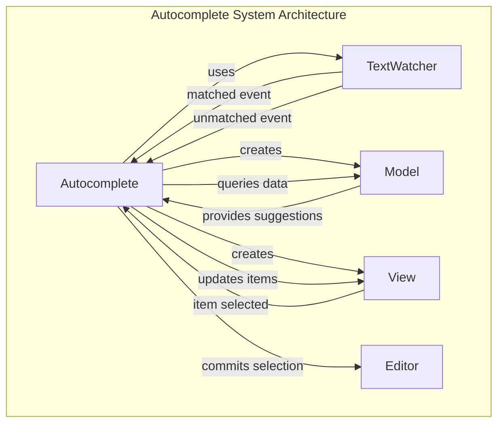
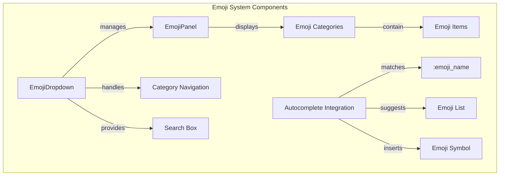
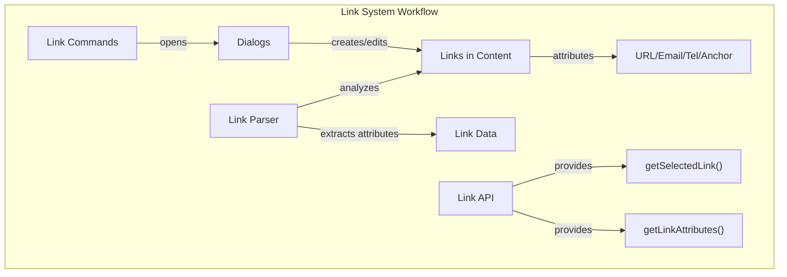

# Text and Input Features

<details>
<summary>Relevant source files</summary>

The following files were used as context for generating this wiki page:

- [dev/langtool/_common.sh](https://github.com/ckeditor/ckeditor4/blob/c7e59ec1/dev/langtool/_common.sh)
- [dev/langtool/meta/ckeditor.core/meta.txt](https://github.com/ckeditor/ckeditor4/blob/c7e59ec1/dev/langtool/meta/ckeditor.core/meta.txt)
- [dev/langtool/meta/ckeditor.plugin-codesnippet/meta.txt](https://github.com/ckeditor/ckeditor4/blob/c7e59ec1/dev/langtool/meta/ckeditor.plugin-codesnippet/meta.txt)
- [dev/langtool/meta/ckeditor.plugin-emoji/meta.txt](https://github.com/ckeditor/ckeditor4/blob/c7e59ec1/dev/langtool/meta/ckeditor.plugin-emoji/meta.txt)
- [dev/langtool/meta/ckeditor.plugin-fakeobjects/meta.txt](https://github.com/ckeditor/ckeditor4/blob/c7e59ec1/dev/langtool/meta/ckeditor.plugin-fakeobjects/meta.txt)
- [dev/langtool/meta/ckeditor.plugin-image2/meta.txt](https://github.com/ckeditor/ckeditor4/blob/c7e59ec1/dev/langtool/meta/ckeditor.plugin-image2/meta.txt)
- [dev/langtool/meta/ckeditor.plugin-language/meta.txt](https://github.com/ckeditor/ckeditor4/blob/c7e59ec1/dev/langtool/meta/ckeditor.plugin-language/meta.txt)
- [dev/langtool/meta/ckeditor.plugin-link/meta.txt](https://github.com/ckeditor/ckeditor4/blob/c7e59ec1/dev/langtool/meta/ckeditor.plugin-link/meta.txt)
- [dev/langtool/meta/ckeditor.plugin-magicline/meta.txt](https://github.com/ckeditor/ckeditor4/blob/c7e59ec1/dev/langtool/meta/ckeditor.plugin-magicline/meta.txt)
- [dev/langtool/meta/ckeditor.plugin-mathjax/meta.txt](https://github.com/ckeditor/ckeditor4/blob/c7e59ec1/dev/langtool/meta/ckeditor.plugin-mathjax/meta.txt)
- [dev/langtool/meta/ckeditor.plugin-smiley/meta.txt](https://github.com/ckeditor/ckeditor4/blob/c7e59ec1/dev/langtool/meta/ckeditor.plugin-smiley/meta.txt)
- [dev/pastetools/getclipboard.html](https://github.com/ckeditor/ckeditor4/blob/c7e59ec1/dev/pastetools/getclipboard.html)
- [plugins/autocomplete/plugin.js](https://github.com/ckeditor/ckeditor4/blob/c7e59ec1/plugins/autocomplete/plugin.js)
- [plugins/bidi/plugin.js](https://github.com/ckeditor/ckeditor4/blob/c7e59ec1/plugins/bidi/plugin.js)
- [plugins/blockquote/plugin.js](https://github.com/ckeditor/ckeditor4/blob/c7e59ec1/plugins/blockquote/plugin.js)
- [plugins/div/plugin.js](https://github.com/ckeditor/ckeditor4/blob/c7e59ec1/plugins/div/plugin.js)
- [plugins/easyimage/samples/easyimage.html](https://github.com/ckeditor/ckeditor4/blob/c7e59ec1/plugins/easyimage/samples/easyimage.html)
- [plugins/emoji/assets/iconsall.png](https://github.com/ckeditor/ckeditor4/blob/c7e59ec1/plugins/emoji/assets/iconsall.png)
- [plugins/emoji/assets/iconsall.svg](https://github.com/ckeditor/ckeditor4/blob/c7e59ec1/plugins/emoji/assets/iconsall.svg)
- [plugins/emoji/icons/emojipanel.png](https://github.com/ckeditor/ckeditor4/blob/c7e59ec1/plugins/emoji/icons/emojipanel.png)
- [plugins/emoji/icons/hidpi/emojipanel.png](https://github.com/ckeditor/ckeditor4/blob/c7e59ec1/plugins/emoji/icons/hidpi/emojipanel.png)
- [plugins/emoji/lang/en.js](https://github.com/ckeditor/ckeditor4/blob/c7e59ec1/plugins/emoji/lang/en.js)
- [plugins/emoji/plugin.js](https://github.com/ckeditor/ckeditor4/blob/c7e59ec1/plugins/emoji/plugin.js)
- [plugins/emoji/samples/emoji.html](https://github.com/ckeditor/ckeditor4/blob/c7e59ec1/plugins/emoji/samples/emoji.html)
- [plugins/emoji/skins/default.css](https://github.com/ckeditor/ckeditor4/blob/c7e59ec1/plugins/emoji/skins/default.css)
- [plugins/flash/plugin.js](https://github.com/ckeditor/ckeditor4/blob/c7e59ec1/plugins/flash/plugin.js)
- [plugins/forms/plugin.js](https://github.com/ckeditor/ckeditor4/blob/c7e59ec1/plugins/forms/plugin.js)
- [plugins/horizontalrule/plugin.js](https://github.com/ckeditor/ckeditor4/blob/c7e59ec1/plugins/horizontalrule/plugin.js)
- [plugins/image/plugin.js](https://github.com/ckeditor/ckeditor4/blob/c7e59ec1/plugins/image/plugin.js)
- [plugins/indent/dev/indent.html](https://github.com/ckeditor/ckeditor4/blob/c7e59ec1/plugins/indent/dev/indent.html)
- [plugins/indent/plugin.js](https://github.com/ckeditor/ckeditor4/blob/c7e59ec1/plugins/indent/plugin.js)
- [plugins/indentblock/plugin.js](https://github.com/ckeditor/ckeditor4/blob/c7e59ec1/plugins/indentblock/plugin.js)
- [plugins/indentlist/plugin.js](https://github.com/ckeditor/ckeditor4/blob/c7e59ec1/plugins/indentlist/plugin.js)
- [plugins/justify/plugin.js](https://github.com/ckeditor/ckeditor4/blob/c7e59ec1/plugins/justify/plugin.js)
- [plugins/link/dialogs/link.js](https://github.com/ckeditor/ckeditor4/blob/c7e59ec1/plugins/link/dialogs/link.js)
- [plugins/link/lang/en.js](https://github.com/ckeditor/ckeditor4/blob/c7e59ec1/plugins/link/lang/en.js)
- [plugins/link/plugin.js](https://github.com/ckeditor/ckeditor4/blob/c7e59ec1/plugins/link/plugin.js)
- [plugins/list/plugin.js](https://github.com/ckeditor/ckeditor4/blob/c7e59ec1/plugins/list/plugin.js)
- [plugins/mentions/samples/mentions.html](https://github.com/ckeditor/ckeditor4/blob/c7e59ec1/plugins/mentions/samples/mentions.html)
- [plugins/pagebreak/plugin.js](https://github.com/ckeditor/ckeditor4/blob/c7e59ec1/plugins/pagebreak/plugin.js)
- [plugins/smiley/dialogs/smiley.js](https://github.com/ckeditor/ckeditor4/blob/c7e59ec1/plugins/smiley/dialogs/smiley.js)
- [plugins/smiley/lang/en.js](https://github.com/ckeditor/ckeditor4/blob/c7e59ec1/plugins/smiley/lang/en.js)
- [plugins/smiley/lang/ru.js](https://github.com/ckeditor/ckeditor4/blob/c7e59ec1/plugins/smiley/lang/ru.js)
- [plugins/smiley/plugin.js](https://github.com/ckeditor/ckeditor4/blob/c7e59ec1/plugins/smiley/plugin.js)
- [plugins/specialchar/dialogs/specialchar.js](https://github.com/ckeditor/ckeditor4/blob/c7e59ec1/plugins/specialchar/dialogs/specialchar.js)
- [plugins/table/plugin.js](https://github.com/ckeditor/ckeditor4/blob/c7e59ec1/plugins/table/plugin.js)
- [plugins/textmatch/plugin.js](https://github.com/ckeditor/ckeditor4/blob/c7e59ec1/plugins/textmatch/plugin.js)
- [plugins/textwatcher/plugin.js](https://github.com/ckeditor/ckeditor4/blob/c7e59ec1/plugins/textwatcher/plugin.js)
- [skins/moono-lisa/dev/locations.json](https://github.com/ckeditor/ckeditor4/blob/c7e59ec1/skins/moono-lisa/dev/locations.json)
- [tests/plugins/autocomplete/a11y.js](https://github.com/ckeditor/ckeditor4/blob/c7e59ec1/tests/plugins/autocomplete/a11y.js)
- [tests/plugins/autocomplete/autocomplete.js](https://github.com/ckeditor/ckeditor4/blob/c7e59ec1/tests/plugins/autocomplete/autocomplete.js)
- [tests/plugins/autocomplete/manual/__template__.html](https://github.com/ckeditor/ckeditor4/blob/c7e59ec1/tests/plugins/autocomplete/manual/__template__.html)
- [tests/plugins/autocomplete/manual/_helpers/utils.js](https://github.com/ckeditor/ckeditor4/blob/c7e59ec1/tests/plugins/autocomplete/manual/_helpers/utils.js)
- [tests/plugins/autocomplete/manual/completingkeycodes.md](https://github.com/ckeditor/ckeditor4/blob/c7e59ec1/tests/plugins/autocomplete/manual/completingkeycodes.md)
- [tests/plugins/autocomplete/manual/optionselection.md](https://github.com/ckeditor/ckeditor4/blob/c7e59ec1/tests/plugins/autocomplete/manual/optionselection.md)
- [tests/plugins/autocomplete/manual/outputtemplate.html](https://github.com/ckeditor/ckeditor4/blob/c7e59ec1/tests/plugins/autocomplete/manual/outputtemplate.html)
- [tests/plugins/autocomplete/manual/outputtemplate.md](https://github.com/ckeditor/ckeditor4/blob/c7e59ec1/tests/plugins/autocomplete/manual/outputtemplate.md)
- [tests/plugins/autocomplete/manual/throttle.html](https://github.com/ckeditor/ckeditor4/blob/c7e59ec1/tests/plugins/autocomplete/manual/throttle.html)
- [tests/plugins/autocomplete/manual/throttle.md](https://github.com/ckeditor/ckeditor4/blob/c7e59ec1/tests/plugins/autocomplete/manual/throttle.md)
- [tests/plugins/autocomplete/manual/viewposition.html](https://github.com/ckeditor/ckeditor4/blob/c7e59ec1/tests/plugins/autocomplete/manual/viewposition.html)
- [tests/plugins/autocomplete/manual/viewposition.md](https://github.com/ckeditor/ckeditor4/blob/c7e59ec1/tests/plugins/autocomplete/manual/viewposition.md)
- [tests/plugins/autocomplete/manual/viewstart.html](https://github.com/ckeditor/ckeditor4/blob/c7e59ec1/tests/plugins/autocomplete/manual/viewstart.html)
- [tests/plugins/autocomplete/manual/viewstart.md](https://github.com/ckeditor/ckeditor4/blob/c7e59ec1/tests/plugins/autocomplete/manual/viewstart.md)
- [tests/plugins/autocomplete/manual/viewtemplate.html](https://github.com/ckeditor/ckeditor4/blob/c7e59ec1/tests/plugins/autocomplete/manual/viewtemplate.html)
- [tests/plugins/autocomplete/manual/viewtemplate.md](https://github.com/ckeditor/ckeditor4/blob/c7e59ec1/tests/plugins/autocomplete/manual/viewtemplate.md)
- [tests/plugins/autocomplete/model.js](https://github.com/ckeditor/ckeditor4/blob/c7e59ec1/tests/plugins/autocomplete/model.js)
- [tests/plugins/autocomplete/view.js](https://github.com/ckeditor/ckeditor4/blob/c7e59ec1/tests/plugins/autocomplete/view.js)
- [tests/plugins/autocomplete/viewposition.js](https://github.com/ckeditor/ckeditor4/blob/c7e59ec1/tests/plugins/autocomplete/viewposition.js)
- [tests/plugins/emoji/dropdown.js](https://github.com/ckeditor/ckeditor4/blob/c7e59ec1/tests/plugins/emoji/dropdown.js)
- [tests/plugins/emoji/manual/caseinsensitive.html](https://github.com/ckeditor/ckeditor4/blob/c7e59ec1/tests/plugins/emoji/manual/caseinsensitive.html)
- [tests/plugins/emoji/manual/caseinsensitive.md](https://github.com/ckeditor/ckeditor4/blob/c7e59ec1/tests/plugins/emoji/manual/caseinsensitive.md)
- [tests/plugins/emoji/manual/emojimatchlabel.html](https://github.com/ckeditor/ckeditor4/blob/c7e59ec1/tests/plugins/emoji/manual/emojimatchlabel.html)
- [tests/plugins/emoji/manual/emojimatchlabel.md](https://github.com/ckeditor/ckeditor4/blob/c7e59ec1/tests/plugins/emoji/manual/emojimatchlabel.md)
- [tests/plugins/emoji/manual/font.html](https://github.com/ckeditor/ckeditor4/blob/c7e59ec1/tests/plugins/emoji/manual/font.html)
- [tests/plugins/emoji/manual/font.md](https://github.com/ckeditor/ckeditor4/blob/c7e59ec1/tests/plugins/emoji/manual/font.md)
- [tests/plugins/indentlist/indentlist.js](https://github.com/ckeditor/ckeditor4/blob/c7e59ec1/tests/plugins/indentlist/indentlist.js)
- [tests/plugins/indentlist/manual/keepcorrectlisttag.html](https://github.com/ckeditor/ckeditor4/blob/c7e59ec1/tests/plugins/indentlist/manual/keepcorrectlisttag.html)
- [tests/plugins/indentlist/manual/keepcorrectlisttag.md](https://github.com/ckeditor/ckeditor4/blob/c7e59ec1/tests/plugins/indentlist/manual/keepcorrectlisttag.md)
- [tests/plugins/link/link.js](https://github.com/ckeditor/ckeditor4/blob/c7e59ec1/tests/plugins/link/link.js)
- [tests/plugins/link/manual/getselectedlink.html](https://github.com/ckeditor/ckeditor4/blob/c7e59ec1/tests/plugins/link/manual/getselectedlink.html)
- [tests/plugins/link/manual/getselectedlink.md](https://github.com/ckeditor/ckeditor4/blob/c7e59ec1/tests/plugins/link/manual/getselectedlink.md)
- [tests/plugins/link/manual/protocol.html](https://github.com/ckeditor/ckeditor4/blob/c7e59ec1/tests/plugins/link/manual/protocol.html)
- [tests/plugins/link/manual/protocol.md](https://github.com/ckeditor/ckeditor4/blob/c7e59ec1/tests/plugins/link/manual/protocol.md)
- [tests/plugins/textwatcher/manual/throttle.html](https://github.com/ckeditor/ckeditor4/blob/c7e59ec1/tests/plugins/textwatcher/manual/throttle.html)
- [tests/plugins/textwatcher/manual/throttle.md](https://github.com/ckeditor/ckeditor4/blob/c7e59ec1/tests/plugins/textwatcher/manual/throttle.md)
- [tests/plugins/textwatcher/textwatcher.js](https://github.com/ckeditor/ckeditor4/blob/c7e59ec1/tests/plugins/textwatcher/textwatcher.js)
- [tests/tickets/13254/1.html](https://github.com/ckeditor/ckeditor4/blob/c7e59ec1/tests/tickets/13254/1.html)
- [tests/tickets/13254/1.js](https://github.com/ckeditor/ckeditor4/blob/c7e59ec1/tests/tickets/13254/1.js)

</details>


This page documents the text-related input features available in CKEditor 4, focusing on features that enhance text entry, autocompletion, and special content insertion. These features provide ways to improve user interaction with the editor by offering suggestions, special characters, and link management capabilities.

## Overview

CKEditor 4 provides several specialized text and input features that enhance the editing experience:

1. **Autocomplete** - Provides intelligent text completion as users type
2. **Emoji** - Allows insertion of emoji characters through a searchable panel
3. **Link Management** - Handles creation, editing, and management of hyperlinks

These features build upon CKEditor's core text handling capabilities and provide additional functionality for common editing tasks.

Sources:
- [plugins/autocomplete/plugin.js:10-654](https://github.com/ckeditor/ckeditor4/blob/c7e59ec1/plugins/autocomplete/plugin.js#L10-L654)
- [plugins/emoji/plugin.js:567-685](https://github.com/ckeditor/ckeditor4/blob/c7e59ec1/plugins/emoji/plugin.js#L567-L685)
- [plugins/link/plugin.js:9-809](https://github.com/ckeditor/ckeditor4/blob/c7e59ec1/plugins/link/plugin.js#L9-L809)

## Autocomplete System

The autocomplete system provides suggestions as users type, similar to what you might find in code editors or messaging applications. It can be customized to suggest various types of content including usernames, emoji, or custom data.



The autocomplete feature consists of the following components:

1. **Autocomplete** - The main controller that initializes the system, handles events, and manages interactions
2. **TextWatcher** - Monitors text changes and identifies patterns that should trigger autocompletion
3. **Model** - Manages data and the current state of suggestions
4. **View** - Creates and manages the dropdown UI for suggestions

### Initialization and Configuration

To use autocomplete, you need to provide two callback functions:

- `textTestCallback` - Tests if the current text matches a pattern for autocompletion
- `dataCallback` - Provides suggestion data for the current matched text

Example initialization:

```javascript
new CKEDITOR.plugins.autocomplete(editor, {
    textTestCallback: function(range) {
        // Check if text matches a pattern
        return CKEDITOR.plugins.textMatch.match(range, matchCallback);
    },
    dataCallback: function(matchInfo, callback) {
        // Provide suggestions based on matchInfo
        callback([
            { id: 1, name: 'Suggestion 1' },
            { id: 2, name: 'Suggestion 2' }
        ]);
    }
});
```

### Customization Options

The autocomplete system can be customized with the following options:

| Option | Description |
|--------|-------------|
| `throttle` | Response delay in milliseconds (default: 20) |
| `itemTemplate` | HTML template for suggestion items |
| `outputTemplate` | Template used when inserting the selected item |
| `followingSpace` | Whether to add a space after insertion |
| `commitKeystrokes` | Array of keystrokes to accept a suggestion |

Sources:
- [plugins/autocomplete/plugin.js:20-256](https://github.com/ckeditor/ckeditor4/blob/c7e59ec1/plugins/autocomplete/plugin.js#L20-L256)
- [plugins/autocomplete/plugin.js:159-198](https://github.com/ckeditor/ckeditor4/blob/c7e59ec1/plugins/autocomplete/plugin.js#L159-L198)
- [plugins/textwatcher/plugin.js:12-16](https://github.com/ckeditor/ckeditor4/blob/c7e59ec1/plugins/textwatcher/plugin.js#L12-L16)
- [tests/plugins/autocomplete/autocomplete.js:49-132](https://github.com/ckeditor/ckeditor4/blob/c7e59ec1/tests/plugins/autocomplete/autocomplete.js#L49-L132)

## Emoji Support

CKEditor 4's emoji plugin provides an intuitive interface for inserting emoji characters into content. It's integrated with the autocomplete system to allow emoji insertion via typing.



### Emoji Panel UI

The emoji panel consists of several components:

1. **Navigation Bar** - Contains category icons for quick access to emoji groups
2. **Search Box** - Allows filtering emoji by name or keywords
3. **Emoji Block** - Displays emoji grouped by categories
4. **Status Bar** - Shows information about the currently selected emoji

### Emoji Categories

Emojis are organized into the following categories:

- People (😀, 😊, 👍, etc.)
- Nature (🐶, 🌺, 🌈, etc.)
- Food (🍎, 🍕, 🍰, etc.)
- Travel (🚗, ✈️, 🏠, etc.)
- Activities (⚽, 🎮, 🎵, etc.)
- Objects (💡, 📱, 📚, etc.)
- Symbols (❤️, ⭐, 🔣, etc.)
- Flags (🇺🇸, 🇯🇵, 🇪🇺, etc.)

### Autocomplete Integration

The emoji plugin integrates with the autocomplete system to allow emoji insertion by typing `:` followed by the emoji name:

```
:smile -> 😀
:heart -> ❤️
:star -> ⭐
```

### Configuration Options

| Option | Description |
|--------|-------------|
| `emoji_minChars` | Minimum characters after `:` to trigger suggestions (default: 2) |
| `emoji_emojiListUrl` | URL to a custom JSON file with emoji definitions |
| `emoji_followingSpace` | Whether to add a space after insertion (default: false) |

Sources:
- [plugins/emoji/plugin.js:12-563](https://github.com/ckeditor/ckeditor4/blob/c7e59ec1/plugins/emoji/plugin.js#L12-L563)
- [plugins/emoji/plugin.js:587-626](https://github.com/ckeditor/ckeditor4/blob/c7e59ec1/plugins/emoji/plugin.js#L587-L626)
- [plugins/emoji/plugin.js:696-748](https://github.com/ckeditor/ckeditor4/blob/c7e59ec1/plugins/emoji/plugin.js#L696-L748)
- [plugins/emoji/skins/default.css:1-238](https://github.com/ckeditor/ckeditor4/blob/c7e59ec1/plugins/emoji/skins/default.css#L1-L238)
- [tests/plugins/emoji/dropdown.js:33-102](https://github.com/ckeditor/ckeditor4/blob/c7e59ec1/tests/plugins/emoji/dropdown.js#L33-L102)

## Link Management

The link plugin provides comprehensive functionality for creating, editing, and managing hyperlinks within the editor content.



### Link Types

The link system supports various types of links:

| Type | Description | Example |
|------|-------------|---------|
| URL | Standard web links | `http://example.com` |
| Email | Email links with optional subject/body | `mailto:user@example.com?subject=Hello` |
| Anchor | Internal page anchors | `#section-name` |
| Tel | Telephone numbers | `tel:123456789` |

### Link Dialog

The link dialog provides options for configuring links:

1. **Info Tab** - Basic link properties (type, URL, display text)
2. **Target Tab** - Link target settings (new window, popup, etc.)
3. **Advanced Tab** - Additional attributes (ID, classes, styles, etc.)

### Link API

The plugin provides several utilities for working with links:

- `CKEDITOR.plugins.link.getSelectedLink(editor)` - Gets the link element at current selection
- `CKEDITOR.plugins.link.getEditorAnchors(editor)` - Retrieves all anchors in the editor content
- `CKEDITOR.plugins.link.parseLinkAttributes(editor, element)` - Parses link attributes into a structured object
- `CKEDITOR.plugins.link.getLinkAttributes(editor, data)` - Converts link data to DOM attributes

### Link Commands

The plugin registers several editor commands:

| Command | Description |
|---------|-------------|
| `link` | Opens the link dialog to create or edit a link |
| `unlink` | Removes the link at the current selection |
| `anchor` | Creates or edits an anchor |
| `removeAnchor` | Removes an anchor |

Sources:
- [plugins/link/plugin.js:50-186](https://github.com/ckeditor/ckeditor4/blob/c7e59ec1/plugins/link/plugin.js#L50-L186)
- [plugins/link/plugin.js:315-395](https://github.com/ckeditor/ckeditor4/blob/c7e59ec1/plugins/link/plugin.js#L315-L395)
- [plugins/link/plugin.js:396-507](https://github.com/ckeditor/ckeditor4/blob/c7e59ec1/plugins/link/plugin.js#L396-L507)
- [plugins/link/dialogs/link.js:225-791](https://github.com/ckeditor/ckeditor4/blob/c7e59ec1/plugins/link/dialogs/link.js#L225-L791)
- [tests/plugins/link/link.js:36-415](https://github.com/ckeditor/ckeditor4/blob/c7e59ec1/tests/plugins/link/link.js#L36-L415)

## Integration with Other Features

The text and input features integrate with other CKEditor 4 components:

### List Integration

Text features work seamlessly with list management, allowing proper indentation and formatting within list structures.

### Indentation Support

Text blocks and special content can be properly indented using the indentation system.

### Justification

Text alignment and justification work with the special content inserted through these features.

Sources:
- [plugins/list/plugin.js:10-267](https://github.com/ckeditor/ckeditor4/blob/c7e59ec1/plugins/list/plugin.js#L10-L267)
- [plugins/indent/plugin.js:16-88](https://github.com/ckeditor/ckeditor4/blob/c7e59ec1/plugins/indent/plugin.js#L16-L88)
- [plugins/indentlist/plugin.js:18-107](https://github.com/ckeditor/ckeditor4/blob/c7e59ec1/plugins/indentlist/plugin.js#L18-L107)
- [plugins/justify/plugin.js:11-75](https://github.com/ckeditor/ckeditor4/blob/c7e59ec1/plugins/justify/plugin.js#L11-L75)

## Accessibility Considerations

The text and input features include several accessibility enhancements:

### Autocomplete Accessibility

- ARIA attributes are added to the editable area (`aria-controls`, `aria-activedescendant`, `aria-autocomplete`)
- Autocomplete suggestions are navigable by keyboard
- The suggestion panel is properly announced to screen readers

### Emoji Panel Accessibility

- Navigation tabs have proper labels and focus management
- Emoji categories and individual emojis are properly labeled
- Keyboard navigation is fully supported

### Link Accessibility

- Links are created with proper semantics for screen readers
- Link dialog includes proper labeling and keyboard accessibility

Sources:
- [plugins/autocomplete/plugin.js:337-400](https://github.com/ckeditor/ckeditor4/blob/c7e59ec1/plugins/autocomplete/plugin.js#L337-L400)
- [tests/plugins/autocomplete/a11y.js:1-16](https://github.com/ckeditor/ckeditor4/blob/c7e59ec1/tests/plugins/autocomplete/a11y.js#L1-L16)

## Customization Examples

### Custom Autocomplete

```javascript
// Create a custom autocomplete for inserting user mentions
new CKEDITOR.plugins.autocomplete(editor, {
    textTestCallback: function(range) {
        return CKEDITOR.plugins.textMatch.match(range, function(text, offset) {
            var match = text.slice(0, offset).match(/@\w*$/);
            if (!match) {
                return null;
            }
            return { start: match.index, end: offset };
        });
    },
    dataCallback: function(matchInfo, callback) {
        var query = matchInfo.query.substr(1); // Remove the '@' character
        // Fetch users matching the query
        fetchUsers(query, function(users) {
            callback(users.map(function(user) {
                return { id: user.id, name: user.name };
            }));
        });
    },
    itemTemplate: '<li data-id="{id}"> {name}</li>',
    outputTemplate: '<a href="/users/{id}">@{name}</a>'
});
```

Sources:
- [plugins/autocomplete/plugin.js:45-101](https://github.com/ckeditor/ckeditor4/blob/c7e59ec1/plugins/autocomplete/plugin.js#L45-L101)
- [plugins/autocomplete/plugin.js:615-683](https://github.com/ckeditor/ckeditor4/blob/c7e59ec1/plugins/autocomplete/plugin.js#L615-L683)