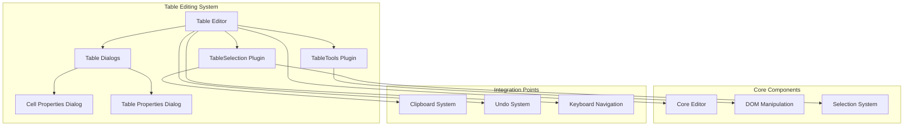
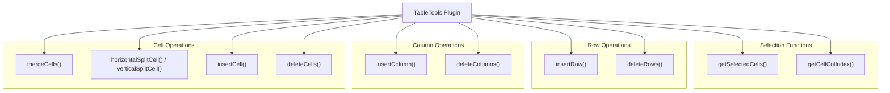
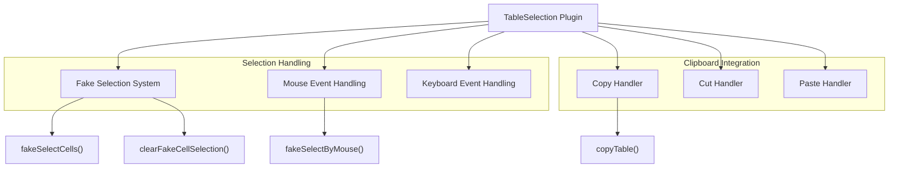

# Table Editing

<details>
<summary>Relevant source files</summary>

The following files were used as context for generating this wiki page:

- [plugins/tab/plugin.js](https://github.com/ckeditor/ckeditor4/blob/c7e59ec1/plugins/tab/plugin.js)
- [plugins/tableselection/plugin.js](https://github.com/ckeditor/ckeditor4/blob/c7e59ec1/plugins/tableselection/plugin.js)
- [plugins/tabletools/dialogs/tableCell.js](https://github.com/ckeditor/ckeditor4/blob/c7e59ec1/plugins/tabletools/dialogs/tableCell.js)
- [plugins/tabletools/plugin.js](https://github.com/ckeditor/ckeditor4/blob/c7e59ec1/plugins/tabletools/plugin.js)
- [tests/plugins/easyimage/manual/editingmode.html](https://github.com/ckeditor/ckeditor4/blob/c7e59ec1/tests/plugins/easyimage/manual/editingmode.html)
- [tests/plugins/easyimage/manual/editingmode.md](https://github.com/ckeditor/ckeditor4/blob/c7e59ec1/tests/plugins/easyimage/manual/editingmode.md)
- [tests/plugins/tableresize/manual/scrollupdate.html](https://github.com/ckeditor/ckeditor4/blob/c7e59ec1/tests/plugins/tableresize/manual/scrollupdate.html)
- [tests/plugins/tableresize/manual/scrollupdate.md](https://github.com/ckeditor/ckeditor4/blob/c7e59ec1/tests/plugins/tableresize/manual/scrollupdate.md)
- [tests/plugins/tableselection/_helpers/tableselection.js](https://github.com/ckeditor/ckeditor4/blob/c7e59ec1/tests/plugins/tableselection/_helpers/tableselection.js)
- [tests/plugins/tableselection/getcellsbetween.js](https://github.com/ckeditor/ckeditor4/blob/c7e59ec1/tests/plugins/tableselection/getcellsbetween.js)
- [tests/plugins/tableselection/integrations/clipboard/pasteflow.html](https://github.com/ckeditor/ckeditor4/blob/c7e59ec1/tests/plugins/tableselection/integrations/clipboard/pasteflow.html)
- [tests/plugins/tableselection/integrations/clipboard/pasteflow.js](https://github.com/ckeditor/ckeditor4/blob/c7e59ec1/tests/plugins/tableselection/integrations/clipboard/pasteflow.js)
- [tests/plugins/tableselection/integrations/clipboard/pastemerge.html](https://github.com/ckeditor/ckeditor4/blob/c7e59ec1/tests/plugins/tableselection/integrations/clipboard/pastemerge.html)
- [tests/plugins/tableselection/integrations/clipboard/pastemerge.js](https://github.com/ckeditor/ckeditor4/blob/c7e59ec1/tests/plugins/tableselection/integrations/clipboard/pastemerge.js)
- [tests/plugins/tableselection/integrations/clipboard/pastenested.html](https://github.com/ckeditor/ckeditor4/blob/c7e59ec1/tests/plugins/tableselection/integrations/clipboard/pastenested.html)
- [tests/plugins/tableselection/integrations/clipboard/pastenested.js](https://github.com/ckeditor/ckeditor4/blob/c7e59ec1/tests/plugins/tableselection/integrations/clipboard/pastenested.js)
- [tests/plugins/tableselection/integrations/clipboard/xss.js](https://github.com/ckeditor/ckeditor4/blob/c7e59ec1/tests/plugins/tableselection/integrations/clipboard/xss.js)
- [tests/plugins/tableselection/integrations/core/getextractselectedhtml.js](https://github.com/ckeditor/ckeditor4/blob/c7e59ec1/tests/plugins/tableselection/integrations/core/getextractselectedhtml.js)
- [tests/plugins/tableselection/integrations/core/selection.html](https://github.com/ckeditor/ckeditor4/blob/c7e59ec1/tests/plugins/tableselection/integrations/core/selection.html)
- [tests/plugins/tableselection/integrations/core/selection.js](https://github.com/ckeditor/ckeditor4/blob/c7e59ec1/tests/plugins/tableselection/integrations/core/selection.js)
- [tests/plugins/tableselection/integrations/core/style.html](https://github.com/ckeditor/ckeditor4/blob/c7e59ec1/tests/plugins/tableselection/integrations/core/style.html)
- [tests/plugins/tableselection/integrations/core/style.js](https://github.com/ckeditor/ckeditor4/blob/c7e59ec1/tests/plugins/tableselection/integrations/core/style.js)
- [tests/plugins/tableselection/integrations/link/link.html](https://github.com/ckeditor/ckeditor4/blob/c7e59ec1/tests/plugins/tableselection/integrations/link/link.html)
- [tests/plugins/tableselection/integrations/link/link.js](https://github.com/ckeditor/ckeditor4/blob/c7e59ec1/tests/plugins/tableselection/integrations/link/link.js)
- [tests/plugins/tableselection/integrations/selectall/selectall.js](https://github.com/ckeditor/ckeditor4/blob/c7e59ec1/tests/plugins/tableselection/integrations/selectall/selectall.js)
- [tests/plugins/tableselection/integrations/tabletools/tabletools.html](https://github.com/ckeditor/ckeditor4/blob/c7e59ec1/tests/plugins/tableselection/integrations/tabletools/tabletools.html)
- [tests/plugins/tableselection/integrations/tabletools/tabletools.js](https://github.com/ckeditor/ckeditor4/blob/c7e59ec1/tests/plugins/tableselection/integrations/tabletools/tabletools.js)
- [tests/plugins/tableselection/manual/editingmode.html](https://github.com/ckeditor/ckeditor4/blob/c7e59ec1/tests/plugins/tableselection/manual/editingmode.html)
- [tests/plugins/tableselection/manual/editingmode.md](https://github.com/ckeditor/ckeditor4/blob/c7e59ec1/tests/plugins/tableselection/manual/editingmode.md)
- [tests/plugins/tableselection/manual/ignore.html](https://github.com/ckeditor/ckeditor4/blob/c7e59ec1/tests/plugins/tableselection/manual/ignore.html)
- [tests/plugins/tableselection/manual/ignore.md](https://github.com/ckeditor/ckeditor4/blob/c7e59ec1/tests/plugins/tableselection/manual/ignore.md)
- [tests/plugins/tableselection/manual/integrations/clipboard/xss.html](https://github.com/ckeditor/ckeditor4/blob/c7e59ec1/tests/plugins/tableselection/manual/integrations/clipboard/xss.html)
- [tests/plugins/tableselection/manual/integrations/clipboard/xss.md](https://github.com/ckeditor/ckeditor4/blob/c7e59ec1/tests/plugins/tableselection/manual/integrations/clipboard/xss.md)
- [tests/plugins/tableselection/manual/nestedtablescroll.html](https://github.com/ckeditor/ckeditor4/blob/c7e59ec1/tests/plugins/tableselection/manual/nestedtablescroll.html)
- [tests/plugins/tableselection/manual/nestedtablescroll.md](https://github.com/ckeditor/ckeditor4/blob/c7e59ec1/tests/plugins/tableselection/manual/nestedtablescroll.md)
- [tests/plugins/tableselection/manual/readonly.html](https://github.com/ckeditor/ckeditor4/blob/c7e59ec1/tests/plugins/tableselection/manual/readonly.html)
- [tests/plugins/tableselection/manual/readonly.md](https://github.com/ckeditor/ckeditor4/blob/c7e59ec1/tests/plugins/tableselection/manual/readonly.md)
- [tests/plugins/tableselection/manual/scrollmouseover.html](https://github.com/ckeditor/ckeditor4/blob/c7e59ec1/tests/plugins/tableselection/manual/scrollmouseover.html)
- [tests/plugins/tableselection/manual/scrollmouseover.md](https://github.com/ckeditor/ckeditor4/blob/c7e59ec1/tests/plugins/tableselection/manual/scrollmouseover.md)
- [tests/plugins/tableselection/scrollmouseover.js](https://github.com/ckeditor/ckeditor4/blob/c7e59ec1/tests/plugins/tableselection/scrollmouseover.js)
- [tests/plugins/tableselection/tableselection.html](https://github.com/ckeditor/ckeditor4/blob/c7e59ec1/tests/plugins/tableselection/tableselection.html)
- [tests/plugins/tableselection/tableselection.js](https://github.com/ckeditor/ckeditor4/blob/c7e59ec1/tests/plugins/tableselection/tableselection.js)
- [tests/plugins/tabletools/_helpers/cellproperties.js](https://github.com/ckeditor/ckeditor4/blob/c7e59ec1/tests/plugins/tabletools/_helpers/cellproperties.js)
- [tests/plugins/tabletools/allowedcontent.js](https://github.com/ckeditor/ckeditor4/blob/c7e59ec1/tests/plugins/tabletools/allowedcontent.js)
- [tests/plugins/tabletools/cellproperties.html](https://github.com/ckeditor/ckeditor4/blob/c7e59ec1/tests/plugins/tabletools/cellproperties.html)
- [tests/plugins/tabletools/cellproperties.js](https://github.com/ckeditor/ckeditor4/blob/c7e59ec1/tests/plugins/tabletools/cellproperties.js)
- [tests/plugins/tabletools/manual/allowedcontent.html](https://github.com/ckeditor/ckeditor4/blob/c7e59ec1/tests/plugins/tabletools/manual/allowedcontent.html)
- [tests/plugins/tabletools/manual/allowedcontent.md](https://github.com/ckeditor/ckeditor4/blob/c7e59ec1/tests/plugins/tabletools/manual/allowedcontent.md)
- [tests/plugins/tabletools/manual/cellheight.html](https://github.com/ckeditor/ckeditor4/blob/c7e59ec1/tests/plugins/tabletools/manual/cellheight.html)
- [tests/plugins/tabletools/manual/cellheight.md](https://github.com/ckeditor/ckeditor4/blob/c7e59ec1/tests/plugins/tabletools/manual/cellheight.md)
- [tests/plugins/tabletools/manual/cellproperties.html](https://github.com/ckeditor/ckeditor4/blob/c7e59ec1/tests/plugins/tabletools/manual/cellproperties.html)
- [tests/plugins/tabletools/manual/cellproperties.md](https://github.com/ckeditor/ckeditor4/blob/c7e59ec1/tests/plugins/tabletools/manual/cellproperties.md)
- [tests/plugins/tabletools/manual/cellpropertiescelltype.html](https://github.com/ckeditor/ckeditor4/blob/c7e59ec1/tests/plugins/tabletools/manual/cellpropertiescelltype.html)
- [tests/plugins/tabletools/manual/cellpropertiescelltype.md](https://github.com/ckeditor/ckeditor4/blob/c7e59ec1/tests/plugins/tabletools/manual/cellpropertiescelltype.md)
- [tests/plugins/tabletools/manual/scopedheaders.html](https://github.com/ckeditor/ckeditor4/blob/c7e59ec1/tests/plugins/tabletools/manual/scopedheaders.html)
- [tests/plugins/tabletools/manual/scopedheaders.md](https://github.com/ckeditor/ckeditor4/blob/c7e59ec1/tests/plugins/tabletools/manual/scopedheaders.md)
- [tests/plugins/toolbar/manual/removebuttons.html](https://github.com/ckeditor/ckeditor4/blob/c7e59ec1/tests/plugins/toolbar/manual/removebuttons.html)
- [tests/plugins/toolbar/manual/removebuttons.md](https://github.com/ckeditor/ckeditor4/blob/c7e59ec1/tests/plugins/toolbar/manual/removebuttons.md)
- [tests/tickets/4527/1.js](https://github.com/ckeditor/ckeditor4/blob/c7e59ec1/tests/tickets/4527/1.js)

</details>


This document provides a comprehensive guide to the table editing functionality in CKEditor 4. It covers the core components, operations, and integration aspects of the table editing system, including cell selection, manipulation of rows and columns, cell merging and splitting, and cell properties management.

For information about the Widget system that provides infrastructure for rich content elements, see [Widget System](#3).

## Overview

CKEditor 4's table editing system allows users to create and manipulate tables within the editor. It consists of two main components: TableTools and TableSelection, which work together to provide a comprehensive table editing experience.



Sources:
- [plugins/tabletools/plugin.js:796-1200](https://github.com/ckeditor/ckeditor4/blob/c7e59ec1/plugins/tabletools/plugin.js#L796-L1200)
- [plugins/tableselection/plugin.js:9-18](https://github.com/ckeditor/ckeditor4/blob/c7e59ec1/plugins/tableselection/plugin.js#L9-L18)
- [plugins/tabletools/dialogs/tableCell.js:6-591](https://github.com/ckeditor/ckeditor4/blob/c7e59ec1/plugins/tabletools/dialogs/tableCell.js#L6-L591)

## TableTools Plugin

The TableTools plugin forms the backbone of table manipulation functionality. It provides commands for adding/removing rows and columns, merging and splitting cells, and modifying cell properties.

### Core Functions

TableTools provides several key functions that serve as the foundation for table editing:

1. **Cell Selection**: Functions to identify and select cells in a table
2. **Table Structure Manipulation**: Adding/removing rows and columns
3. **Cell Merging and Splitting**: Combining and dividing cells
4. **Cell Properties Management**: Modifying cell attributes



Sources:
- [plugins/tabletools/plugin.js:9-241](https://github.com/ckeditor/ckeditor4/blob/c7e59ec1/plugins/tabletools/plugin.js#L9-L241) - Selection and utility functions
- [plugins/tabletools/plugin.js:123-161](https://github.com/ckeditor/ckeditor4/blob/c7e59ec1/plugins/tabletools/plugin.js#L123-L161) - Insert row function
- [plugins/tabletools/plugin.js:163-241](https://github.com/ckeditor/ckeditor4/blob/c7e59ec1/plugins/tabletools/plugin.js#L163-L241) - Delete rows function
- [plugins/tabletools/plugin.js:275-321](https://github.com/ckeditor/ckeditor4/blob/c7e59ec1/plugins/tabletools/plugin.js#L275-L321) - Insert column function
- [plugins/tabletools/plugin.js:323-447](https://github.com/ckeditor/ckeditor4/blob/c7e59ec1/plugins/tabletools/plugin.js#L323-L447) - Delete columns function
- [plugins/tabletools/plugin.js:449-466](https://github.com/ckeditor/ckeditor4/blob/c7e59ec1/plugins/tabletools/plugin.js#L449-L466) - Insert cell function
- [plugins/tabletools/plugin.js:468-500](https://github.com/ckeditor/ckeditor4/blob/c7e59ec1/plugins/tabletools/plugin.js#L468-L500) - Delete cells function
- [plugins/tabletools/plugin.js:562-690](https://github.com/ckeditor/ckeditor4/blob/c7e59ec1/plugins/tabletools/plugin.js#L562-L690) - Merge cells function
- [plugins/tabletools/plugin.js:692-755](https://github.com/ckeditor/ckeditor4/blob/c7e59ec1/plugins/tabletools/plugin.js#L692-L755) - Horizontal split cell function
- [plugins/tabletools/plugin.js:757-794](https://github.com/ckeditor/ckeditor4/blob/c7e59ec1/plugins/tabletools/plugin.js#L757-L794) - Vertical split cell function

### Cell Selection

The `getSelectedCells` function is fundamental to table operations as it identifies the cells that are currently selected in the table. This function handles various selection scenarios including:

- Single cell selection
- Multiple cell selection
- Row or column selection

```javascript
// Function signature
function getSelectedCells(selection, table) { ... }
```

The function returns an array of DOM elements representing the selected cells.

Sources:
- [plugins/tabletools/plugin.js:9-83](https://github.com/ckeditor/ckeditor4/blob/c7e59ec1/plugins/tabletools/plugin.js#L9-L83)

### Table Structure Manipulation

#### Adding and Removing Rows

The `insertRow` function adds a new row to the table, either before or after the current row based on the `insertBefore` parameter.

```javascript
// Function signature
function insertRow(selectionOrCells, insertBefore) { ... }
```

The `deleteRows` function removes one or more rows from the table based on the selected cells.

```javascript
// Function signature
function deleteRows(selectionOrRow) { ... }
```

Sources:
- [plugins/tabletools/plugin.js:123-161](https://github.com/ckeditor/ckeditor4/blob/c7e59ec1/plugins/tabletools/plugin.js#L123-L161) - Insert row function
- [plugins/tabletools/plugin.js:163-241](https://github.com/ckeditor/ckeditor4/blob/c7e59ec1/plugins/tabletools/plugin.js#L163-L241) - Delete rows function

#### Adding and Removing Columns

The `insertColumn` function adds a new column to the table, either before or after the current column based on the `insertBefore` parameter.

```javascript
// Function signature
function insertColumn(selectionOrCells, insertBefore) { ... }
```

The `deleteColumns` function removes one or more columns from the table based on the selected cells.

```javascript
// Function signature
function deleteColumns(selection) { ... }
```

Sources:
- [plugins/tabletools/plugin.js:275-321](https://github.com/ckeditor/ckeditor4/blob/c7e59ec1/plugins/tabletools/plugin.js#L275-L321) - Insert column function
- [plugins/tabletools/plugin.js:323-447](https://github.com/ckeditor/ckeditor4/blob/c7e59ec1/plugins/tabletools/plugin.js#L323-L447) - Delete columns function

### Cell Merging and Splitting

The `mergeCells` function combines multiple selected cells into a single cell, preserving the content from each of the merged cells.

```javascript
// Function signature
function mergeCells(selection, mergeDirection, isDetect) { ... }
```

The `horizontalSplitCell` and `verticalSplitCell` functions divide a cell into two cells, either horizontally or vertically.

```javascript
// Function signatures
function horizontalSplitCell(selection, isDetect) { ... }
function verticalSplitCell(selection, isDetect) { ... }
```

Sources:
- [plugins/tabletools/plugin.js:562-690](https://github.com/ckeditor/ckeditor4/blob/c7e59ec1/plugins/tabletools/plugin.js#L562-L690) - Merge cells function
- [plugins/tabletools/plugin.js:692-755](https://github.com/ckeditor/ckeditor4/blob/c7e59ec1/plugins/tabletools/plugin.js#L692-L755) - Horizontal split cell function
- [plugins/tabletools/plugin.js:757-794](https://github.com/ckeditor/ckeditor4/blob/c7e59ec1/plugins/tabletools/plugin.js#L757-L794) - Vertical split cell function

## TableSelection Plugin

The TableSelection plugin enhances the table editing experience by providing advanced cell selection capabilities. It allows users to select multiple cells, rows, or columns by clicking and dragging with the mouse.



Sources:
- [plugins/tableselection/plugin.js:9-18](https://github.com/ckeditor/ckeditor4/blob/c7e59ec1/plugins/tableselection/plugin.js#L9-L18) - Plugin structure definition
- [plugins/tableselection/plugin.js:151-178](https://github.com/ckeditor/ckeditor4/blob/c7e59ec1/plugins/tableselection/plugin.js#L151-L178) - Fake select cells function
- [plugins/tableselection/plugin.js:180-228](https://github.com/ckeditor/ckeditor4/blob/c7e59ec1/plugins/tableselection/plugin.js#L180-L228) - Fake select by mouse function
- [plugins/tableselection/plugin.js:120-149](https://github.com/ckeditor/ckeditor4/blob/c7e59ec1/plugins/tableselection/plugin.js#L120-L149) - Clear fake cell selection function
- [plugins/tableselection/plugin.js:399-481](https://github.com/ckeditor/ckeditor4/blob/c7e59ec1/plugins/tableselection/plugin.js#L399-L481) - Copy table function

### Fake Selection System

The TableSelection plugin implements a "fake selection" system that provides visual feedback for selected cells while maintaining a single real selection for the browser. This is achieved through:

1. Adding a special class (`cke_table-faked-selection`) to selected cells
2. Creating a hidden true selection that the browser can work with
3. Maintaining a list of all selected cells

```javascript
// Function to create a fake selection of cells
function fakeSelectCells(editor, cells) { ... }
```

Sources:
- [plugins/tableselection/plugin.js:151-178](https://github.com/ckeditor/ckeditor4/blob/c7e59ec1/plugins/tableselection/plugin.js#L151-L178)

### Mouse Handling

The plugin provides sophisticated mouse handling to enable intuitive cell selection:

1. Mousedown on a cell starts the selection process
2. Mousemove over other cells extends the selection
3. Mouseup completes the selection

```javascript
// Function to handle mouse selection
function fakeSelectByMouse(editor, cellOrTable, evt) { ... }
```

Sources:
- [plugins/tableselection/plugin.js:180-228](https://github.com/ckeditor/ckeditor4/blob/c7e59ec1/plugins/tableselection/plugin.js#L180-L228)
- [plugins/tableselection/plugin.js:288-378](https://github.com/ckeditor/ckeditor4/blob/c7e59ec1/plugins/tableselection/plugin.js#L288-L378)

### Clipboard Integration

The TableSelection plugin integrates with the clipboard system to provide advanced copy, cut, and paste functionality for tables:

1. **Copy/Cut**: When copying or cutting from a table selection, the plugin creates a proper HTML representation of the selected cells.
2. **Paste**: When pasting into a table, the plugin intelligently merges the pasted content with the existing table structure.

```javascript
// Function to handle copying a table
function copyTable(editor, isCut) { ... }
```

Sources:
- [plugins/tableselection/plugin.js:399-481](https://github.com/ckeditor/ckeditor4/blob/c7e59ec1/plugins/tableselection/plugin.js#L399-L481)
- [plugins/tableselection/plugin.js:483-498](https://github.com/ckeditor/ckeditor4/blob/c7e59ec1/plugins/tableselection/plugin.js#L483-L498)
- [plugins/tableselection/plugin.js:664-773](https://github.com/ckeditor/ckeditor4/blob/c7e59ec1/plugins/tableselection/plugin.js#L664-L773)

## Cell Properties Dialog

The Cell Properties dialog allows users to modify various attributes of selected table cells, including:

1. Dimensions (width and height)
2. Text formatting (word wrap, horizontal and vertical alignment)
3. Cell type (data cell or header cell)
4. Cell spanning (rowspan and colspan)
5. Appearance (background color, border color)

```mermaid
graph TB
    CellPropertiesDialog["Cell Properties Dialog"]
    
    subgraph "Dimension Controls"
        Width["Width Field"]
        Height["Height Field"]
        WidthType["Width Unit Type"]
        HeightType["Height Unit Type"]
    end
    
    subgraph "Formatting Controls"
        WordWrap["Word Wrap"]
        HAlign["Horizontal Alignment"]
        VAlign["Vertical Alignment"]
    end
    
    subgraph "Cell Type Controls"
        CellType["Cell Type"]
        RowSpan["Row Span"]
        ColSpan["Column Span"]
    end
    
    subgraph "Appearance Controls"
        BgColor["Background Color"]
        BorderColor["Border Color"]
    end
    
    CellPropertiesDialog --> Width
    CellPropertiesDialog --> Height
    CellPropertiesDialog --> WidthType
    CellPropertiesDialog --> HeightType
    CellPropertiesDialog --> WordWrap
    CellPropertiesDialog --> HAlign
    CellPropertiesDialog --> VAlign
    CellPropertiesDialog --> CellType
    CellPropertiesDialog --> RowSpan
    CellPropertiesDialog --> ColSpan
    CellPropertiesDialog --> BgColor
    CellPropertiesDialog --> BorderColor
```



Sources:
- [plugins/tabletools/dialogs/tableCell.js:6-591](https://github.com/ckeditor/ckeditor4/blob/c7e59ec1/plugins/tabletools/dialogs/tableCell.js#L6-L591)
- [plugins/tabletools/dialogs/tableCell.js:13-298](https://github.com/ckeditor/ckeditor4/blob/c7e59ec1/plugins/tabletools/dialogs/tableCell.js#L13-L298) - Dialog definition
- [plugins/tabletools/dialogs/tableCell.js:429-534](https://github.com/ckeditor/ckeditor4/blob/c7e59ec1/plugins/tabletools/dialogs/tableCell.js#L429-L534) - Dialog setup functions

### Dialog Structure

The Cell Properties dialog is constructed dynamically based on the editor's configuration and capabilities. The dialog items are organized into columns for better usability:

```javascript
// Dialog definition
items = [
    getCellSizeFieldDefinition('width'),
    getCellSizeFieldDefinition('height'),
    // Word wrap field
    // Alignment fields
    // Cell type field
    // Span fields
    // Color fields
    // ...
]
```

Sources:
- [plugins/tabletools/dialogs/tableCell.js:13-298](https://github.com/ckeditor/ckeditor4/blob/c7e59ec1/plugins/tabletools/dialogs/tableCell.js#L13-L298)

### Cell Type Options

The dialog provides options for changing the cell type:

1. **Data Cell** (`<td>`) - Regular table cell
2. **Header Cell** (`<th>`) - Table header cell
3. **Column Header** (`<th scope="col">`) - Column header (when `tabletools_scopedHeaders` is enabled)
4. **Row Header** (`<th scope="row">`) - Row header (when `tabletools_scopedHeaders` is enabled)

The available options depend on the `tabletools_scopedHeaders` configuration setting.

```javascript
function getAvailableCellTypes(editor) {
    if (editor.config.tabletools_scopedHeaders) {
        return [
            [langCell.data, 'td'],
            [langCell.columnHeader, 'thc'],
            [langCell.rowHeader, 'thr']
        ];
    }

    return [
        [langCell.data, 'td'],
        [langCell.header, 'th']
    ];
}
```

Sources:
- [plugins/tabletools/dialogs/tableCell.js:120-169](https://github.com/ckeditor/ckeditor4/blob/c7e59ec1/plugins/tabletools/dialogs/tableCell.js#L120-L169) - Cell type field
- [plugins/tabletools/dialogs/tableCell.js:577-590](https://github.com/ckeditor/ckeditor4/blob/c7e59ec1/plugins/tabletools/dialogs/tableCell.js#L577-L590) - getAvailableCellTypes function

### Property Application

When applying changes, the dialog updates the selected cells with the new properties. Each property is processed individually, and only changed properties are applied to avoid unnecessary modifications:

```javascript
// From dialog onOk handler
for (var i = 0; i < cells.length; i++) {
    this.commitContent(cells[i]);
}
```

Sources:
- [plugins/tabletools/dialogs/tableCell.js:360-380](https://github.com/ckeditor/ckeditor4/blob/c7e59ec1/plugins/tabletools/dialogs/tableCell.js#L360-L380) - Dialog onOk handler
- [plugins/tabletools/dialogs/tableCell.js:381-409](https://github.com/ckeditor/ckeditor4/blob/c7e59ec1/plugins/tabletools/dialogs/tableCell.js#L381-L409) - Dialog onLoad handler with optimization

## Integration with Other Systems

### Tab and Keyboard Navigation

The table editing system integrates with the Tab plugin to provide intuitive navigation within tables:

1. **Tab Key**: Moves to the next cell, creating a new row if needed
2. **Shift+Tab**: Moves to the previous cell

```javascript
// Tab plugin integration
if (tabTools) {
    editor.on('key', function(ev) {
        if (ev.data.keyCode == 9 && editor.execCommand('selectNextCell') || // TAB
        ev.data.keyCode == (CKEDITOR.SHIFT + 9) && editor.execCommand('selectPreviousCell')) // SHIFT+TAB
        ev.cancel();
    });
}
```

Sources:
- [plugins/tab/plugin.js:104-110](https://github.com/ckeditor/ckeditor4/blob/c7e59ec1/plugins/tab/plugin.js#L104-L110) - Tab key handling
- [plugins/tab/plugin.js:24-83](https://github.com/ckeditor/ckeditor4/blob/c7e59ec1/plugins/tab/plugin.js#L24-L83) - selectNextCellCommand function

### Clipboard System

The table editing system integrates with the clipboard system to handle copy, cut, and paste operations within tables:

1. **Copy/Cut**: Properly formats the selected cells as HTML when copying to the clipboard
2. **Paste**: Intelligently handles pasting content into tables, including pasting tables into tables

The TableSelection plugin enhances this functionality by providing specialized handling for table selections.

Sources:
- [plugins/tableselection/plugin.js:399-481](https://github.com/ckeditor/ckeditor4/blob/c7e59ec1/plugins/tableselection/plugin.js#L399-L481) - Copy table function
- [plugins/tableselection/plugin.js:664-773](https://github.com/ckeditor/ckeditor4/blob/c7e59ec1/plugins/tableselection/plugin.js#L664-L773) - Paste table function

### Context Menu Integration

The TableTools plugin adds entries to the context menu when right-clicking on table cells, providing quick access to table operations:

1. **Cell operations**: Insert, delete, merge, split
2. **Row operations**: Insert before/after, delete
3. **Column operations**: Insert before/after, delete

```javascript
// Context menu integration
if (editor.contextMenu) {
    editor.contextMenu.addListener(function(element, selection, path) {
        var cell = path.contains({'td': 1, 'th': 1}, 1);
        if (cell && !cell.isReadOnly()) {
            return {
                tablecell: CKEDITOR.TRISTATE_OFF,
                tablerow: CKEDITOR.TRISTATE_OFF,
                tablecolumn: CKEDITOR.TRISTATE_OFF
            };
        }
        return null;
    });
}
```

Sources:
- [plugins/tabletools/plugin.js:1015-1173](https://github.com/ckeditor/ckeditor4/blob/c7e59ec1/plugins/tabletools/plugin.js#L1015-L1173) - Menu items definition
- [plugins/tabletools/plugin.js:1177-1189](https://github.com/ckeditor/ckeditor4/blob/c7e59ec1/plugins/tabletools/plugin.js#L1177-L1189) - Context menu integration

## Content Filtering and Allowed Content

The table editing system respects the editor's content filtering rules, ensuring that only allowed table features are available:

1. Each cell property command specifies its required and allowed content
2. Cell properties dialog dynamically adjusts based on allowed content

```javascript
// Example of allowed content for cell properties
addCmd('cellProperties', new CKEDITOR.dialogCommand('cellProperties', createDef({
    allowedContent: 'td th{width,height,border-color,background-color,white-space,vertical-align,text-align}[colspan,rowspan]',
    requiredContent: requiredContent,
    // ...
})));
```

The dialog UI automatically adjusts based on the editor's content filtering configuration, showing only the controls that are relevant for the allowed content.

Sources:
- [plugins/tabletools/plugin.js:819-874](https://github.com/ckeditor/ckeditor4/blob/c7e59ec1/plugins/tabletools/plugin.js#L819-L874) - Cell properties command definition
- [plugins/tabletools/dialogs/tableCell.js:303-317](https://github.com/ckeditor/ckeditor4/blob/c7e59ec1/plugins/tabletools/dialogs/tableCell.js#L303-L317) - Dialog content filtering

## Configuration Options

The table editing system can be configured through the following options:

| Option | Type | Default | Description |
|--------|------|---------|-------------|
| `tabletools_scopedHeaders` | Boolean | `false` | When enabled, provides additional cell type options (column header and row header) with proper `scope` attributes |
| `enableTabKeyTools` | Boolean | `true` | Controls whether the Tab key can be used for table navigation |
| `tabSpaces` | Number | `0` | Number of spaces to insert when pressing Tab (when set to 0, uses table navigation) |

Sources:
- [plugins/tabletools/dialogs/tableCell.js:577-590](https://github.com/ckeditor/ckeditor4/blob/c7e59ec1/plugins/tabletools/dialogs/tableCell.js#L577-L590) - tabletools_scopedHeaders usage
- [plugins/tab/plugin.js:87-93](https://github.com/ckeditor/ckeditor4/blob/c7e59ec1/plugins/tab/plugin.js#L87-L93) - tabSpaces configuration
- [plugins/tab/plugin.js:104-110](https://github.com/ckeditor/ckeditor4/blob/c7e59ec1/plugins/tab/plugin.js#L104-L110) - enableTabKeyTools configuration

## Common Table Operations

Here's a reference of the most common table operations and their corresponding commands:

| Operation | Command | Description |
|-----------|---------|-------------|
| Insert row before | `rowInsertBefore` | Inserts a row before the current row |
| Insert row after | `rowInsertAfter` | Inserts a row after the current row |
| Delete row | `rowDelete` | Deletes the current row |
| Insert column before | `columnInsertBefore` | Inserts a column before the current column |
| Insert column after | `columnInsertAfter` | Inserts a column after the current column |
| Delete column | `columnDelete` | Deletes the current column |
| Insert cell before | `cellInsertBefore` | Inserts a cell before the current cell |
| Insert cell after | `cellInsertAfter` | Inserts a cell after the current cell |
| Delete cell | `cellDelete` | Deletes the current cell |
| Merge cells | `cellMerge` | Merges selected cells |
| Merge right | `cellMergeRight` | Merges the current cell with the cell to its right |
| Merge down | `cellMergeDown` | Merges the current cell with the cell below it |
| Split cell horizontally | `cellHorizontalSplit` | Splits the current cell horizontally |
| Split cell vertically | `cellVerticalSplit` | Splits the current cell vertically |
| Cell properties | `cellProperties` | Opens the cell properties dialog |

Sources: