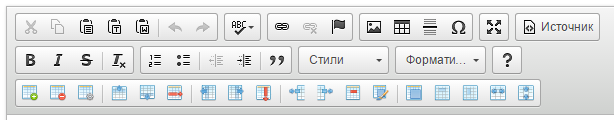

# tabletoolstoolbar
A plugin for CKEditor 4, that add toolbar's groups with buttons relevant to [tabletools plugin's](http://ckeditor.com/addon/tabletools) table's context menu items actions.



## Toolbar's groups and buttons
- table - contains buttons for work with tables
  -  tableinsert - add new table
  -  tabledelete - delete current table
  -  tableproperties - show dialog with table properties
- tablerow - contains buttons for work with rows
  -  tablerowinsertbefore - add row above current cell
  -  tablerowinsertafter - add row under current cell
  -  tablerowdelete - delete row with current cell
- tablecolumn - contains buttons for work with columns
  -  tablecolumninsertbefore - add column before current cell
  -  tablecolumninsertafter - add column after current cell
  -  tablecolumndelete - delete column with current cell
- tablecell - contains buttons for work with cells (except merge/split)
  -  tablecellinsertbefore - add cell before current cell
  -  tablecellinsertafter - add cell after current cell
  -  tablecelldelete - delete current cell
  -  tablecellproperties - whow dialog with current cell properties
- tablecellmergesplit - contains buttons for cell merge/split
  -  tablecellsmerge - merge selected cells
  -  tablecellmergeright - merge current cell with right cell
  -  tablecellmergedown - merge current cell with down cell
  -  tablecellsplithorizontal - split horizontal current cell
  -  tablecellsplitvertical - split vertical current cell

## How to use

Add required toolbar's group to your toolbar's config:

```javascript
toolbarGroups : [
		{ name: 'clipboard', groups: [ 'clipboard', 'undo' ] },
        ...
		{ name: 'others', groups: [ 'others' ] },
		'/',
		{ name: 'tables', groups: [ 'table','tablerow','tablecolumn', 'tablecell','tablecellmergesplit' ] }
	]
    });
```

For more info please read [official toolbar configuration guide](http://docs.ckeditor.com/#!/guide/dev_toolbar).

## Third-party components
Icons (some with partial changes)from ["Farm-Fresh Web Icons"](http://www.fatcow.com/free-icons).

## Licence
[MIT License](https://tldrlegal.com/license/mit-license).
